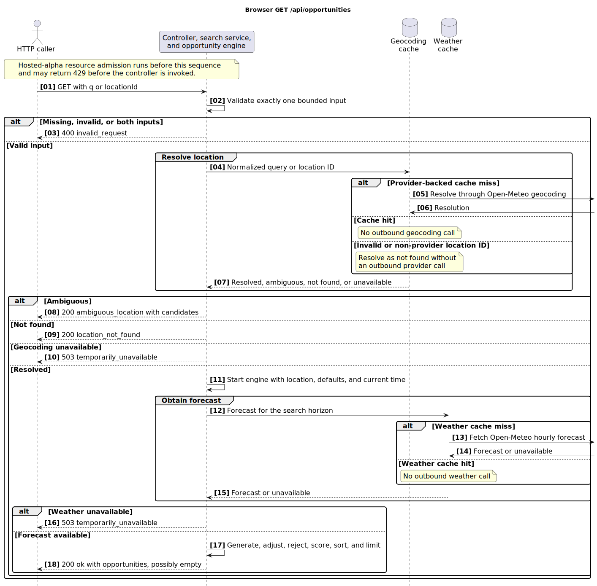
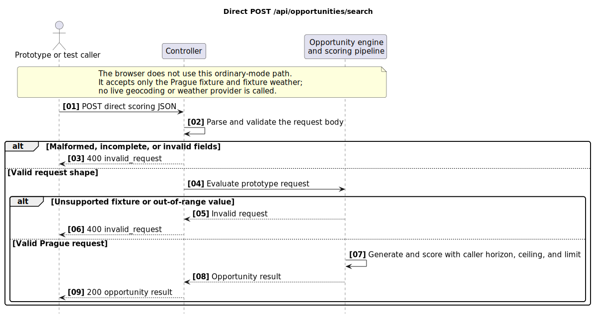

# First Backend/Web API Shape

This document owns product API design and intended future shapes. For the
currently implemented controller mappings, concrete consumers, and exposure,
see the [HTTP route inventory](http-route-inventory.md).

## Goal

The first API should support a single-page web experience:

```text
/search?q=Praha
```

The page should accept a city/location query, resolve it, return Moon opportunities when possible, and support playful fictional Easter eggs without requiring accounts, cookies, email, or saved server-side preferences.

## Public UX

Recommended first routes:

```text
/search?q=Praha
/l/prague-cz
/feeds/prague-cz.atom
/calendars/prague-cz.ics
/o/prague-cz-2026-06-29T1920Z.ics
```

Implementation tracking:
[#15](https://github.com/rapucha/moon-service/issues/15) for the web lookup and
shareable result flow, and
[#16](https://github.com/rapucha/moon-service/issues/16) for feeds and
calendar exports.

The web page can call a single opportunity search endpoint:

```http
GET /api/opportunities?q=Praha&lang=cs
```

`lang` is optional. If absent, use `Accept-Language` as a display/ranking hint only.

## Request Parameters

`q`:

- Required for query-based lookup.
- Raw Unicode city/location query.
- Do not ASCII-normalize before geocoding.
- Reject empty or unreasonably long queries with `invalid_request`.
- One visible-character queries are allowed because real one-symbol place names exist, such as `Å` and `Y`, but they should use stricter handling because they are highly ambiguous.

`lang`:

- Optional BCP 47 language tag.
- Used only for display/ranking preferences.
- Must not prevent local-language queries from resolving.

`country`:

- Optional ISO country code.
- Used as a disambiguation hint, not as a hard filter unless the UI explicitly says so.

`locationId`:

- Optional alternative to `q` for a selected canonical real location.
- The current backend accepts provider-backed IDs returned after
  `ambiguous_location`; curated fictional IDs remain a future contract.

## Response Statuses

Use `status` for the overall request state:

```text
ok
ambiguous_location
location_not_found
invalid_request
temporarily_unavailable
rate_limited
```

Meanings:

- `ok`: resolved one location and completed the lookup. For real locations, `opportunities` may contain results or be empty.
- `ambiguous_location`: multiple plausible candidates; the current backend
  returns real geocoding candidates only, while fictional candidates remain a
  future contract.
- `location_not_found`: no real geocoding result. The current backend has no
  fictional fallback.
- `invalid_request`: missing, empty after trimming, too long, malformed, or unsupported input.
- `temporarily_unavailable`: the current backend could not complete geocoding
  or weather lookup. The target contract may apply the same state to other
  required dependencies.
- `rate_limited`: request was valid, but the client or service exceeded an application-level rate limit.

For a resolved real location, `status: "ok"` with `opportunities: []` means
evaluation completed successfully but produced no scored result. Today that can
mean no natural windows were generated, no live portion remained, or every
retained window was rejected by the thin-crescent visibility rule. There is no
minimum total-score threshold. Dependency failures should not be represented as
an empty list.

HTTP status codes can stay conventional:

- `200` for product states such as `ok`, `ambiguous_location`, and `location_not_found`.
- `400` for `invalid_request`.
- `429` for `rate_limited`.
- `503` for `temporarily_unavailable`.

## Message Codes

Responses may include `messages` for non-fatal context:

```text
local_horizon_not_modelled
fictional_result
query_alias_used
input_normalized
one_character_query
```

Meanings:

- `local_horizon_not_modelled`: terrain, buildings, trees, and exact local horizon are not included.
- `fictional_result`: the response is an Easter egg and not real-world guidance.
- `query_alias_used`: raw geocoding returned no candidates, so a curated alias, transliteration, or exact curated one-character place record was used.
- `input_normalized`: lookup/cache input was normalized, such as whitespace collapsing, while preserving the original query in the response.
- `one_character_query`: the query is a single visible character and was handled with stricter lookup rules.

## Rate Limits And Upstream Quotas

The backend must protect both Moon Service and upstream providers.

Application-level limits:

- Rate limit `/api/opportunities` by IP or coarse anonymous client fingerprint
  before public alpha. For home-hosted alpha, start with an edge or ingress
  limit around 30 requests per minute per client, with stricter handling for
  one-character or otherwise high-ambiguity lookups.
- Edge or ingress limits are acceptable as an early safety control, but the
  documented `rate_limited` JSON response requires application-level handling.
- Keep limits generous enough for manual use and testing.
- Return `status: "rate_limited"` with HTTP `429` when a client is limited.
- Include a retry hint when possible.

Upstream provider limits:

- Open-Meteo free weather API is documented as non-commercial and rate-limited.
- Open-Meteo geocoding should be cached and should not be called on every keystroke.
- Avoid typeahead/autocomplete in v0 to reduce geocoding request volume.
- Cache geocoding, weather, and scoring outputs enough to avoid repeated provider calls for the same city/time window.
- If an upstream provider quota is exhausted, return `temporarily_unavailable`, not `opportunities: []`.
- Record outbound provider calls in local counters so `/admin/status` can show hourly, daily, and monthly usage.

Example rate-limited response:

```json
{
  "status": "rate_limited",
  "message": "Too many requests. Please try again shortly.",
  "retryAfterSeconds": 60
}
```

## Input Validation And Abuse Protection

Treat lookup input as hostile even when it looks like a city name.

Validation rules:

- Require `q` after Unicode trim.
- Reject empty input.
- Use a maximum length for city/location search, initially around 100 visible characters.
- Allow one visible Unicode letter or number because real one-symbol place names exist.
- Reject or strip ASCII control characters and Unicode bidirectional control characters.
- Normalize whitespace runs to a single space for lookup/cache keys while preserving the original query for display/debug context.
- Do not call aliases, secondary geocoders, or future LLM fallback for invalid input.

One-character query rules:

- Permit one visible-character queries such as `Å` or `Y`.
- Require exact geocoding or exact curated alias match.
- Do not invoke broad fuzzy fallback, dynamic translation/transliteration, secondary geocoding, or LLM fallback by default.
- Return `ambiguous_location` if multiple plausible places match.
- Rate-limit one-character lookups conservatively because they are cheap to abuse and likely to be ambiguous.

Safety rules:

- Escape `q`, provider display names, and aliases before rendering them in HTML.
- Do not put raw `q` in structured application logs by default.
- Do not build provider URLs by string concatenation; use encoded query parameters.
- Cache negative lookups briefly, but cap negative-cache size and TTL to avoid cache pollution.
- Keep provider call counters and rate limits visible in `/admin/status`.

## Admin Status Endpoint

The first backend should expose a private operator endpoint:

```http
GET /admin/status
```

This endpoint is for the Moon Service operator, not public users. It should be protected and may render simple server-side HTML before any richer admin UI exists.

Minimum response/page fields:

```text
app:
  version
  build_time
  environment

providers:
  operations:
    open-meteo-weather:
      provider
      operation
      usage:
        hourly:
          windowStartedAt
          used
          limit
          knownLimit
          percentUsed
          warningState
        daily:
          windowStartedAt
          used
          limit
          knownLimit
          percentUsed
          warningState
        monthly:
          windowStartedAt
          used
          limit
          knownLimit
          percentUsed
          warningState
    open-meteo-geocoding:
      provider
      operation
      usage:
        hourly
        daily
        monthly
  open_meteo_weather:
    aggregate outcome counters and latency summary
  open_meteo_geocoding:
    aggregate outcome counters and latency summary

caches:
  geocoding_hit_rate
  weather_hit_rate
  scoring_hit_rate

features:
  fictional_llm_fallback_enabled
  feed_generation_enabled

public_api:
  opportunity_search_rate_limit
```

The status page should make quota risk visible before exhaustion. If known
limits are configured, show warning states at roughly 50 percent, 80 percent,
and 95 percent usage. Unknown limits must stay explicit instead of returning a
fake percent. Provider operations should stay generic enough for later
geocoding, weather, email, calendar, ephemeris, map, or LLM-backed fictional
location providers.

## Candidate Kinds

Use `kind` on candidates/results, not in `status`:

```text
real_location
fictional_location
```

`real_location`:

- Comes from geocoding provider data.
- Can have latitude, longitude, elevation, timezone, country, admin areas.
- Can produce real opportunities, RSS/Atom feeds, and `.ics` exports.

`fictional_location`:

- Comes from curated fictional data or later LLM-assisted lore classification.
- Must not include real coordinates.
- Must not produce RSS/Atom feed entries, `.ics` exports, real weather, or real ephemeris results.
- Can produce a clearly labeled fictional report.

## Opportunity Window Contract

Real opportunities should represent natural visible-Moon windows, not artificial
slices produced by ephemeris sampling. Low Moon remains the strongest default
use case, but context Moon opportunities should not be excluded when light and
weather are favorable.

The backend should first find physical Moon passes: continuous intervals where
the apparent refracted Moon altitude stays above the local horizon. A pass is
bounded by Moonrise, Moonset, or the search horizon edges. Local midnight is not
a pass boundary.

Useful recommendation windows live inside a Moon pass. A single pass may
produce more than one opportunity, for example one while the Moon is ascending
and another while it is descending. Recommendation windows may be bounded by
Moonrise, Moonset, optional crossings through the configured altitude ceiling,
the pass peak, or the search horizon edges.

Response rules:

- The current response remains a flat `opportunities` array. Follow-up #53
  tracks whether the API should later become pass-centric, with Moon passes as
  the primary ranked objects and recommendation windows nested inside them.
- The anonymous `GET /api/opportunities` lookup requests up to ten raw
  recommendation windows by default, ordered by the existing score and
  tie-break rules. Ten is a provisional discovery safeguard while the scoring
  model is being evaluated under #33, not a claim that every returned candidate
  will produce an objectively good photograph.
- The direct `POST /api/opportunities/search` scoring contract keeps its
  caller-supplied `limit`; increasing the anonymous lookup default does not
  change that explicit request control.
- `startsAt` and `endsAt` define the useful opportunity window.
- `moonPass` identifies the containing physical Moon pass. Clients may use
  `moonPass.id` to group ascending and descending recommendations from the
  same pass, so ten raw candidates may render as fewer than ten pass cards.
  `moonPass.startsAt` and `moonPass.endsAt` describe the whole pass, which may
  cross local midnight.
- `moonPass.path` describes Moon movement across the whole physical pass. The
  current flat response repeats this bounded pass path on each opportunity so a
  grouped client can draw one continuous pass chart; follow-up #53 can remove
  that duplication if the API becomes pass-centric.
- `suggestedAt` is optional and only identifies a representative time inside
  the window for sorting, links, or display.
- `moon` describes the Moon at `suggestedAt`; keep this field as the compact
  suggested-time summary for compatibility.
- `moon.phaseAngleDegrees` uses the astronomical lunar phase angle: `0` is new
  Moon, `90` is first quarter, `180` is full Moon, and `270` is last quarter.
- `moon.brightLimbTiltDegrees` is an optional observer-oriented value at
  `suggestedAt`. It gives the direction from the Moon center toward the Sun in
  the local sky tangent plane: `0` points toward local zenith at the top of a
  horizon-aligned image, `90` points right toward increasing azimuth, and angles
  increase clockwise in the range `[0, 360)`. A missing or `null` value means
  clients must retain their location-independent phase fallback. This is not a
  celestial-north position angle, lunar-axis rotation, or parallactic angle.
- `moon.northPoleTiltDegrees` is an optional observer-oriented value at
  `suggestedAt`. It gives the direction from the Moon center toward the lunar
  north rotational pole in the same local tangent-plane convention: `0` points
  toward local zenith, `90` points right toward increasing azimuth, and angles
  increase clockwise in `[0, 360)`. A missing or `null` value means clients
  retain the canonical north-up surface texture. This field rotates surface
  sampling only; it does not change the phase silhouette or bright-limb
  direction and does not model libration.
- `moonPath` describes Moon movement across the window. It must include direct
  `start`, `suggested`, and `end` points plus a bounded `samples` array
  suitable for compact UI charts. V0 samples the path at regular 30-minute
  intervals, with additional samples at suggested time, window boundaries, and
  light-bucket crossings.
- `moonPath` points include `lightBucket` derived from Sun altitude so clients
  can show daylight, golden hour, twilight, and night changes across the same
  Moon path without treating weather precision as minute-level.
- `moonPath` points include `sunAzimuthDegrees` alongside
  `sunAltitudeDegrees` so clients can annotate secondary Sun positions without
  doing their own ephemeris calculation.
- Every `moonPass.path` and `moonPath` point includes Moon-disc orientation for
  its own `at` instant. `moonPhaseAngleDegrees` uses the same convention as
  `moon.phaseAngleDegrees`; nullable `brightLimbTiltDegrees` and
  `northPoleTiltDegrees` use the same observer-oriented conventions as the
  compact `moon` summary. The two tilt fields retain their independent null
  fallbacks. Clients rendering older responses without a per-point phase may
  fall back to the containing opportunity's `moon` summary.
- Do not expose ephemeris sampling cadence such as `stepMinutes` in the public
  API.

The current engine selects the hourly forecast record covering `suggestedAt`;
the response's weather summary and aggregate-shaped fields currently describe
that one record. The target V0 weather-window contract is broader:

- Weather fields on an opportunity should aggregate the merged weather
  interval. V0 uses hourly weather fields because cloud cover is the primary
  scoring input and Open-Meteo exposes cloud-cover layers hourly.
- Natural visible-Moon windows should split at provider forecast change
  boundaries when those changes affect the recommendation.
- Adjacent intervals should merge when the derived weather class and
  decision-relevant facts are equivalent.
- A single opportunity may then cover a broad interval when the Moon remains
  visible and the forecast state is stable.
- Avoid wording that implies minute-level weather certainty.

## Preview Response Examples

### Real Opportunities

```json
{
  "status": "ok",
  "query": "Praha",
  "locale": "cs",
  "location": {
    "kind": "real_location",
    "id": "openmeteo:prague-cz",
    "displayName": "Prague / Praha, Czech Republic",
    "latitude": 50.0755,
    "longitude": 14.4378,
    "elevationMeters": 250,
    "timezone": "Europe/Prague",
    "countryCode": "CZ"
  },
  "generatedAt": "2026-06-14T09:00:00Z",
  "forecastHorizonDays": 7,
  "opportunities": [
    {
      "id": "prague-cz-2026-06-29T1920Z",
      "windowKind": "moonrise_low",
      "moonPass": {
        "id": "prague-cz-pass-2026-06-29T1848Z",
        "startsAt": "2026-06-29T18:48:00Z",
        "endsAt": "2026-06-30T02:12:00Z",
        "path": {
          "start": {
            "at": "2026-06-29T18:48:00Z",
            "altitudeDegrees": 0.1,
            "azimuthDegrees": 119.4,
            "moonPhaseAngleDegrees": 157.0,
            "brightLimbTiltDegrees": 1.2,
            "northPoleTiltDegrees": 56.8,
            "sunAltitudeDegrees": -1.2,
            "sunAzimuthDegrees": 306.4,
            "lightBucket": "civil_twilight",
            "role": "start"
          },
          "end": {
            "at": "2026-06-30T02:12:00Z",
            "altitudeDegrees": 0.1,
            "azimuthDegrees": 236.8,
            "moonPhaseAngleDegrees": 159.0,
            "brightLimbTiltDegrees": 310.0,
            "northPoleTiltDegrees": 42.0,
            "sunAltitudeDegrees": -14.0,
            "sunAzimuthDegrees": 42.1,
            "lightBucket": "night",
            "role": "end"
          },
          "samples": [
            {
              "at": "2026-06-29T18:48:00Z",
              "altitudeDegrees": 0.1,
              "azimuthDegrees": 119.4,
              "moonPhaseAngleDegrees": 157.0,
              "brightLimbTiltDegrees": 1.2,
              "northPoleTiltDegrees": 56.8,
              "sunAltitudeDegrees": -1.2,
              "sunAzimuthDegrees": 306.4,
              "lightBucket": "civil_twilight",
              "role": "start"
            },
            {
              "at": "2026-06-29T22:30:00Z",
              "altitudeDegrees": 31.4,
              "azimuthDegrees": 181.2,
              "moonPhaseAngleDegrees": 158.0,
              "brightLimbTiltDegrees": 340.0,
              "northPoleTiltDegrees": 50.0,
              "sunAltitudeDegrees": -15.3,
              "sunAzimuthDegrees": 354.8,
              "lightBucket": "night",
              "role": "path"
            },
            {
              "at": "2026-06-30T02:12:00Z",
              "altitudeDegrees": 0.1,
              "azimuthDegrees": 236.8,
              "moonPhaseAngleDegrees": 159.0,
              "brightLimbTiltDegrees": 310.0,
              "northPoleTiltDegrees": 42.0,
              "sunAltitudeDegrees": -14.0,
              "sunAzimuthDegrees": 42.1,
              "lightBucket": "night",
              "role": "end"
            }
          ]
        }
      },
      "startsAt": "2026-06-29T18:48:00Z",
      "suggestedAt": "2026-06-29T19:20:00Z",
      "endsAt": "2026-06-29T20:04:00Z",
      "localTimeZone": "Europe/Prague",
      "score": 82,
      "confidence": "medium",
      "moon": {
        "altitudeDegrees": 4.2,
        "azimuthDegrees": 126.5,
        "illuminationPercent": 96,
        "phaseAngleDegrees": 157.1,
        "brightLimbTiltDegrees": 1.9,
        "northPoleTiltDegrees": 57.4,
        "phaseName": "waxing_gibbous"
      },
      "moonPath": {
        "start": {
          "at": "2026-06-29T18:48:00Z",
          "altitudeDegrees": 0.1,
          "azimuthDegrees": 119.4,
          "moonPhaseAngleDegrees": 157.0,
          "brightLimbTiltDegrees": 1.2,
          "northPoleTiltDegrees": 56.8,
          "sunAltitudeDegrees": -1.2,
          "sunAzimuthDegrees": 306.4,
          "lightBucket": "civil_twilight",
          "role": "start"
        },
        "suggested": {
          "at": "2026-06-29T19:20:00Z",
          "altitudeDegrees": 4.2,
          "azimuthDegrees": 126.5,
          "moonPhaseAngleDegrees": 157.1,
          "brightLimbTiltDegrees": 1.9,
          "northPoleTiltDegrees": 57.4,
          "sunAltitudeDegrees": -4.8,
          "sunAzimuthDegrees": 312.2,
          "lightBucket": "civil_twilight",
          "role": "suggested"
        },
        "end": {
          "at": "2026-06-29T20:04:00Z",
          "altitudeDegrees": 11.8,
          "azimuthDegrees": 138.2,
          "moonPhaseAngleDegrees": 157.3,
          "brightLimbTiltDegrees": 3.1,
          "northPoleTiltDegrees": 58.8,
          "sunAltitudeDegrees": -9.1,
          "sunAzimuthDegrees": 321.7,
          "lightBucket": "nautical_twilight",
          "role": "end"
        },
        "samples": [
          {
            "at": "2026-06-29T18:48:00Z",
            "altitudeDegrees": 0.1,
            "azimuthDegrees": 119.4,
            "moonPhaseAngleDegrees": 157.0,
            "brightLimbTiltDegrees": 1.2,
            "northPoleTiltDegrees": 56.8,
            "sunAltitudeDegrees": -1.2,
            "sunAzimuthDegrees": 306.4,
            "lightBucket": "civil_twilight",
            "role": "start"
          },
          {
            "at": "2026-06-29T19:07:00Z",
            "altitudeDegrees": 2.5,
            "azimuthDegrees": 123.6,
            "moonPhaseAngleDegrees": 157.1,
            "brightLimbTiltDegrees": 1.6,
            "northPoleTiltDegrees": 57.1,
            "sunAltitudeDegrees": -3.2,
            "sunAzimuthDegrees": 309.8,
            "lightBucket": "civil_twilight",
            "role": "path"
          },
          {
            "at": "2026-06-29T19:20:00Z",
            "altitudeDegrees": 4.2,
            "azimuthDegrees": 126.5,
            "moonPhaseAngleDegrees": 157.1,
            "brightLimbTiltDegrees": 1.9,
            "northPoleTiltDegrees": 57.4,
            "sunAltitudeDegrees": -4.8,
            "sunAzimuthDegrees": 312.2,
            "lightBucket": "civil_twilight",
            "role": "suggested"
          },
          {
            "at": "2026-06-29T19:42:00Z",
            "altitudeDegrees": 7.1,
            "azimuthDegrees": 131.8,
            "moonPhaseAngleDegrees": 157.2,
            "brightLimbTiltDegrees": 2.4,
            "northPoleTiltDegrees": 58.0,
            "sunAltitudeDegrees": -6.8,
            "sunAzimuthDegrees": 316.9,
            "lightBucket": "nautical_twilight",
            "role": "path"
          },
          {
            "at": "2026-06-29T20:04:00Z",
            "altitudeDegrees": 11.8,
            "azimuthDegrees": 138.2,
            "moonPhaseAngleDegrees": 157.3,
            "brightLimbTiltDegrees": 3.1,
            "northPoleTiltDegrees": 58.8,
            "sunAltitudeDegrees": -9.1,
            "sunAzimuthDegrees": 321.7,
            "lightBucket": "nautical_twilight",
            "role": "end"
          }
        ]
      },
      "sun": {
        "altitudeDegrees": -4.8,
        "azimuthDegrees": 312.2,
        "lightBucket": "civil_twilight"
      },
      "weather": {
        "sourceResolution": "hourly",
        "segmentKind": "partly_cloudy",
        "cloudCoverMeanPercent": 38,
        "cloudCoverMaxPercent": 52,
        "lowCloudCoverMaxPercent": 20,
        "precipitationProbabilityMaxPercent": 5,
        "visibilityMinMeters": 18000,
        "summary": "partly cloudy"
      },
      "exposureBalance": {
        "label": "balanced",
        "text": "Twilight may still provide enough scene light while keeping the Moon readable."
      },
      "reason": "Moon is low in the southeast during a twilight window with low precipitation risk.",
      "links": {
        "ics": "/o/prague-cz-2026-06-29T1920Z.ics"
      }
    }
  ],
  "rejected": [
    {
      "startsAt": "2026-07-14T03:45:00Z",
      "endsAt": "2026-07-14T18:26:00Z",
      "reasonCode": "thin_crescent_near_conjunction",
      "reason": "The Moon is an extremely thin crescent too close to the Sun for an ordinary visible Moon opportunity.",
      "moonSunSeparationDegrees": 4.6,
      "moonIlluminationPercent": 0.2,
      "moonAltitudeDegrees": 4.4,
      "sunAltitudeDegrees": 0.2
    }
  ],
  "links": {
    "self": "/search?q=Praha",
    "location": "/l/prague-cz",
    "atom": "/feeds/prague-cz.atom"
  },
  "messages": [
    {
      "level": "info",
      "code": "local_horizon_not_modelled",
      "text": "Local hills, buildings, or trees may affect exact visibility near the horizon."
    }
  ]
}
```

### Ambiguous Location

```json
{
  "status": "ambiguous_location",
  "query": "Prague",
  "candidates": [
    {
      "kind": "real_location",
      "id": "openmeteo:prague-cz",
      "displayName": "Prague / Praha, Czech Republic",
      "countryCode": "CZ",
      "timezone": "Europe/Prague"
    },
    {
      "kind": "real_location",
      "id": "openmeteo:prague-ok-us",
      "displayName": "Prague, Oklahoma, United States",
      "countryCode": "US",
      "timezone": "America/Chicago"
    },
    {
      "kind": "fictional_location",
      "id": "fictional:fallout:prague",
      "displayName": "Prague, Fallout universe",
      "fictionalUniverse": "Fallout",
      "reportTemplateId": "fallout-radstorm",
      "generatedBy": "curated"
    }
  ]
}
```

### Alias Fallback

```json
{
  "status": "ok",
  "query": "東京",
  "locale": "ja",
  "location": {
    "kind": "real_location",
    "id": "openmeteo:tokyo-jp",
    "displayName": "東京都, Japan",
    "latitude": 35.6895,
    "longitude": 139.69171,
    "elevationMeters": 44,
    "timezone": "Asia/Tokyo",
    "countryCode": "JP"
  },
  "lookup": {
    "originalQuery": "東京",
    "searchedQuery": "Tokyo",
    "aliasApplied": true,
    "aliasSource": "curated"
  },
  "opportunities": [],
  "messages": [
    {
      "level": "info",
      "code": "query_alias_used",
      "text": "We searched for Tokyo after the original place name did not resolve."
    }
  ]
}
```

### One-Character Query

```json
{
  "status": "ambiguous_location",
  "query": "Å",
  "candidates": [
    {
      "kind": "real_location",
      "id": "openmeteo:aa-nordland-no",
      "displayName": "Å, Nordland, Norway",
      "countryCode": "NO",
      "timezone": "Europe/Oslo"
    },
    {
      "kind": "real_location",
      "id": "openmeteo:aa-vasternorrland-se",
      "displayName": "Å, Västernorrland, Sweden",
      "countryCode": "SE",
      "timezone": "Europe/Stockholm"
    }
  ],
  "messages": [
    {
      "level": "info",
      "code": "one_character_query",
      "text": "One-character place names are allowed, but may be ambiguous."
    }
  ]
}
```

### Fictional Report

```json
{
  "status": "ok",
  "query": "Xanadu",
  "location": {
    "kind": "fictional_location",
    "id": "fictional:literary:xanadu",
    "displayName": "Xanadu",
    "fictionalUniverse": "literary/mythic",
    "generatedBy": "curated"
  },
  "fictionalReport": {
    "title": "Fictional Moon Report",
    "summary": "Pleasure-dome moonlight expected. This is an Easter egg, not real-world photography guidance.",
    "conditions": [
      "Alph river haze",
      "impossible silver twilight",
      "excellent dreamlike contrast"
    ]
  },
  "messages": [
    {
      "level": "warning",
      "code": "fictional_result",
      "text": "This result is fictional and does not use real weather or ephemeris data."
    }
  ]
}
```

### Location Not Found

```json
{
  "status": "location_not_found",
  "query": "Xyznotacity",
  "message": "We could not find that place on Earth or in the usual imaginary maps.",
  "suggestions": [
    "Check spelling.",
    "Try adding a country, such as \"Prague, Czech Republic\".",
    "Try a city or town rather than an exact address."
  ]
}
```

### Invalid Request

```json
{
  "status": "invalid_request",
  "query": "",
  "message": "Enter a city or town.",
  "errors": [
    {
      "field": "q",
      "code": "empty_query",
      "text": "The location query is required."
    }
  ]
}
```

```json
{
  "status": "invalid_request",
  "message": "That location query is too long.",
  "errors": [
    {
      "field": "q",
      "code": "query_too_long",
      "text": "Use a city, town, or short location name."
    }
  ]
}
```

```json
{
  "status": "invalid_request",
  "message": "That location query contains unsupported characters.",
  "errors": [
    {
      "field": "q",
      "code": "unsupported_control_characters",
      "text": "Remove control or bidirectional formatting characters."
    }
  ]
}
```

### Empty Opportunities

```json
{
  "status": "ok",
  "location": {
    "kind": "real_location",
    "id": "openmeteo:prague-cz",
    "displayName": "Prague / Praha, Czech Republic",
    "timezone": "Europe/Prague"
  },
  "forecastHorizonDays": 7,
  "opportunities": [],
  "emptyReason": {
    "code": "no_useful_low_moon_windows",
    "text": "No useful low-Moon window was found in the forecast period."
  }
}
```

## Internationalization Behavior

- Accept raw Unicode input.
- Do not assume query language from browser locale.
- Use `lang` or `Accept-Language` as display/ranking hints only.
- Store times as UTC instants.
- Return the resolved location timezone.
- Display event times in the location timezone.
- Keep first MVP UI copy English-only unless translation work is explicitly added.
- Provider validation found that Open-Meteo Geocoding resolves many raw Unicode city queries, but misses some native-script cases such as Japanese `東京`, `京都`, and `大阪`, and Korean `서울`. Keeping a broad raw Unicode promise requires a curated alias/transliteration fallback before considering a secondary geocoder or narrower v0 search promise.

## Local Recent Searches

The first web MVP may use browser `localStorage` for recent searches.

Rules:

- Store only an ordered list of recent location display names and slugs/canonical IDs.
- Do not store timestamps in v0.
- Do not store exact addresses.
- Avoid storing latitude/longitude if a slug/canonical ID is enough.
- Keep a small maximum, such as 5 or 10 entries.
- Provide `Clear recent searches`.
- The app must work when localStorage is disabled or cleared.
- Do not use localStorage for auth, consent, private tokens, or server tracking.

Example:

```json
[
  {
    "displayName": "Prague / Praha, Czech Republic",
    "slug": "prague-cz",
    "timezone": "Europe/Prague"
  }
]
```

## Future Event-Aware Search

The first `/api/opportunities?q=...` contract is location-focused. Recurring
event-aware search should be added later only after the base location, Moon,
weather, feed, and calendar behavior works.

A later event-aware request can either extend the lookup with an optional event
context or use a separate endpoint. The event context should describe an
approximate recurring pattern, not a guaranteed occurrence:

```text
event_kind
display_name
days_of_week or recurrence_rule
local_time_window
early_late_tolerance_minutes
active_date_range
optional route/direction/azimuth fields
source and confidence fields
```

Event-aware responses should keep the base opportunity facts and add event
match facts, for example:

```text
eventMatch:
  expectedLocalWindow
  uncertaintyWindow
  overlapWindow
  timingConfidence
  source
  caveat
```

Do not expose event-aware matches as exact minute-level predictions. Flights,
transport schedules, and other recurring events can be delayed, early, rerouted,
or cancelled. If the system does not use a live event provider, response copy
must say that the event timing is approximate.

Public RSS/Atom or `.ics` links may be acceptable for canonical, nonpersonal
event patterns encoded in a URL. Personal saved event subscriptions require the
privacy and storage model to cover stored preferences, notification delivery,
retention, and deletion before implementation.

## Feed And Calendar Rules

Implementation tracking:
[#16](https://github.com/rapucha/moon-service/issues/16).

RSS/Atom:

- Only for real public opportunities.
- Suitable for city/region feeds and best-upcoming feeds.
- Do not include fictional reports.
- Do not include private user preferences.

`.ics`:

- Dynamic public calendar feeds may be generated on demand for canonical real locations, such as `/calendars/prague-cz.ics`.
- Calendar feeds should contain a rolling window of upcoming public opportunities for that location and use caching rather than manual feed creation per requested city.
- Only for real individual opportunities.
- Individual event exports, such as `/o/prague-cz-2026-06-29T1920Z.ics`, should include title, time window, location display name, summary, and caveat about local horizon obstruction.
- Do not generate `.ics` for fictional reports.

## Privacy And Storage Rules

- No mandatory account.
- No server-side user profile in v0.
- No email alerts in v0.
- No cookies for remembering users.
- Server may cache geocoding/weather/scoring data by provider, canonical location, rounded coordinate, and forecast time.
- Browser may keep recent searches locally with `localStorage`.
- Backend logs should avoid raw query strings and exact coordinates where possible.

## Implemented Opportunity-Search Sequence

The browser uses only `GET /api/opportunities`; the direct POST contract shown
at the bottom is for ordinary-mode prototype and test callers. In hosted-alpha
mode, resource admission can return `429` before this application sequence
begins; the separate [resource-admission diagrams](diagrams/hosted-alpha-resource-limits.pdf)
cover that filter, its token buckets, and its concurrency permit.

### Browser GET

[](diagrams/opportunity-search-get.svg)

[PlantUML source](diagrams/opportunity-search-get.puml)

### Direct Prototype POST

[](diagrams/opportunity-search-post.svg)

[PlantUML source](diagrams/opportunity-search-post.puml)

In prose: GET validates one lookup input, resolves it through a status-aware
cache, stops on an ambiguous, missing, or unavailable location, then obtains a
cached hourly forecast before running the opportunity pipeline. A successful
pipeline may return an empty list. POST bypasses both live provider paths and
uses the scoring prototype's sole `prague-cz` fixture and fixed fixture weather.

The implementation authority is the
[controller](../backend/src/main/java/dev/moonservice/backend/web/OpportunitySearchController.java),
[search service](../backend/src/main/java/dev/moonservice/backend/opportunity/OpportunitySearchService.java),
[location cache](../backend/src/main/java/dev/moonservice/backend/location/CachingLocationResolver.java),
[scoring engine](../backend/src/main/java/dev/moonservice/backend/opportunity/scoring/ScoringOpportunitySearchEngine.java),
and [weather cache](../backend/src/main/java/dev/moonservice/backend/weather/CachingWeatherForecastProvider.java).

## Target Internal Service Boundary

Even with a single opportunity search endpoint, keep target responsibilities
separate. Fictional lookup, feed/calendar assembly, and recurring-event search
below are not implemented by the current opportunity path.

```text
opportunity_search
  -> geocoding
  -> fictional location lookup / optional LLM lore fallback
  -> ephemeris
  -> weather
  -> scoring
  -> feed/calendar link assembly
```

The coordinate-backed opportunity engine was delivered through
[#13](https://github.com/rapucha/moon-service/issues/13). The first Open-Meteo
weather integration is tracked by
[#14](https://github.com/rapucha/moon-service/issues/14).

This keeps the public API simple without making the backend design hard to change.

Recurring event-aware search can later add:

```text
  -> recurring event pattern validation
  -> event occurrence window generation
  -> event/Moon/weather overlap scoring
```

Keep this out of the v0 lookup until the simpler city opportunity contract is
stable.
