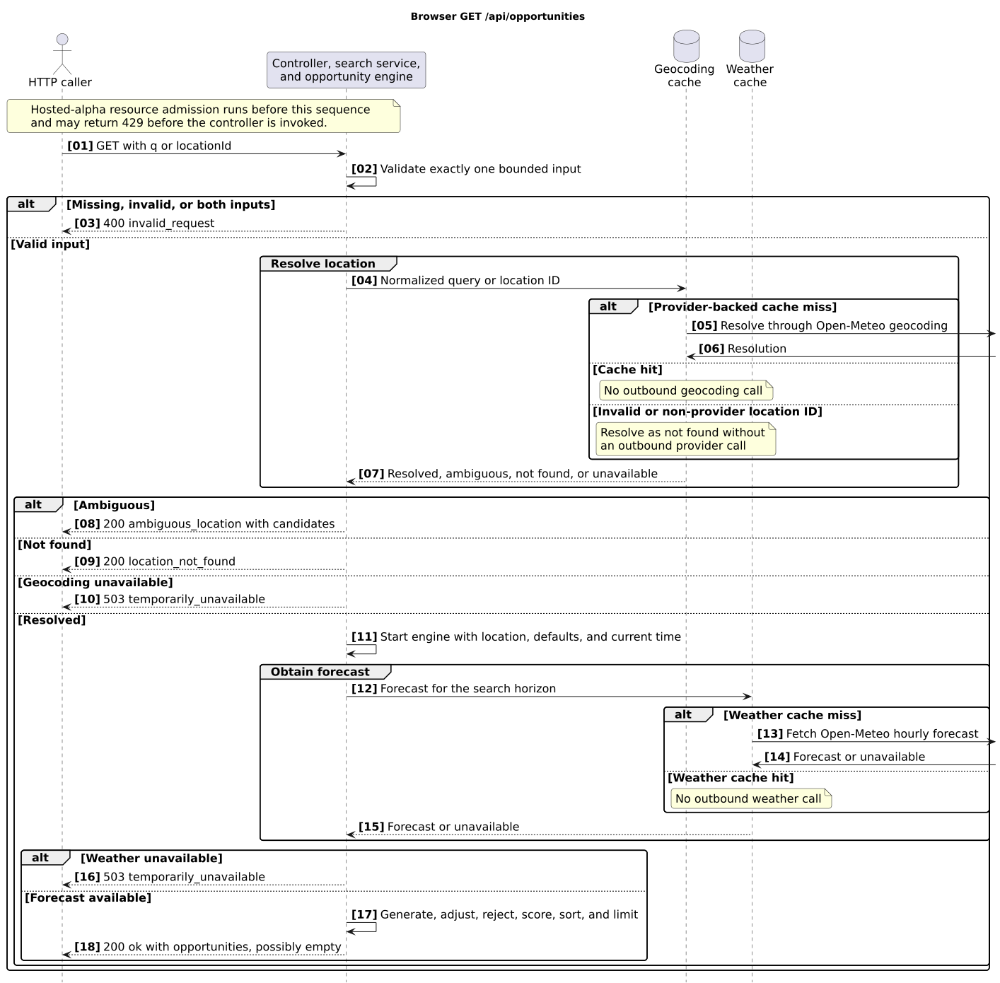
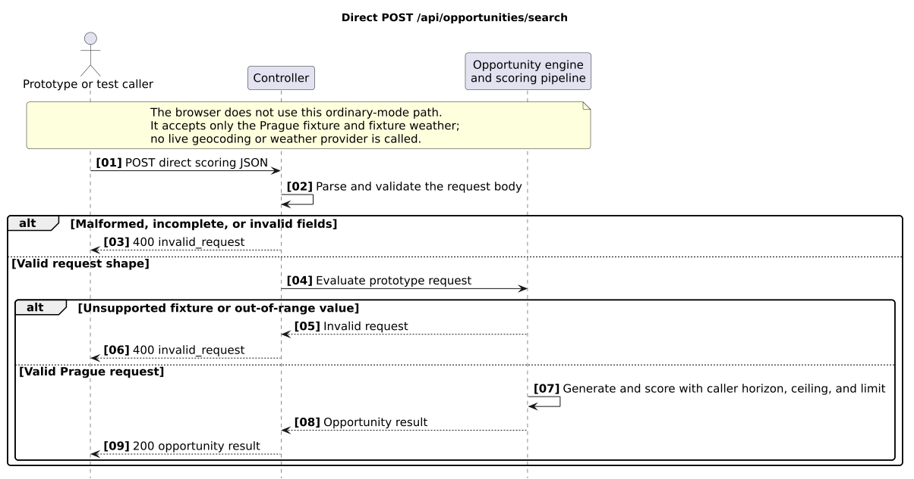

# First Backend/Web API Shape

This document defines the product API and its planned additions. For the routes
that the controllers currently implement, who calls them, and how they are
exposed, see the [HTTP route inventory](http-route-inventory.md).

## Goal

The first API should support this single-page web flow:

```text
/search?q=Praha
```

The page should accept and resolve a city or location query. It should return
Moon opportunities when possible and support playful fictional Easter eggs. It
should not require accounts, cookies, email, or preferences saved on the
server.

## Public UX

Public browser, Atom feed, and calendar routes in this contract:

```text
/search?q=Praha
/search?locationId=moon-service-3067696
/feeds/atom?locationId=moon-service-3067696
/feeds/atom?locationId=moon-service-3067696&preferences=<canonical-v1-json>
/o/<opportunity-id>.ics?locationId=moon-service-3067696
/calendars/opportunities.ics?locationId=moon-service-3067696
```

The Atom forms and subscribable calendar use the current opaque,
provider-tied canonical location ID. A provider change may require a new
subscription URL. Issue
[#288](https://github.com/rapucha/moon-service/issues/288) tracks the later
friendly-URL decision.

Implementation tracking:
[#15](https://github.com/rapucha/moon-service/issues/15) for the web lookup and
shareable result flow, and
[#16](https://github.com/rapucha/moon-service/issues/16) for feeds and
calendar exports.

When no hard preference is active, the current web page uses the shareable GET
endpoint to search for opportunities:

```http
GET /api/opportunities?q=Praha&lang=cs
```

`lang` is optional. When it is absent, use `Accept-Language` only as a hint for
display and ranking.

When at least one is active, the page sends request-scoped version 1
preferences to the same-origin product API without putting them in the page,
share, or lookup URL:

```http
POST /api/opportunities
Content-Type: application/json
```

## Request Parameters

`q`:

- Query-based lookup requires this parameter.
- It contains the raw Unicode city or location query.
- Do not convert the query to ASCII before geocoding.
- Reject empty or unreasonably long queries with `invalid_request`.
- Allow one-visible-character queries because real one-symbol place names exist,
  such as `Å` and `Y`. These queries should receive stricter handling because
  they are highly ambiguous.

`lang`:

- Optional BCP 47 language tag.
- Use it only for display and ranking preferences.
- It must not prevent local-language queries from resolving.

`country`:

- Optional ISO country code.
- Use it as a disambiguation hint. Do not use it as a hard filter unless the UI
  explicitly says so.

`locationId`:

- Optional alternative to `q` when the user has selected a canonical real
  location.
- The current backend accepts provider-backed IDs returned after
  `ambiguous_location`; curated fictional IDs remain a future contract.

`order`:

- Optional query parameter on `GET /api/opportunities` and
  `POST /api/opportunities`.
- Accepted values are `best_match` and `soonest`.
- Omission selects `best_match`.
- A present empty or unsupported value is `invalid_request`. The server rejects
  it before location resolution or weather lookup.
- For the product POST, `order` remains in the query. It is not a JSON body
  member.

## Response Statuses

Use `status` to report the result of the whole request:

```text
ok
ambiguous_location
location_not_found
opportunity_not_found
invalid_request
temporarily_unavailable
rate_limited
request_too_large
unsupported_media_type
```

Meanings:

- `ok`: the backend resolved one location and completed the lookup. For a real
  location, `opportunities` may contain results or be empty.
- `ambiguous_location`: multiple plausible candidates matched. The current
  backend returns only real geocoding candidates. Fictional candidates remain
  part of a future contract.
- `location_not_found`: geocoding found no real location. The current backend
  has no fictional fallback.
- `opportunity_not_found`: an individual calendar request resolved its
  location, but the live search no longer contains the exact requested ID.
- `invalid_request`: the input is missing, empty after trimming, too long,
  malformed, or unsupported.
- `temporarily_unavailable`: the current backend could not complete the
  geocoding or weather lookup, or it detected a missing filtered Atom link in
  an otherwise successful final product response. The target contract may use
  the same state when another required dependency fails.
- `rate_limited`: the request was valid, but the client or service exceeded an
  application-level rate limit.
- `request_too_large`: the product preference POST exceeded its raw-body
  limit.
- `unsupported_media_type`: the product preference POST did not use
  `application/json`.

For a resolved real location, `status: "ok"` with `opportunities: []` means the
backend completed evaluation but produced no scored result. Today, this can
mean that the backend generated no natural windows, found no remaining live
portion, or rejected every retained window under the thin-crescent visibility
rule. There is no minimum total-score threshold. A dependency failure should
not appear as an empty list.

HTTP status codes can stay conventional:

- `200` for product states such as `ok`, `ambiguous_location`, and `location_not_found`.
- `400` for `invalid_request`.
- `404` for `location_not_found` on a direct calendar route, or
  `opportunity_not_found` on the individual calendar route.
- `413` for `request_too_large`.
- `415` for `unsupported_media_type`.
- `429` for `rate_limited`.
- `503` for `temporarily_unavailable`.

## Message Codes

Responses may include `messages` with non-fatal information:

```text
local_horizon_not_modelled
fictional_result
query_alias_used
input_normalized
one_character_query
```

Meanings:

- `local_horizon_not_modelled`: the calculation does not include terrain,
  buildings, trees, or the exact local horizon.
- `fictional_result`: the response is an Easter egg, not real-world guidance.
- `query_alias_used`: raw geocoding returned no candidates, so the lookup used a
  curated alias, transliteration, or exact curated one-character place record.
- `input_normalized`: the backend normalized input for lookup and cache use,
  such as by collapsing whitespace, but preserved the original query in the
  response.
- `one_character_query`: the query contains one visible character, so the
  backend used stricter lookup rules.

## Rate Limits And Upstream Quotas

The backend must protect Moon Service and its upstream providers.

Application-level limits:

- Before public alpha, rate limit `/api/opportunities` by IP or coarse anonymous
  client fingerprint. For home-hosted alpha, start with an edge or ingress
  limit around 30 requests per minute per client. Apply stricter handling to
  one-character and other highly ambiguous lookups.
- Edge or ingress limits are acceptable as an early safety control, but the
  documented `rate_limited` JSON response requires application-level handling.
- Keep the limits generous enough for manual use and testing.
- Return `status: "rate_limited"` with HTTP `429` when a client is limited.
- Include a retry hint when possible.

Upstream provider limits:

- The Open-Meteo free weather API is documented as non-commercial and
  rate-limited.
- Open-Meteo geocoding should be cached and should not be called on every keystroke.
- Avoid typeahead/autocomplete in v0 to reduce geocoding request volume.
- Cache geocoding, weather, and scoring output enough to avoid repeated provider
  calls for the same city and time window.
- If an upstream provider quota is exhausted, return `temporarily_unavailable`,
  not `opportunities: []`.
- Record outbound provider calls in local counters so `/admin/status` can show
  hourly, daily, and monthly usage.

Example rate-limited response:

```json
{
  "status": "rate_limited",
  "message": "Too many requests. Please try again shortly.",
  "retryAfterSeconds": 60
}
```

## Input Validation And Abuse Protection

Treat every lookup value as hostile input, even when it looks like a city name.

Validation rules:

- Require `q` after Unicode trim.
- Reject empty input.
- Limit city and location searches to an initial maximum of around 100 visible
  characters.
- Allow one visible Unicode letter or number because real one-symbol place names exist.
- Reject or remove ASCII control characters and Unicode bidirectional control
  characters.
- Collapse whitespace runs to one space in lookup and cache keys. Preserve the
  original query for display and debugging.
- For invalid input, do not call aliases, secondary geocoders, or a future LLM
  fallback.

One-character query rules:

- Permit one visible-character queries such as `Å` or `Y`.
- Require exact geocoding or exact curated alias match.
- Do not invoke broad fuzzy fallback, dynamic translation/transliteration,
  secondary geocoding, or LLM fallback by default.
- Return `ambiguous_location` if multiple plausible places match.
- Rate-limit one-character lookups conservatively. They are cheap to abuse and
  likely to be ambiguous.

Safety rules:

- Escape `q`, provider display names, and aliases before rendering them as
  HTML.
- Do not put raw `q` in structured application logs by default.
- Do not build provider URLs by string concatenation; use encoded query parameters.
- Cache negative lookups briefly. Cap the negative-cache size and TTL to avoid
  cache pollution.
- Keep provider call counters and rate limits visible in `/admin/status`.

## Product Preference POST

`POST /api/opportunities` is the anonymous same-origin product route for one
request-scoped search. It accepts optional version 1 hard preferences and an
optional weather-ranking mode. It uses the same location resolution, live
weather lookup, Moon-window generation, scoring, selected order, and result
limit as `GET /api/opportunities`.

The product and direct routes remain distinct:

- `GET /api/opportunities` remains the preference-free product route. Both
  product routes accept the same optional `order` query parameter. A
  location-only share URL does not choose the API method; the receiving browser
  uses GET or the product POST based on its own active preferences.
- `POST /api/opportunities/search` remains the fixture-backed direct scoring
  route. It does not accept this product request or its ordering option.

### Request

The top-level JSON object must contain exactly one usable `q` or `locationId`.
It may also contain `weatherRanking`, `preferences`, or both:

```json
{
  "q": "Prague",
  "weatherRanking": "prefer_clear",
  "preferences": {
    "version": 1,
    "altitudeDegrees": { "minimum": 2, "maximum": 15 },
    "azimuthDegrees": {
      "included": { "start": 330, "end": 30 },
      "excluded": { "start": 350, "end": 10 }
    }
  }
}
```

The route applies the existing normalization and limits to `q` and
`locationId`. It rejects a missing, blank, oversized, or unsupported-control
value. It also rejects a request that contains both lookup fields or neither
one. A field outside `q`, `locationId`, `weatherRanking`, and `preferences` is
an unknown top-level field and makes the request invalid. In particular,
`order` belongs in the query and is invalid in this JSON object.

`weatherRanking` is separate from the hard `preferences` object. When present,
it must be a JSON string with exactly one of these values:

| Value | Ranking behavior |
| --- | --- |
| `balanced` | Use the default mix of Moon, light, weather, and forecast confidence. |
| `prefer_clear` | Give clearer skies a stronger weather score while keeping every score component active. |
| `ignore_weather` | Exclude weather and forecast confidence from the score, then normalize the remaining components to 0–100. |

When `weatherRanking` is absent, the server uses `balanced`. Product GET and
product POST without this field keep the existing balanced candidates, scores,
order, and response shape. Explicit `balanced` produces the same result but
adds the applied-mode response field described below.

Changing the mode does not change candidate intervals, `startsAt`,
`suggestedAt`, `endsAt`, active hard filters, excluded-sample counts, empty
reasons, or preference-impact diagnostics. The selected `order` keeps its
existing behavior. `best_match` ranks by the selected mode's score. `soonest`
keeps chronological order and uses that score to break ties between equal
times. Weather is fetched and returned in every mode. Weather lookup failure
keeps the existing
`temporarily_unavailable` behavior. The exact scoring behavior is defined in
[Weather-Ranking Modes](opportunity-evaluation-contract.md#weather-ranking-modes).

When `preferences` is present, `version` is required and must be `1`. Every
filter is optional:

- `altitudeDegrees` contains finite `minimum` and `maximum` values in
  `[0, 90]`. Both endpoints are inclusive. `minimum` may equal `maximum`, but
  it must not exceed it.
- `azimuthDegrees` contains an optional `included` sector, an optional
  `excluded` obstruction sector, or both. At least one sector is required.
  Each sector contains finite `start` and `end` absolute compass bearings in
  `[0, 360)`. A greater start crosses north through `0°`; equal endpoints are
  invalid. With only `excluded`, the full compass is implicitly included. When
  both are present, the directed excluded sector must be contained in the
  directed included sector.
- `time` selects exactly one mode. `local_clock` mode requires one `window` and
  no `buckets`. The window contains `start` and `end` in 24-hour `HH:mm`
  format, starts inclusively, and ends exclusively. A later start crosses
  midnight; equal endpoints are invalid. The route uses the resolved
  location's timezone. `light_bucket` mode instead requires `buckets` and no
  `window`.
- Ambient-light bucket values are `daylight`, `golden_hour`,
  `civil_twilight`, `nautical_twilight`, and `night`.
- `namedPhases` contains one or more of `new_moon`, `waxing_crescent`,
  `first_quarter`, `waxing_gibbous`, `full_moon`, `waning_gibbous`,
  `last_quarter`, and `waning_crescent`.
- `brightLimbOrientationDegrees` contains one to eight inclusive directed
  ranges. Every range uses finite `start` and `end` values in `[0, 360)`.
  Greater starts cross `0°`, equal endpoints are invalid, and the ranges form a
  union. A request that combines this field with `full_moon` remains valid and
  the field remains present in normalized active filters. When the field is
  active, however, a sample in the existing `full_moon` phase-angle bucket
  `[157.5°, 202.5°)` cannot match it. Other selected phase buckets use their
  reported bright-limb orientation normally.

The complete filter semantics, including lunar-disk azimuth matching,
transition refinement, local-clock daylight-saving behavior, and the
bright-limb orientation convention, are defined in
[Version 1 Hard Preferences](scoring-model.md#version-1-hard-preferences).
`northPoleTiltDegrees` is not a preference field.

An absent `preferences` member must produce the same candidates, scores, and
final order as GET for the same location, captured server time, and selected
order. A preferences object that contains only `{"version": 1}` must preserve
that candidate set, scores, and final order.

### Transport and errors

The client must send `Content-Type: application/json`. Normal media-type
parameters such as a charset are allowed. The raw request body must not exceed
16,384 bytes. The server checks a known body length and also enforces the limit
while receiving a body whose length is unknown. It must reject an oversized
body before a location or weather provider call.

Every validation error uses the existing opportunity error fields `status`,
`generatedAt`, and `message`:

| HTTP status | `status` | Applies when |
| ---: | --- | --- |
| `400` | `invalid_request` | The order query value is invalid; the body is empty or invalid JSON; or a known field, version, lookup value, or top-level field is invalid. |
| `413` | `request_too_large` | The raw body exceeds 16,384 bytes, whether its length is known or streamed. |
| `415` | `unsupported_media_type` | `Content-Type` is missing or is not `application/json`. |

If `weatherRanking` is not a string or one of the three supported values, the
server returns `400 invalid_request`. It validates the field before geocoding,
ephemeris calculation, or weather lookup. The error response and logs must not
echo the supplied mode, a raw preference value, or the request body. Invalid
requests must not call the location or weather provider.

After final response assembly, a successful product POST with applied filtered
state must contain root `links.atomWithFilters` as a non-blank string. Applied
filtered state means that `normalizedActiveFilters` is non-empty or
`appliedWeatherRanking` is `prefer_clear` or `ignore_weather`. If that link is
absent, not a string, or blank, the server must replace the inconsistent
successful response with `503 temporarily_unavailable`, `Cache-Control:
no-store`, and this exact generic message:

```text
Opportunity lookup is temporarily unavailable.
```

The server writes one `ERROR` application-log event with fixed code
`filtered_atom_link_invariant_failed`. The validated current request ID is its
sole explicit dynamic value. The event must not contain a location, query,
URL, preference, filter, weather data, request body, user-agent value, IP
address, or other user data. It uses only the existing bounded application-log
retention and adds no log destination, metric, or storage.

The check does not change a valid filtered response, an all-off response,
another non-`ok` product POST response, or GET behavior.

### Unknown preference fields

For supported preference version `1`, the server ignores unknown members below
`preferences` and still applies every valid known field. Unknown top-level
members remain invalid.

The response describes ignored members with deterministic JSON Pointer paths
rooted at the preferences value. Paths use RFC 6901 escaping. For example, an
unknown member in the known clock window has path `/time/window/unknown`.

`windows` is not an alias for `window`. A plural-only `local_clock` value is
invalid because the required `window` is missing. When a valid `window` is
present, `windows` is an unknown preference member with path `/time/windows`.

The server walks known object members in input order and known arrays by
ascending index, depth first. When a member itself is unknown, the server
counts that path once and does not descend into its object or array value.
Unknown members inside a known object or known array element receive their own
paths.

The warning fields are:

- `ignoredPreferenceFieldCount`: the total number of unknown paths;
- `ignoredPreferenceFields`: the first 20 JSON-string paths in traversal order;
  clients must render them as text, not HTML; and
- `additionalIgnoredPreferenceFieldCount`:
  `max(0, ignoredPreferenceFieldCount - 20)`.

The server writes one structured `ignored_preference_fields` event for the
request when it finds unknown preference members. That event records only
preference version `1`, the total count, and whether the returned list was
truncated. It must not record field names, field values, or the raw body.

### Successful response

When `preferences` is present, the successful response adds:

```json
{
  "appliedPreferenceVersion": 1,
  "normalizedActiveFilters": {
    "altitudeDegrees": { "minimum": 2.0, "maximum": 15.0 }
  },
  "excludedSampleCount": 12,
  "ignoredPreferenceFieldCount": 0,
  "ignoredPreferenceFields": [],
  "additionalIgnoredPreferenceFieldCount": 0
}
```

When the request explicitly contains `weatherRanking` and scoring returns
`status: "ok"`, the response also adds the selected value:

```json
{
  "appliedWeatherRanking": "prefer_clear"
}
```

The response omits `appliedWeatherRanking` when the request omits the field. It
also omits it from `ambiguous_location`, `location_not_found`,
`temporarily_unavailable`, and every error response.

Under `ignore_weather`, every returned opportunity omits `weatherFit` and
`forecastConfidence` from `components` and adds:

```json
{
  "scoreBasis": {
    "componentPoints": 54,
    "componentMaximum": 70,
    "excludedComponents": ["weatherFit", "forecastConfidence"]
  }
}
```

`componentPoints` is an integer sum of the active components. The omitted
weather fields are inactive, not zero. Raw weather facts remain present on the
opportunity. The other modes keep the existing five-component shape and omit
`scoreBasis`.

`normalizedActiveFilters` contains every active filter and its normalized
value. `excludedSampleCount` counts candidate samples rejected by one or more
hard filters according to the scoring-model contract. The server counts a
sample once even when several filters reject it. It does not return the
excluded candidates.

When azimuth filtering is active, every returned `moonPass` also contains
`azimuthMatchIntervals`:

```json
{
  "azimuthMatchIntervals": [
    { "startsAt": "2026-06-29T18:41:12Z", "endsAt": "2026-06-29T19:26:08Z" }
  ]
}
```

The intervals are chronological and non-overlapping. They contain every
continuous interval where the core filter marked that physical pass as an
azimuth match, within the existing inclusive domain from `moonPass.startsAt`
through `moonPass.endsAt`. Search-horizon edges may already bound the pass; the
preference route does not extend it.

The engine calculates this authoritative azimuth-only mask before altitude,
time, phase, bright-limb, and other candidate filters, and before ranking and
the global result limit. An interval may therefore have no returned
opportunity. Repeated opportunities with the same `moonPass.id` must carry
identical arrays. A transition timestamp where the lunar disk only touches a
sector boundary locates the visual boundary but remains nonmatching. Clients
must not infer the mask from opportunity windows or center-position path
samples. The response omits `azimuthMatchIntervals` when azimuth filtering is
inactive.

When active filters remove every candidate, the server returns HTTP `200`,
`status: "ok"`, an empty `opportunities` array, and:

```json
{
  "emptyReason": {
    "code": "no_opportunities_match_preferences",
    "text": "No opportunity matched the active preferences."
  }
}
```

This state is not an astronomy, geocoding, or weather-provider failure. A
preference response keeps the existing scores and raw Moon, Sun,
ambient-light, weather, and forecast-confidence facts.

Every successful preference search with at least one active supported filter
also returns this diagnostic:

```json
{
  "preferenceImpact": {
    "unfilteredOpportunityCount": 12,
    "filters": [
      {
        "filter": "altitudeDegrees",
        "matchingOpportunityCount": 8,
        "status": "next_match",
        "lookAheadDays": 200,
        "nextMatchAt": "2026-10-08T18:22:00Z"
      },
      {
        "filter": "namedPhases",
        "matchingOpportunityCount": 3,
        "status": "not_found",
        "lookAheadDays": 200
      }
    ]
  }
}
```

`unfilteredOpportunityCount` counts distinct live natural opportunity windows
in the ordinary request horizon after the ordinary visibility rejection and
before preference filters, ranking, and the global result limit. An expired
window does not count.

`filters` has exactly one row for each active supported top-level filter, in
this order when present: `altitudeDegrees`, `azimuthDegrees`, `time`,
`namedPhases`, and `brightLimbOrientationDegrees`. Each row evaluates that
filter by itself against the same unfiltered source windows.
`matchingOpportunityCount` counts a source window once when any interval from
that window matches and passes the ordinary visibility rejection. A filter
that splits one source window into several matching intervals cannot make its
count exceed `unfilteredOpportunityCount`.

`lookAheadDays` is `200`. `status: "next_match"` includes `nextMatchAt`, the
earliest theoretical matching instant found for that filter alone.
`status: "not_found"` omits `nextMatchAt` and means that the bounded
calculation found no match.

| Successful preference result | `preferenceImpact` |
| --- | --- |
| One or more supported active filters | Present, including when opportunities are returned |
| No active filter, or a preference-free GET | Omitted |

The calculation starts at the server instant captured for the request and
examines the interval through exactly 200 days later, including both
endpoints. It uses the existing five-minute ephemeris sampling and crossing
refinement. A theoretical match requires the Moon to be above the modelled
horizon and to match the row's single active filter. The other preference
filters are disabled. A match at the initial instant or at the 200-day
boundary is eligible.

The diagnostic uses deterministic ephemeris, lunar-radius, location-timezone,
and hard-filter calculations. It does not apply weather, scoring, result
limits, or another preference to a row. It generates the ordinary-horizon
baseline once, shares request-local astronomical values across the independent
comparisons, and scans the long-range interval once for all rows. It does not
extend the ordinary weather horizon or make another weather, geocoding, or
other provider request. A complete enter-and-exit event between five-minute
samples can be missed.

When `preferences` is absent, the response omits all preference-only metadata,
including `appliedPreferenceVersion`, normalized filters, excluded-sample
counts, ignored-field metadata, preference `emptyReason`, `preferenceImpact`,
and azimuth masks. A request with only `weatherRanking` follows this same
non-hard-preference path.

### Privacy, caches, and hosted alpha

Every response from `POST /api/opportunities`, including a validation error,
location state, provider failure, or hosted-alpha rejection, must contain
`Cache-Control: no-store`.

The service may send `q` or `locationId` through the current location flow. It
must not send a preference or `weatherRanking` to a geocoding or weather
provider. It must not add the mode to provider, opportunity, weather, or shared
cache keys, page/share URLs, cookies, server-side profiles, or analytics events.
The process-local Atom feed-state cache is the narrow exception: it keys one
rebuildable state by the canonical filtered feed path. A successful response
may contain the backend-generated individual `.ics`, filtered Atom, and
subscribable-calendar URLs documented below; those reusable URLs can carry
normalized applied preferences and weather ranking. Moon Service application
logs omit their query strings.
The server must not permanently store the body, a preference, the mode, an
availability window, or a personal profile.

Hosted alpha allows a bounded JSON body only for this exact product POST, the
separately specified planning POST, and the feedback submission route. It
applies the same whole-site token, provider token, and provider-concurrency
admission as the product GET. A rejected request keeps the existing
`429 rate_limited` shape, does not call a provider, and includes
`Cache-Control: no-store`. Forwarded identity headers remain ignored. The new
route does not loosen another hosted-alpha path, method, body, CORS, or
preflight rule.

## Moon Planning POST

`POST /api/opportunities/planning` is the anonymous same-origin, weather-free
planning API. It searches one compiled backend horizon, initially 365 days, and
returns at most one `nextPlanningWindow`. The ordinary seven-day weather-backed
APIs, direct fixture POST, and independent `preferenceImpact` diagnostic keep
their existing contracts.

After an ordinary successful empty result for a real location, the browser may
call this route only after explicit user activation. `app.js` calls through
`opportunityPreferences.js` with the ordinary response's canonical location ID
and the current active version 1 preference snapshot. A Full-only
bright-limb target remains in browser state but is absent from both the
ordinary and planning request snapshots.
`planningView.js` renders the weather-free result. Hosted alpha exposes the
exact planning POST and required browser module under the admission and surface
rules below.

### Request and interval

```json
{
  "locationId": "moon-service-3067696",
  "preferences": { "version": 1 }
}
```

`locationId` and `preferences` are required, and `preferences.version` must be `1`.
The browser must copy the normalized canonical `locationId` from a completed
ordinary response. Every existing version 1 hard-preference field is optional
and keeps the
validation and semantics defined under [Product Preference POST](#product-preference-post).
The route does not accept `q`, `weatherRanking`, coordinates, timezone, a
horizon, a result limit, or another lookup field. Unknown top-level fields are
invalid. In particular, it rejects product weather-ranking modes rather than
ignoring them.
Unknown members below the supported `preferences` object keep the existing
bounded JSON Pointer warning and aggregate-only logging rules.

The client must send `Content-Type: application/json`; ordinary media-type
parameters are allowed. The 16,384-byte raw-body limit applies to known and
streamed lengths. The server must reject invalid media, an oversized body,
invalid JSON, or invalid known fields before location work.

After transport and body validation, the server captures the clock once before
location resolution or calculation. One positive compile-time
`PLANNING_HORIZON_DAYS` policy, initially `365`, defines the exact half-open
interval `[capturedAt, capturedAt + Duration.ofDays(PLANNING_HORIZON_DAYS))`.
At the initial value, the interval is exactly 8,760 hours. It is not 365
local-midnight dates and does not start after the ordinary seven-day horizon.

The horizon is not a request field, environment or Spring property, feature
flag, user setting, configuration endpoint, or public extension point. The
natural-window maximum Moon altitude is fixed at `90.0` degrees and cannot be
overridden. The service may resolve the canonical ID through the existing
bounded location-resolution cache and geocoder on a cache miss because the ID
does not contain coordinates or timezone. It must not send preferences to the
geocoder.

### Calculation

- Generate complete natural Moon windows chronologically over the exact instant interval.
  Apply the captured lower and exclusive upper bounds to every retained
  interval. A window whose `startsAt` equals the exclusive endpoint, or a
  suggestion there, is ineligible; a clipped `endsAt` may equal it as a delimiter.
- Preserve the deterministic Moon geometry, Sun altitude, ambient light,
  timezone, natural-window, suggestion-selection, and ordinary
  astronomy-visibility behavior. Apply altitude, azimuth, local-clock or
  ambient-light, named-phase, and bright-limb preferences together, including
  the existing lunar-disk azimuth and transition-refinement semantics.
- Preserve the five-minute hard-filter sampling and one-second transition
  refinement. A condition that begins and ends entirely between samples is
  outside this contract; the route does not provide a continuous event solver.
- Generate and filter the complete interval. Order retained windows by
  `startsAt`, then `suggestedAt`, then ID, and return the first. Return an empty
  result only after the complete interval has been evaluated.
- Do not call `WeatherForecastProvider`, request weather, apply weather
  rejection, calculate weather fit or forecast confidence, synthesize weather,
  rank by an ordinary opportunity score, or run `preferenceImpact`.

### Success and empty responses

A nonempty result uses HTTP `200`, `status: "ok"`, and this closed shape:

```json
{
  "status": "ok",
  "generatedAt": "2026-10-24T12:00:00Z",
  "startsAt": "2026-10-24T12:00:00Z",
  "endsAt": "2027-10-24T12:00:00Z",
  "planningHorizonDays": 365,
  "location": { "id": "moon-service-3067696", "kind": "real_location",
    "displayName": "Prague, Czechia", "timezone": "Europe/Prague", "countryCode": "CZ" },
  "appliedPreferenceVersion": 1,
  "normalizedActiveFilters": {},
  "ignoredPreferenceFields": [],
  "ignoredPreferenceFieldCount": 0,
  "additionalIgnoredPreferenceFieldCount": 0,
  "nextPlanningWindow": {
    "id": "moon-service-3067696-2026-10-25T0450Z", "windowKind": "moonrise_low",
    "startsAt": "2026-10-25T04:35:00Z", "suggestedAt": "2026-10-25T04:50:00Z",
    "endsAt": "2026-10-25T05:10:00Z", "localTimeZone": "Europe/Prague",
    "moon": {
      "altitudeDegrees": 4.2, "azimuthDegrees": 82.3,
      "illuminationPercent": 98.1, "phaseAngleDegrees": 170.4,
      "brightLimbTiltDegrees": 274.8, "northPoleTiltDegrees": 31.2,
      "phaseName": "full_moon"
    },
    "sun": {
      "altitudeDegrees": -4.7, "azimuthDegrees": 286.4,
      "lightBucket": "civil_twilight"
    },
    "moonPass": {
      "id": "moon-service-3067696-pass-2026-10-25T0420Z",
      "startsAt": "2026-10-25T04:20:00Z",
      "endsAt": "2026-10-25T06:00:00Z",
      "path": {
        "start": {
          "at": "2026-10-25T04:20:00Z",
          "altitudeDegrees": 0.0, "azimuthDegrees": 78.1,
          "moonPhaseAngleDegrees": 170.4,
          "brightLimbTiltDegrees": 275.1, "northPoleTiltDegrees": 31.1,
          "sunAltitudeDegrees": -8.2, "sunAzimuthDegrees": 281.0,
          "lightBucket": "nautical_twilight", "role": "start"
        },
        "end": {
          "at": "2026-10-25T06:00:00Z",
          "altitudeDegrees": 0.0, "azimuthDegrees": 101.4,
          "moonPhaseAngleDegrees": 170.5,
          "brightLimbTiltDegrees": 273.9, "northPoleTiltDegrees": 31.7,
          "sunAltitudeDegrees": 4.1, "sunAzimuthDegrees": 300.3,
          "lightBucket": "golden_hour", "role": "end"
        },
        "samples": [
          {
            "at": "2026-10-25T04:20:00Z",
            "altitudeDegrees": 0.0, "azimuthDegrees": 78.1,
            "moonPhaseAngleDegrees": 170.4,
            "brightLimbTiltDegrees": 275.1, "northPoleTiltDegrees": 31.1,
            "sunAltitudeDegrees": -8.2, "sunAzimuthDegrees": 281.0,
            "lightBucket": "nautical_twilight", "role": "start"
          },
          {
            "at": "2026-10-25T04:50:00Z",
            "altitudeDegrees": 4.2, "azimuthDegrees": 82.3,
            "moonPhaseAngleDegrees": 170.4,
            "brightLimbTiltDegrees": 274.8, "northPoleTiltDegrees": 31.2,
            "sunAltitudeDegrees": -4.7, "sunAzimuthDegrees": 286.4,
            "lightBucket": "civil_twilight", "role": "path"
          },
          {
            "at": "2026-10-25T06:00:00Z",
            "altitudeDegrees": 0.0, "azimuthDegrees": 101.4,
            "moonPhaseAngleDegrees": 170.5,
            "brightLimbTiltDegrees": 273.9, "northPoleTiltDegrees": 31.7,
            "sunAltitudeDegrees": 4.1, "sunAzimuthDegrees": 300.3,
            "lightBucket": "golden_hour", "role": "end"
          }
        ]
      }
    }
  }
}
```

For readability, the `path.samples` array above is abridged. A live response
contains the complete list described below.

All shown members are required and non-null except
`moon.brightLimbTiltDegrees`, `moon.northPoleTiltDegrees`, and either tilt in a
Moon-pass path point, which may be JSON `null`.
`normalizedActiveFilters` is an object, and all three ignored-field warning
members remain present when empty or zero. All timestamps are precise RFC 3339
UTC strings. The browser shows ordinary planning times rounded to the
nearest minute, but it must use the response instants for validation, ordering,
and path geometry. IDs, kinds, display names, timezones, country codes, phase
names, and light buckets are strings. Degree, illumination, and phase-angle
values are finite JSON numbers. Horizon, version, and warning counts are
integers.
`location.kind` is `real_location`, `location.id` is the normalized canonical
request ID, and the window timezone equals the location timezone.

`generatedAt` and `startsAt` equal the captured instant.
`planningHorizonDays` equals the compiled policy, and `endsAt` is exactly
`Duration.ofDays(planningHorizonDays)` after `startsAt`. A returned window has
`startsAt >=` the top-level `startsAt`, `suggestedAt <` the top-level `endsAt`,
and its own `endsAt <=` the top-level `endsAt`. Within the window,
`startsAt < endsAt` and `startsAt <= suggestedAt <= endsAt`. The window's
`endsAt` may equal the exclusive endpoint as an interval delimiter.

`moonPass` identifies the selected window's natural Moon pass. Its interval is
bounded by the same planning horizon, contains the returned window, and equals
the first and last `path.samples` timestamps. `path.start` and `path.end`
repeat those endpoint samples exactly. `path.samples` is the complete
chronological `MoonWindow.passPathSamples()` list, including both endpoints.
The server does not paginate, truncate, resample, or calculate another path for
this response. A pass that touches either planning-horizon boundary stays
bounded by that boundary.

Each pass point contains the Moon altitude, azimuth, phase angle, nullable
bright-limb tilt, nullable north-pole tilt, Sun altitude and azimuth, ambient
light bucket, and `start`, `path`, or `end` role shown above. Suggested-time
facts remain authoritative for `suggestedAt`; the browser may merge one
UI-only `suggested` point into the pass samples for display.

When `normalizedActiveFilters` contains `azimuthDegrees`, `moonPass` also
contains the authoritative chronological, non-overlapping
`azimuthMatchIntervals` described under
[Successful response](#successful-response). The intervals are bounded by this
returned pass. The response omits that member when azimuth filtering is
inactive. A client must not infer a direction mask from path samples or from
the retained planning window.

The response must omit `opportunities`, `forecastHorizonDays`, `score`,
`confidence`, `components`, `weather`, weather summaries, ranking reasons,
ordinary score-derived photo hints, synthetic placeholders, calendar links,
and `preferenceImpact`. JSON `null` or zero does not satisfy this omission.

`nextPlanningWindow` is always present. When nothing matches, it is JSON `null`
and every other success member remains present; `emptyReason` is:

```json
{ "code": "no_planning_date", "text": "No matching Moon date was found in the next 365 days." }
```

`emptyReason` is absent for a nonempty result. Its text uses the same compiled
horizon value as the interval and response. The horizon is a practical search
bound, not a complete astronomical recurrence cycle, so an empty result does
not prove that the preferences are impossible or cannot match after `endsAt`.

### Errors, privacy, and exposure

A dependency failure uses the existing three-field status envelope:

```json
{ "status": "temporarily_unavailable", "generatedAt": "2026-10-24T12:00:00Z",
  "message": "Location lookup is temporarily unavailable." }
```

The route uses `400 invalid_request`, `413 request_too_large`, and
`415 unsupported_media_type` for request failures. Location resolution keeps
the existing `200 ambiguous_location` and `200 location_not_found` states. A
required-dependency failure uses `503 temporarily_unavailable`; none of these
states becomes a successful empty result.

Every response that reaches this route uses `Cache-Control: no-store`. The
server must not put the body, preference names or values, local-time
availability, returned dates, or response content in a URL, cookie, application
log, analytics event, server profile, permanent store, or shared cache. It must
not add a planning-result cache. Only the existing bounded location-resolution
cache may retain the normalized location ID under its current policy.

Logs may contain the method, fixed route path, HTTP status, duration, request
ID, and the existing ignored-field aggregate with version, count, and
truncation state. That aggregate must not contain preference paths or values.
In hosted-alpha mode, whole-site admission precedes shared provider admission
for the exact planning POST. A refusal returns the canonical no-store
`429 rate_limited` response without a provider call. Surface policy permits
only `POST` on the exact route and bodyless `GET` or `HEAD` on
`/planningView.js`; path variants, other methods, CORS, and preflight remain
closed.

## Admin Status Endpoint

The first backend should provide this private operator endpoint:

```http
GET /admin/status
```

This endpoint is for the Moon Service operator, not public users. It should be
protected. It may render simple server-side HTML before a richer admin UI
exists.

Minimum response/page fields:

```text
app:
  version
  build_time
  environment

providers:
  operations:
    open-meteo-weather:
      provider
      operation
      usage:
        hourly:
          windowStartedAt
          used
          limit
          knownLimit
          percentUsed
          warningState
        daily:
          windowStartedAt
          used
          limit
          knownLimit
          percentUsed
          warningState
        monthly:
          windowStartedAt
          used
          limit
          knownLimit
          percentUsed
          warningState
    open-meteo-geocoding:
      provider
      operation
      usage:
        hourly
        daily
        monthly
  open_meteo_weather:
    aggregate outcome counters and latency summary
  open_meteo_geocoding:
    aggregate outcome counters and latency summary

caches:
  geocoding_hit_rate
  weather_hit_rate
  scoring_hit_rate

features:
  fictional_llm_fallback_enabled
  feed_generation_enabled

public_api:
  opportunity_search_rate_limit
```

The status page should show quota risk before a quota is exhausted. When known
limits are configured, show warning states at roughly 50 percent, 80 percent,
and 95 percent usage. Unknown limits must remain explicit; do not return a fake
percentage. Provider operations should remain generic enough to support later
geocoding, weather, email, calendar, ephemeris, map, or LLM-backed fictional
location providers.

## Candidate Kinds

Put `kind` on candidates and results, not in `status`:

```text
real_location
fictional_location
```

`real_location`:

- Comes from geocoding provider data.
- Can include latitude, longitude, elevation, timezone, country, and admin
  areas.
- Can produce real opportunities, RSS/Atom feeds, and `.ics` exports.

`fictional_location`:

- Comes from curated fictional data or a later LLM-assisted lore
  classification.
- Must not include real coordinates.
- Must not produce RSS/Atom feed entries, `.ics` exports, real weather, or real ephemeris results.
- Can produce a clearly labeled fictional report.

## Opportunity Window Contract

Real opportunities should represent natural windows when the Moon is visible,
not artificial slices created by ephemeris sampling. A low Moon remains the
strongest default use case. The backend should not exclude context Moon
opportunities when light and weather are favorable.

The backend should first find physical Moon passes. A pass is a continuous
interval when the apparent refracted Moon altitude stays above the local
horizon. Moonrise, Moonset, or an edge of the search horizon bounds the pass.
Local midnight does not.

The backend finds useful recommendation windows inside each Moon pass. One pass
may produce more than one opportunity, such as one while the Moon ascends and
another while it descends. Moonrise, Moonset, optional crossings through the
configured altitude ceiling, the pass peak, or search-horizon edges may bound
a recommendation window.

Response rules:

- The current response remains a flat `opportunities` array. Follow-up #53
  tracks whether the API should later become pass-centric, with Moon passes as
  the primary ranked objects and recommendation windows nested inside them.
- Both product routes apply the selected order to every eligible finalized
  opportunity before applying the default ten-result limit. An omitted
  `order`, or `order=best_match`, keeps the current score ordering and tie
  behavior. `order=soonest` sorts by `suggestedAt` ascending, total score
  descending, then stable opportunity `id` ascending. If the IDs are also
  equal, stable sorting preserves deterministic source order.
- Ten remains a provisional discovery safeguard while #33 evaluates the
  scoring model. It does not mean that every returned candidate will produce
  an objectively good photograph.
- `POST /api/opportunities/search` remains score ordered and keeps its
  caller-supplied `limit`. The product `order` query is not part of that direct
  fixture contract.
- `startsAt` and `endsAt` define the useful opportunity window.
- The API serializes ordinary opportunity bounds, `suggestedAt`, Moon-pass
  bounds, `azimuthMatchIntervals`, and `preferenceImpact.nextMatchAt` as
  precise RFC 3339 instants. It does not apply the browser's nearest-minute
  display rule to response values.
- With active preferences, the server first finds precise matching fragments.
  It may join consecutive fragments only when they belong to the same physical
  Moon pass, their natural source-window coverage touches or overlaps, and the
  precise gap is no more than ten minutes. A grouped practical envelope may
  contain that short mismatch. Clients must not treat the envelope or its
  `moonPath` as proof of a continuous preference match.
- `moonPass` identifies the physical Moon pass that contains the opportunity.
  Clients may use `moonPass.id` to group ascending and descending
  recommendations from the same pass. Therefore, ten raw candidates may render
  as fewer than ten pass cards. `moonPass.startsAt` and `moonPass.endsAt`
  describe the whole pass, which may cross local midnight.
- `moonPass.path` describes Moon movement across the whole physical pass. The
  current flat response repeats this bounded pass path on each opportunity. A
  grouped client can then draw one continuous pass chart. Follow-up #53 can
  remove that duplication if the API becomes pass-centric.
- `suggestedAt` is optional in the public shape. When present, it identifies a
  precise representative time inside the window for sorting, links, or
  display. With active preferences, it must lie in a retained matching fragment
  and satisfy the live `notBefore` cutoff. The ten-minute grouping rule does
  not relax the live cutoff, search horizon, physical Moon-pass identity, or
  thin-crescent near-conjunction rejection.
- `moon` describes the Moon at `suggestedAt`; keep this field as the compact
  suggested-time summary for compatibility.
- `moon.phaseAngleDegrees` uses the astronomical lunar phase angle: `0` is new
  Moon, `90` is first quarter, `180` is full Moon, and `270` is last quarter.
- `moon.brightLimbTiltDegrees` is an optional observer-oriented value at
  `suggestedAt`. It points from the Moon center toward the Sun in the local sky
  tangent plane. In a horizon-aligned image, `0` points toward the local zenith
  at the top, `90` points right toward increasing azimuth, and angles increase
  clockwise in the range `[0, 360)`. When the value is missing or `null`,
  clients must retain their location-independent phase fallback. This value is
  not a celestial-north position angle, lunar-axis rotation, or parallactic
  angle.
- `moon.northPoleTiltDegrees` is an optional observer-oriented value at
  `suggestedAt`. It points from the Moon center toward the lunar north
  rotational pole and uses the same local tangent-plane convention. `0` points
  toward the local zenith, `90` points right toward increasing azimuth, and
  angles increase clockwise in `[0, 360)`. When the value is missing or `null`,
  clients retain the canonical north-up surface texture. This field rotates
  only surface sampling. It does not change the phase silhouette or
  bright-limb direction, and it does not model libration.
- `moonPath` describes Moon movement across the window. It must directly
  include `start`, `suggested`, and `end` points. It must also include a bounded
  `samples` array suitable for compact UI charts. V0 samples the path at regular
  30-minute intervals and adds samples at the suggested time, window
  boundaries, and light-bucket crossings.
- `moonPath` points include `lightBucket` derived from Sun altitude so clients
  can show daylight, golden hour, twilight, and night changes across the same
  Moon path without treating weather precision as minute-level.
- `moonPath` points include `sunAzimuthDegrees` alongside
  `sunAltitudeDegrees` so clients can annotate secondary Sun positions without
  doing their own ephemeris calculation.
- Every `moonPass.path` and `moonPath` point includes the Moon-disc orientation
  at its own `at` instant. `moonPhaseAngleDegrees` uses the same convention as
  `moon.phaseAngleDegrees`. Nullable `brightLimbTiltDegrees` and
  `northPoleTiltDegrees` use the same observer-oriented conventions as the
  compact `moon` summary. The two tilt fields keep separate null fallbacks.
  Clients that render older responses without a per-point phase may fall back
  to the containing opportunity's `moon` summary.
- Do not expose ephemeris sampling cadence such as `stepMinutes` in the public
  API.

### Current-Moon product snapshot

Every `status: "ok"` response from `GET /api/opportunities` and product
`POST /api/opportunities` contains required top-level `asOf` and `currentMoon`
members. The server captures `asOf` once before it derives the resolved
location's default local start date. `generatedAt` equals `asOf`. The same
instant governs the live-window cutoff, current Moon and Sun facts, and the
containing-pass calculation.

This addition applies only after a real location resolves and the opportunity
search succeeds. Ambiguous, not-found, invalid, unavailable, and rate-limited
envelopes keep their existing shapes. Fixture-backed
`POST /api/opportunities/search` omits `asOf` and `currentMoon`.

`currentMoon` contains:

```json
{
  "horizonState": "above_or_on_horizon",
  "moon": {
    "altitudeDegrees": 12.3,
    "azimuthDegrees": 118.4,
    "illuminationPercent": 72.1,
    "phaseAngleDegrees": 115.2,
    "brightLimbTiltDegrees": 241.8,
    "northPoleTiltDegrees": 18.5,
    "phaseName": "waxing_gibbous"
  },
  "sun": {
    "altitudeDegrees": -5.2,
    "azimuthDegrees": 283.1,
    "lightBucket": "civil_twilight"
  },
  "nextRiseBoundary": null,
  "nextPass": null,
  "activePass": {
    "startBoundary": {
      "status": "found",
      "at": "2026-08-05T20:12:03Z"
    },
    "endBoundary": {
      "status": "not_found_within_range"
    },
    "representedStartsAt": "2026-08-05T20:12:03Z",
    "representedEndsAt": "2026-08-07T23:00:00Z",
    "path": {
      "start": {},
      "now": {},
      "end": {},
      "samples": []
    }
  }
}
```

The abbreviated path above shows its required structure. Every path point has
the complete existing Moon-path point shape. A live `samples` array is not
empty and follows the sampling rules below.

The server derives `horizonState` from the unrounded Moon altitude in the
`asOf` sample. An altitude at least `0.0` is
`above_or_on_horizon`; an altitude below `0.0` is `below_horizon`. It rounds
wire numbers only after this decision. `moon` and `sun` use the existing field
names and nullability. Both Moon orientation values may be JSON `null`; all
other current Moon and Sun members are required.

`nextRiseBoundary` is required. When the Moon is below the horizon, it is a
boundary object. The server searches forward from `asOf` through the inclusive
instant 26 hours later for the next directional Moonrise, using the same
one-hour bracketing and one-second refinement rules as `activePass`. When it
is at or above the horizon, `nextRiseBoundary` is JSON `null`. The outer
response's non-null omission rule must not remove this member.

`nextPass` is required. It is JSON `null` when the Moon is at or above the
horizon, when no rise is found, or when the rise is exactly at the inclusive
26-hour end. Otherwise it has the found rise boundary, the next-set boundary,
represented start and end instants, and a path with `start`, `end`, and
`samples`. It has no `now` member. The server searches for the set only after
the found rise and only through the same 26-hour end. A missing set uses that
end as the represented end.

When the Moon is below the horizon, `activePass` is required and is JSON
`null`. A `nextRiseBoundary` with `status: "found"` includes `at`; a
`not_found_within_range` boundary omits it.

When the Moon is at or above the horizon, `activePass` is required. The server
searches backward from `asOf` through the inclusive instant 26 hours earlier
for the latest directional Moonrise. It searches forward through the
inclusive instant 26 hours later for the next directional Moonset. A Moonrise
crosses from below `0.0` to at or above `0.0`; a Moonset crosses in the other
direction. A crossing exactly at `asOf` or either 26-hour edge counts only for
its correct direction. The server refines a strict crossing to the existing
one-second tolerance.

Each boundary has `status: "found"` and required `at`, or
`status: "not_found_within_range"` with `at` omitted. A found boundary supplies
its represented endpoint. A missing boundary uses its corresponding 26-hour
edge. The finite search does not establish or return
`continuous_visibility`.

`activePass.path.start.at`, `activePass.path.now.at`, and
`activePass.path.end.at` equal the represented start, top-level `asOf`, and
represented end. Those separately serialized points keep `start`, `now`, and
`end` roles even when two points share an instant.

`nextPass.path.start.at` and `nextPass.path.end.at` equal its represented
endpoints. Its samples follow the same path rules but do not include top-level
`asOf` or a `now` role.

Each path's `samples` array is chronological and deduplicated by instant. It
contains both represented endpoints, the three quarter-interval points,
30-minute points anchored at the represented start, and relevant refined
light-bucket crossings. `activePass.path.samples` also contains exact top-level
`asOf`. Exactly one active-pass sample has `role: "now"`; that role wins when
`asOf` equals another sampled instant. Every sample carries Moon position,
sample-specific phase and orientations, Sun position, and the light bucket from
the same instant.

The server calculates `currentMoon` independently of candidate eligibility,
preferences, scores, IDs, paths, counts, ordering, and the ten-result limit.
It returns the snapshot when `opportunities` is empty. If a ranked opportunity
represents the same physical pass, both representations remain and all ranked
facts remain unchanged.

The current engine selects the hourly forecast record that covers
`suggestedAt`. The response's weather summary and aggregate-shaped fields
currently describe that one record. The target V0 weather-window contract
instead describes weather across the opportunity window:

- Weather fields on an opportunity should aggregate the merged weather
  interval. V0 uses hourly weather fields because cloud cover is the primary
  scoring input and Open-Meteo exposes cloud-cover layers hourly.
- Natural visible-Moon windows should split at provider forecast boundaries
  when a forecast change affects the recommendation.
- Adjacent intervals should merge when the derived weather class and
  decision-relevant facts are equivalent.
- One opportunity may then cover a broad interval while the Moon remains
  visible and the forecast state remains stable.
- Avoid wording that implies minute-level weather certainty.

## Preview Response Examples

### Real Opportunities

```json
{
  "status": "ok",
  "query": "Praha",
  "locale": "cs",
  "location": {
    "kind": "real_location",
    "id": "openmeteo:prague-cz",
    "displayName": "Prague / Praha, Czech Republic",
    "latitude": 50.0755,
    "longitude": 14.4378,
    "elevationMeters": 250,
    "timezone": "Europe/Prague",
    "countryCode": "CZ"
  },
  "generatedAt": "2026-06-14T09:00:00Z",
  "asOf": "2026-06-14T09:00:00Z",
  "currentMoon": {
    "horizonState": "below_horizon",
    "moon": {
      "altitudeDegrees": -18.2,
      "azimuthDegrees": 301.4,
      "illuminationPercent": 3.2,
      "phaseAngleDegrees": 344.0,
      "brightLimbTiltDegrees": 88.1,
      "northPoleTiltDegrees": 14.7,
      "phaseName": "new_moon"
    },
    "sun": {
      "altitudeDegrees": 45.2,
      "azimuthDegrees": 144.1,
      "lightBucket": "daylight"
    },
    "nextRiseBoundary": {
      "status": "found",
      "at": "2026-06-14T20:48:11Z"
    },
    "nextPass": {
      "startBoundary": { "status": "found", "at": "2026-06-14T20:48:11Z" },
      "endBoundary": { "status": "found", "at": "2026-06-15T04:11:22Z" },
      "representedStartsAt": "2026-06-14T20:48:11Z",
      "representedEndsAt": "2026-06-15T04:11:22Z",
      "path": { "start": {}, "end": {}, "samples": [] }
    },
    "activePass": null
  },
  "forecastHorizonDays": 7,
  "opportunities": [
    {
      "id": "prague-cz-2026-06-29T1920Z",
      "windowKind": "moonrise_low",
      "moonPass": {
        "id": "prague-cz-pass-2026-06-29T1848Z",
        "startsAt": "2026-06-29T18:48:00Z",
        "endsAt": "2026-06-30T02:12:00Z",
        "path": {
          "start": {
            "at": "2026-06-29T18:48:00Z",
            "altitudeDegrees": 0.1,
            "azimuthDegrees": 119.4,
            "moonPhaseAngleDegrees": 157.0,
            "brightLimbTiltDegrees": 1.2,
            "northPoleTiltDegrees": 56.8,
            "sunAltitudeDegrees": -1.2,
            "sunAzimuthDegrees": 306.4,
            "lightBucket": "civil_twilight",
            "role": "start"
          },
          "end": {
            "at": "2026-06-30T02:12:00Z",
            "altitudeDegrees": 0.1,
            "azimuthDegrees": 236.8,
            "moonPhaseAngleDegrees": 159.0,
            "brightLimbTiltDegrees": 310.0,
            "northPoleTiltDegrees": 42.0,
            "sunAltitudeDegrees": -14.0,
            "sunAzimuthDegrees": 42.1,
            "lightBucket": "night",
            "role": "end"
          },
          "samples": [
            {
              "at": "2026-06-29T18:48:00Z",
              "altitudeDegrees": 0.1,
              "azimuthDegrees": 119.4,
              "moonPhaseAngleDegrees": 157.0,
              "brightLimbTiltDegrees": 1.2,
              "northPoleTiltDegrees": 56.8,
              "sunAltitudeDegrees": -1.2,
              "sunAzimuthDegrees": 306.4,
              "lightBucket": "civil_twilight",
              "role": "start"
            },
            {
              "at": "2026-06-29T22:30:00Z",
              "altitudeDegrees": 31.4,
              "azimuthDegrees": 181.2,
              "moonPhaseAngleDegrees": 158.0,
              "brightLimbTiltDegrees": 340.0,
              "northPoleTiltDegrees": 50.0,
              "sunAltitudeDegrees": -15.3,
              "sunAzimuthDegrees": 354.8,
              "lightBucket": "night",
              "role": "path"
            },
            {
              "at": "2026-06-30T02:12:00Z",
              "altitudeDegrees": 0.1,
              "azimuthDegrees": 236.8,
              "moonPhaseAngleDegrees": 159.0,
              "brightLimbTiltDegrees": 310.0,
              "northPoleTiltDegrees": 42.0,
              "sunAltitudeDegrees": -14.0,
              "sunAzimuthDegrees": 42.1,
              "lightBucket": "night",
              "role": "end"
            }
          ]
        }
      },
      "startsAt": "2026-06-29T18:48:00Z",
      "suggestedAt": "2026-06-29T19:20:00Z",
      "endsAt": "2026-06-29T20:04:00Z",
      "localTimeZone": "Europe/Prague",
      "score": 82,
      "confidence": "medium",
      "components": {
        "moonAltitudeFit": 30,
        "sunLightFit": 24,
        "moonIlluminationFit": 15,
        "weatherFit": 9,
        "forecastConfidence": 4
      },
      "moon": {
        "altitudeDegrees": 4.2,
        "azimuthDegrees": 126.5,
        "illuminationPercent": 96,
        "phaseAngleDegrees": 157.1,
        "brightLimbTiltDegrees": 1.9,
        "northPoleTiltDegrees": 57.4,
        "phaseName": "waxing_gibbous"
      },
      "moonPath": {
        "start": {
          "at": "2026-06-29T18:48:00Z",
          "altitudeDegrees": 0.1,
          "azimuthDegrees": 119.4,
          "moonPhaseAngleDegrees": 157.0,
          "brightLimbTiltDegrees": 1.2,
          "northPoleTiltDegrees": 56.8,
          "sunAltitudeDegrees": -1.2,
          "sunAzimuthDegrees": 306.4,
          "lightBucket": "civil_twilight",
          "role": "start"
        },
        "suggested": {
          "at": "2026-06-29T19:20:00Z",
          "altitudeDegrees": 4.2,
          "azimuthDegrees": 126.5,
          "moonPhaseAngleDegrees": 157.1,
          "brightLimbTiltDegrees": 1.9,
          "northPoleTiltDegrees": 57.4,
          "sunAltitudeDegrees": -4.8,
          "sunAzimuthDegrees": 312.2,
          "lightBucket": "civil_twilight",
          "role": "suggested"
        },
        "end": {
          "at": "2026-06-29T20:04:00Z",
          "altitudeDegrees": 11.8,
          "azimuthDegrees": 138.2,
          "moonPhaseAngleDegrees": 157.3,
          "brightLimbTiltDegrees": 3.1,
          "northPoleTiltDegrees": 58.8,
          "sunAltitudeDegrees": -9.1,
          "sunAzimuthDegrees": 321.7,
          "lightBucket": "nautical_twilight",
          "role": "end"
        },
        "samples": [
          {
            "at": "2026-06-29T18:48:00Z",
            "altitudeDegrees": 0.1,
            "azimuthDegrees": 119.4,
            "moonPhaseAngleDegrees": 157.0,
            "brightLimbTiltDegrees": 1.2,
            "northPoleTiltDegrees": 56.8,
            "sunAltitudeDegrees": -1.2,
            "sunAzimuthDegrees": 306.4,
            "lightBucket": "civil_twilight",
            "role": "start"
          },
          {
            "at": "2026-06-29T19:07:00Z",
            "altitudeDegrees": 2.5,
            "azimuthDegrees": 123.6,
            "moonPhaseAngleDegrees": 157.1,
            "brightLimbTiltDegrees": 1.6,
            "northPoleTiltDegrees": 57.1,
            "sunAltitudeDegrees": -3.2,
            "sunAzimuthDegrees": 309.8,
            "lightBucket": "civil_twilight",
            "role": "path"
          },
          {
            "at": "2026-06-29T19:20:00Z",
            "altitudeDegrees": 4.2,
            "azimuthDegrees": 126.5,
            "moonPhaseAngleDegrees": 157.1,
            "brightLimbTiltDegrees": 1.9,
            "northPoleTiltDegrees": 57.4,
            "sunAltitudeDegrees": -4.8,
            "sunAzimuthDegrees": 312.2,
            "lightBucket": "civil_twilight",
            "role": "suggested"
          },
          {
            "at": "2026-06-29T19:42:00Z",
            "altitudeDegrees": 7.1,
            "azimuthDegrees": 131.8,
            "moonPhaseAngleDegrees": 157.2,
            "brightLimbTiltDegrees": 2.4,
            "northPoleTiltDegrees": 58.0,
            "sunAltitudeDegrees": -6.8,
            "sunAzimuthDegrees": 316.9,
            "lightBucket": "nautical_twilight",
            "role": "path"
          },
          {
            "at": "2026-06-29T20:04:00Z",
            "altitudeDegrees": 11.8,
            "azimuthDegrees": 138.2,
            "moonPhaseAngleDegrees": 157.3,
            "brightLimbTiltDegrees": 3.1,
            "northPoleTiltDegrees": 58.8,
            "sunAltitudeDegrees": -9.1,
            "sunAzimuthDegrees": 321.7,
            "lightBucket": "nautical_twilight",
            "role": "end"
          }
        ]
      },
      "sun": {
        "altitudeDegrees": -4.8,
        "azimuthDegrees": 312.2,
        "lightBucket": "civil_twilight"
      },
      "weather": {
        "sourceResolution": "hourly",
        "segmentKind": "partly_cloudy",
        "cloudCoverMeanPercent": 38,
        "cloudCoverMaxPercent": 52,
        "lowCloudCoverMaxPercent": 20,
        "midCloudCoverMaxPercent": 35,
        "highCloudCoverMaxPercent": 40,
        "precipitationProbabilityMaxPercent": 5,
        "precipitationMm": 0.0,
        "visibilityMinMeters": 18000,
        "weatherCode": 2,
        "summary": "partly cloudy"
      },
      "exposureBalance": {
        "label": "balanced",
        "text": "Twilight may still provide enough scene light while keeping the Moon readable."
      },
      "reason": "Moon is low in the southeast during a twilight window with low precipitation risk.",
      "links": {
        "ics": "/o/prague-cz-2026-06-29T1920Z.ics?locationId=prague-cz"
      }
    }
  ],
  "rejected": [
    {
      "startsAt": "2026-07-14T03:45:00Z",
      "endsAt": "2026-07-14T18:26:00Z",
      "reasonCode": "thin_crescent_near_conjunction",
      "reason": "The Moon is an extremely thin crescent too close to the Sun for an ordinary visible Moon opportunity.",
      "moonSunSeparationDegrees": 4.6,
      "moonIlluminationPercent": 0.2,
      "moonAltitudeDegrees": 4.4,
      "sunAltitudeDegrees": 0.2
    }
  ],
  "links": {
    "self": "/search?q=Praha",
    "location": "/l/prague-cz",
    "calendarFeed": "/calendars/opportunities.ics?locationId=openmeteo%3Aprague-cz"
  },
  "messages": [
    {
      "level": "info",
      "code": "local_horizon_not_modelled",
      "text": "Local hills, buildings, or trees may affect exact visibility near the horizon."
    }
  ]
}
```

### Ambiguous Location

```json
{
  "status": "ambiguous_location",
  "query": "Prague",
  "candidates": [
    {
      "kind": "real_location",
      "id": "openmeteo:prague-cz",
      "displayName": "Prague / Praha, Czech Republic",
      "countryCode": "CZ",
      "timezone": "Europe/Prague"
    },
    {
      "kind": "real_location",
      "id": "openmeteo:prague-ok-us",
      "displayName": "Prague, Oklahoma, United States",
      "countryCode": "US",
      "timezone": "America/Chicago"
    },
    {
      "kind": "fictional_location",
      "id": "fictional:fallout:prague",
      "displayName": "Prague, Fallout universe",
      "fictionalUniverse": "Fallout",
      "reportTemplateId": "fallout-radstorm",
      "generatedBy": "curated"
    }
  ]
}
```

### Alias Fallback

```json
{
  "status": "ok",
  "query": "東京",
  "locale": "ja",
  "location": {
    "kind": "real_location",
    "id": "openmeteo:tokyo-jp",
    "displayName": "東京都, Japan",
    "latitude": 35.6895,
    "longitude": 139.69171,
    "elevationMeters": 44,
    "timezone": "Asia/Tokyo",
    "countryCode": "JP"
  },
  "lookup": {
    "originalQuery": "東京",
    "searchedQuery": "Tokyo",
    "aliasApplied": true,
    "aliasSource": "curated"
  },
  "opportunities": [],
  "links": {
    "calendarFeed": "/calendars/opportunities.ics?locationId=openmeteo%3Atokyo-jp"
  },
  "messages": [
    {
      "level": "info",
      "code": "query_alias_used",
      "text": "We searched for Tokyo after the original place name did not resolve."
    }
  ]
}
```

### One-Character Query

```json
{
  "status": "ambiguous_location",
  "query": "Å",
  "candidates": [
    {
      "kind": "real_location",
      "id": "openmeteo:aa-nordland-no",
      "displayName": "Å, Nordland, Norway",
      "countryCode": "NO",
      "timezone": "Europe/Oslo"
    },
    {
      "kind": "real_location",
      "id": "openmeteo:aa-vasternorrland-se",
      "displayName": "Å, Västernorrland, Sweden",
      "countryCode": "SE",
      "timezone": "Europe/Stockholm"
    }
  ],
  "messages": [
    {
      "level": "info",
      "code": "one_character_query",
      "text": "One-character place names are allowed, but may be ambiguous."
    }
  ]
}
```

### Fictional Report

```json
{
  "status": "ok",
  "query": "Xanadu",
  "location": {
    "kind": "fictional_location",
    "id": "fictional:literary:xanadu",
    "displayName": "Xanadu",
    "fictionalUniverse": "literary/mythic",
    "generatedBy": "curated"
  },
  "fictionalReport": {
    "title": "Fictional Moon Report",
    "summary": "Pleasure-dome moonlight expected. This is an Easter egg, not real-world photography guidance.",
    "conditions": [
      "Alph river haze",
      "impossible silver twilight",
      "excellent dreamlike contrast"
    ]
  },
  "messages": [
    {
      "level": "warning",
      "code": "fictional_result",
      "text": "This result is fictional and does not use real weather or ephemeris data."
    }
  ]
}
```

### Location Not Found

```json
{
  "status": "location_not_found",
  "query": "Xyznotacity",
  "message": "We could not find that place on Earth or in the usual imaginary maps.",
  "suggestions": [
    "Check spelling.",
    "Try adding a country, such as \"Prague, Czech Republic\".",
    "Try a city or town rather than an exact address."
  ]
}
```

### Invalid Request

```json
{
  "status": "invalid_request",
  "query": "",
  "message": "Enter a city or town.",
  "errors": [
    {
      "field": "q",
      "code": "empty_query",
      "text": "The location query is required."
    }
  ]
}
```

```json
{
  "status": "invalid_request",
  "message": "That location query is too long.",
  "errors": [
    {
      "field": "q",
      "code": "query_too_long",
      "text": "Use a city, town, or short location name."
    }
  ]
}
```

```json
{
  "status": "invalid_request",
  "message": "That location query contains unsupported characters.",
  "errors": [
    {
      "field": "q",
      "code": "unsupported_control_characters",
      "text": "Remove control or bidirectional formatting characters."
    }
  ]
}
```

### Empty Opportunities

```json
{
  "status": "ok",
  "location": {
    "kind": "real_location",
    "id": "openmeteo:prague-cz",
    "displayName": "Prague / Praha, Czech Republic",
    "timezone": "Europe/Prague"
  },
  "forecastHorizonDays": 7,
  "opportunities": [],
  "emptyReason": {
    "code": "no_useful_low_moon_windows",
    "text": "No useful low-Moon window was found in the forecast period."
  },
  "links": {
    "calendarFeed": "/calendars/opportunities.ics?locationId=openmeteo%3Aprague-cz"
  }
}
```

## Internationalization Behavior

- Accept raw Unicode input.
- Do not assume query language from browser locale.
- Use `lang` or `Accept-Language` as display/ranking hints only.
- Store times as UTC instants.
- Return the resolved location timezone.
- Display event times in the location timezone.
- Keep the first MVP UI copy in English only unless translation work is
  explicitly added.
- Provider validation found that Open-Meteo Geocoding resolves many raw Unicode
  city queries. It misses some native-script cases, including Japanese `東京`,
  `京都`, and `大阪`, and Korean `서울`. A broad raw Unicode promise requires a
  curated alias or transliteration fallback before considering a secondary
  geocoder or a narrower v0 search promise.

## Local Recent Searches

The first web MVP may store recent searches in browser `localStorage`.

Rules:

- Store only an ordered list of recent location display names and slugs or
  canonical IDs.
- Do not store timestamps in v0.
- Do not store exact addresses.
- Avoid storing latitude/longitude if a slug/canonical ID is enough.
- Keep a small maximum, such as 5 or 10 entries.
- Provide `Clear recent searches`.
- The app must work when `localStorage` is disabled or cleared.
- Do not use localStorage for auth, consent, private tokens, or server tracking.

Example:

```json
[
  {
    "displayName": "Prague / Praha, Czech Republic",
    "slug": "prague-cz",
    "timezone": "Europe/Prague"
  }
]
```

## Calibration Feedback API

Issue [#33](https://github.com/rapucha/moon-service/issues/33) tracks the full
calibration-feedback work. Issue
[#165](https://github.com/rapucha/moon-service/issues/165) defines and
implements this smaller version 1 contract. The backend implements both routes.
Browser controls remain separate work. Existing opportunity `id` and
`moonPass.id` values do not change.

The hand-authored
[OpenAPI root](openapi/calibration-feedback-v1.yaml) is the canonical wire
contract. The local
[shared](openapi/calibration-feedback-v1-common.yaml) and
[submission](openapi/calibration-feedback-v1-submission.yaml) component files
define its referenced schemas. This Markdown section defines rules that OpenAPI
cannot state clearly: normalization, location resolution, processing order,
idempotency bytes, admission, privacy, logging, and error handling. The
implementation has no Swagger UI, generated client, runtime validation, or
build dependency for this contract.

The alpha exposes only these two routes:

- `GET /api/calibration-feedback/v1/capability`
- `POST /api/calibration-feedback/v1/submissions`

There is no historical preview route, timing mode, reverse-observation mode,
saved-review queue, or feedback-only location lookup.

### Shared transport and identifiers

Both routes return JSON. Each response contains integer `schemaVersion: 1` and
an RFC 3339 UTC `serverTime`, and it uses `Cache-Control: no-store`. Submission
accepts UTF-8 `application/json`; an optional `charset=utf-8` parameter is
allowed. The server rejects other media types, content encodings, duplicate or
unknown members, explicit `null` values, malformed Unicode, and unpaired
surrogates. It limits the received submission body to 16,384 bytes before JSON
parsing. When a declared or streamed body exceeds the limit, the server rejects
it without parsing the excess.

The browser copies `locationId` and `opportunityId` from the currently loaded
opportunity response. It does not request device-location or GPS permission.

For feedback, the server first removes the maximal leading and trailing
sequence of these Unicode White_Space code points from `locationId`:
U+0009-U+000D, U+0020, U+0085, U+00A0, U+1680, U+2000-U+200A, U+2028, U+2029,
U+202F, U+205F, and U+3000. The result must contain 1-100 Unicode code points.
Control characters and these bidirectional controls are invalid: U+061C,
U+200E-U+200F, U+202A-U+202E, and U+2066-U+2069. The server does not apply case
folding or NFC to the ID. This feedback rule does not change validation for
opportunity lookup.

`opportunityId` is an opaque value copied from the loaded result. It identifies
the opportunity that the tester claims to have used. The server accepts it
exactly as parsed, without trimming, case folding, or NFC changes. It must be
nonblank. It cannot contain outer Unicode White_Space, control characters, or
the bidirectional controls listed above. The server validates and stores the
claim, but it does not verify where the value came from or whether it belongs
to `locationId`. The alpha trusts this link supplied by the tester. It does not
add an opportunity provider or rebuild the recommendation only to prove the
link.

For a new report, the server uses the established cached `resolveLocationId`
path to resolve the normalized `locationId`. On a cache miss, the configured
geocoding provider receives only the provider-backed part derived from that
selected ID. The provider never receives the opportunity ID or feedback
content. Invalid location-ID syntax returns `400 invalid_request`. A
syntactically valid ID that no longer resolves returns
`422 location_not_found`. Resolver unavailability or an unexpected ambiguous
result for a canonical ID returns `503 feedback_unavailable`.

The server uses the resolved city as a calculation input. The city does not
prove that the tester was there. The alpha accepts the risk of fabricated
observations.

### Capability

```http
GET /api/calibration-feedback/v1/capability
```

The route always returns `200`. It does not require working feedback
persistence. OpenAPI defines these exact response fields:

- `schemaVersion`
- `serverTime`
- `featureState`: `enabled | disabled`
- `submissionAvailability`: `available | disabled | unavailable`

Explicit feature configuration sets `featureState`; database health does not.
The reduced state mapping is exact:

| Feature setting | Persistence and dependency state | `featureState` | `submissionAvailability` |
| --- | --- | --- | --- |
| Disabled | Any | `disabled` | `disabled` |
| Enabled | Persistence disabled or settings incomplete | `enabled` | `disabled` |
| Enabled | Persistence startup failed or current status is unavailable | `enabled` | `unavailable` |
| Enabled | Persistence is full | `enabled` | `unavailable` |
| Enabled | Persistence is below capacity but the resolver or astronomy engine is known unavailable | `enabled` | `unavailable` |
| Enabled | Persistence is normal or near capacity and no dependency is known unavailable | `enabled` | `available` |

Running out of write tokens temporarily does not change capability.

The response never exposes the database type, configuration, capacity, counts,
resolver or provider details, or failure text. Availability reports whether a
new submission can be made; it does not reserve capacity. When a full store
reports `unavailable`, an exact replay may still return `200` because it creates
no row. During a database outage, the server cannot replay a submission until
persistence is reachable.

### Submission wire shape

```http
POST /api/calibration-feedback/v1/submissions
```

Browsers use this route from the same origin. The route sends no permissive CORS
headers and provides no cross-origin preflight support. The same public
contract applies to non-browser clients.

The closed request object requires:

- `schemaVersion: 1`;
- lowercase-canonical UUIDv4 `clientSubmissionId`;
- `locationId` from the loaded result; and
- `opportunityId` from the loaded opportunity.

The request accepts three optional, non-null evidence members:

- `ambientLight`: `good | too_bright | too_dark`;
- `crescentVisibility`: `visible | too_small_to_see`; and
- `notes`: normalized free text.

After note normalization, at least one evidence member must remain present. An
omitted member means missing evidence, not an `unknown` answer. A present note
that normalizes to an empty string is invalid. The server does not silently
turn it into an omitted member.

For notes, the server rejects U+0000, malformed Unicode, and unpaired
surrogates. It then applies Unicode NFC and removes the maximal outer sequence
of the Unicode White_Space set listed above. The result must contain 1-4,000
Unicode code points inclusive. A code point is not a UTF-16 code unit, byte, or
grapheme cluster. Mixed scripts and emoji are allowed. The server does not
normalize CRLF or CR line endings, detect language, or translate text. It
stores the normalized note.

After the bounded body arrives, the server captures one receipt instant. It
immediately truncates that instant to microsecond precision. For a new report,
that exact normalized instant becomes the observation instant, astronomy
calculation instant, response `submittedAt`, and stored `submittedAt`. The
server stores it once.

The request cannot contain timing, mode, old rating, recommendation snapshot,
location detail, client astronomy, weather, application revision,
`serverReportId`, `submittedAt`, or an idempotency digest. The server resolves
and stores only the canonical backend location ID. At the receipt instant, it
recomputes and stores exactly Moon altitude, Moon illumination, Sun altitude,
and light bucket. It stores no coordinates, elevation, timezone, country,
display name, weather, azimuth, phase or tilt value, open-ended astronomy JSON,
or client preview fact.

### Exact idempotency digest

The repository uses `clientSubmissionId` as its lookup key. The digest compares
the five semantic client-authored slots listed below. It does not authenticate
or sign the request, and it does not prove request integrity.

The five fixed semantic slots, in order, are:

1. normalized `locationId`;
2. accepted `opportunityId`;
3. `ambientLight`, using its lowercase API spelling, if present;
4. `crescentVisibility`, using its lowercase API spelling, if present; and
5. normalized `notes`, if present.

Exclude `schemaVersion`, `clientSubmissionId`, `serverReportId`, receipt or
submission time, resolved location data, astronomy facts, application
revision, and every other server-supplied value. The `v1` suffix in the
constant prefix versions this digest representation. It is not a serialized
request field.

Build the digest input exactly as follows:

1. Write the US-ASCII bytes of
   `moon-service/calibration-feedback/idempotency/v1`.
2. Immediately append one slot frame for each of the five slots above.
3. A missing slot is the single byte `0x00`.
4. A present slot starts with `0x01`, followed by its UTF-8 byte length as one
   unsigned 32-bit big-endian integer, followed by exactly those UTF-8 bytes.
   The first two slots are required and therefore always start with `0x01`.
5. Write no length or value after `0x00`. Add no separator, prefix terminator,
   byte-order mark, padding, or trailing byte anywhere in the representation.
6. Compute SHA-256 over the complete representation and store the raw 32 digest
   bytes, not hexadecimal text.

One golden vector uses `locationId: "moon-service-3067696"`,
`opportunityId: "opportunity-1"`, `ambientLight: "good"`, an absent
`crescentVisibility`, and `notes: "Nice crescent"`. Its framed input is 119
bytes. The raw digest, rendered as hexadecimal only for this test vector, is
`cae49e707f8369f022638bcb97c365b6531e9c609bd312b920addc8cfeebd6d5`.

Use parsed and normalized values, never raw JSON spellings or bytes. Therefore,
JSON member order, insignificant JSON whitespace, equivalent JSON string
escapes, and canonically equivalent note spellings do not change the digest.
Adding, removing, or changing an optional slot does change it. Fixed slots and
presence markers distinguish each field and an omitted field without depending
on a JSON serializer.

A later change to this representation needs a new prefix/version and explicit
migration authority. Implementations require golden vectors for the framing and
SHA-256 result. They also require equivalence tests for JSON spelling and
Unicode normalization.

### Processing and admission order

For each bounded submission:

1. Capture the prospective receipt instant once the body has fully arrived.
   Truncate it to microsecond precision before using it for any calculation or
   response.
2. Parse the closed request object. Validate and normalize its values, enforce
   the evidence rule, and build the exact digest.
3. If the feedback feature is disabled, return `503 feedback_unavailable`
   without querying persistence, resolving the location, or consuming a token.
4. Query persistence by `clientSubmissionId`.
5. Handle the persistence result. `Found` with a matching digest returns `200`
   with `status: replayed` and the original `serverReportId` and `submittedAt`.
   `Found` with a different digest returns `409 client_submission_conflict`.
   `Disabled` or `Unavailable` returns `503 feedback_unavailable`. None of these
   paths resolves the location or consumes a write token. Only `NotFound`
   continues.
6. Read repository status. `Disabled`, `Unavailable`, or an available-but-full
   status returns `503` without a token. Normal and near-capacity status
   continue.
7. Resolve the normalized `locationId`. Resolver failure consumes no write
   token.
8. Consume one instance-global write token immediately before the server
   recomputes the current astronomy facts and performs the atomic store.
   Admission treats the request as new because the early lookup returned
   `NotFound`.
9. Recompute the four astronomy facts at the normalized receipt instant and
   call the repository. The repository repeats the UUID and capacity checks
   inside its transaction to close concurrent races.

When a failed attempt creates no row, the client may retry it with the same UUID
and normalized payload. That later attempt can create the row with its later
receipt instant because receipt time is not a digest slot. Changing any digest
slot requires a new client UUID. After an uncertain response, the client
retains the exact UUID and normalized payload only for this immediate retry
behavior.

Every visitor to one application instance shares the same write bucket. The
bucket starts full, has capacity 12, and restores one whole token for each
complete hour measured by a monotonic clock, up to 12. Refill advances by
complete intervals and retains a partial interval. A process restart creates a
new, full in-memory bucket. Instances do not share buckets. Accounts, IP
addresses, forwarded identity, User-Agent, and other visitor identities do not
affect the bucket.

A request that reaches admission as `NotFound` consumes a token. The server
does not restore that token after a downstream astronomy, capacity-race, or
database failure. It also does not restore the token after a transactional
replay or conflict caused by a concurrent same-UUID request winning. Early
`Found` replay and conflict paths consume no token. When the bucket is empty,
the server returns `429`. `Retry-After` equals the ceiling of the seconds until
the next token, and `error.retryAfterSeconds` contains the same integer.

After storing a new report, the server returns `201` with `status: created` and
a server-generated UUIDv4 `serverReportId`. For an exact replay, it returns
`200` with `status: replayed` and the original IDs and submission instant.
Resolver, astronomy, or persistence unavailability, disabled persistence, and
configured-capacity refusal use `503 feedback_unavailable` without revealing
the cause.

### Error, availability, and privacy boundary

OpenAPI defines the stable HTTP mappings and reduced error codes:

- `400 invalid_json | invalid_request`;
- `409 client_submission_conflict`;
- `413 request_too_large`;
- `415 unsupported_media_type`;
- `422 location_not_found | invalid_report`;
- `429 rate_limited`; and
- `503 feedback_unavailable`.

The following table defines exactly how clients complete and retry
submissions:

| Outcome | Browser treatment | Retry rule |
| --- | --- | --- |
| `201 created` or `200 replayed` | Complete the submission and show its returned status. | Do not retry. |
| `409 client_submission_conflict` | Stop and explain that the UUID belongs to different content. | Do not retry with that UUID or generate a replacement automatically. |
| `429 rate_limited` | Keep the UUID and frozen payload and show the server delay. | After `Retry-After`, the tester may explicitly retry while the feature is enabled and submission availability is not `disabled`. |
| `503 feedback_unavailable` | Keep the UUID and frozen payload and show generic unavailability. | The tester may explicitly retry only while the feature is enabled and submission availability is not `disabled`. An `unavailable` capability does not hide an existing exact-retry action. |
| No definite response | Show `Submission outcome unknown` and keep the UUID and frozen payload. | Subject to the same capability rule, the tester may explicitly retry. A committed row replays; otherwise the retry may create it at the later receipt instant. |
| Other definite `4xx` response | Preserve safe input and identify the correction when possible. | Never retry automatically. A change to any normalized digest slot requires a new UUID; a transport-only correction may retain it. |

Errors never echo request values or dependency details. Include `error.field`
only when useful. Include `error.retryAfterSeconds` only with `rate_limited`.
Every `429` includes the matching integer `Retry-After` header. Clients retry
only when the tester explicitly starts the retry.

Logs controlled by Moon Service may keep the method, route, status, duration,
request ID, coarse outcome, and aggregate storage warnings. They do not retain
raw request bodies, location ID, opportunity ID, evidence values, notes, either
feedback UUID, astronomy values, IP addresses, forwarded identity, or
User-Agent. Aggregate capacity warnings contain only state and counts.

Feedback and its persistence remain disabled by default. PostgreSQL retains an
accepted report until it is manually deleted by server report UUID. A feedback
database failure may disable submission, but it does not prevent application
startup, opportunity lookup, liveness, `/healthz`, or `/readyz`.

## Moon Event POST

`POST /api/moon-events` discovers special Moon events independently of ordinary
Moon-pass scoring. The first event type is a locally visible lunar eclipse.
The website consumes this contract through `moonEventView.js`; later Atom and
iCalendar integrations must not define its astronomy or preference rules
separately.

```http
POST /api/moon-events
Content-Type: application/json
```

```json
{
  "locationId": "moon-service-3067696",
  "preferences": { "version": 1 }
}
```

Both fields are required. `{ "version": 1 }` means that every preference is
off. The route uses the planning request parser, so Version 1 validation,
normalization, ignored nested-field warnings, media handling, and the 16,384
byte body limit are identical to the planning API. No other top-level field is
accepted. In particular, the request cannot set `weatherRanking`, a horizon,
a result limit, coordinates, or `q`. Query parameters, aliases, GET variants,
and compatibility paths are not accepted.

### Successful response

The server captures `generatedAt` once. `startsAt` has the same value. `endsAt`
is 18 calendar months later at the same local clock time in the resolved
location timezone. The horizon is half-open: `[startsAt, endsAt)`.

```json
{
  "status": "ok",
  "generatedAt": "2025-09-01T00:00:00Z",
  "startsAt": "2025-09-01T00:00:00Z",
  "endsAt": "2027-03-01T01:00:00Z",
  "location": {
    "id": "moon-service-3067696",
    "kind": "real_location",
    "displayName": "Prague, Czechia",
    "timezone": "Europe/Prague",
    "countryCode": "CZ"
  },
  "appliedPreferenceVersion": 1,
  "normalizedActiveFilters": {},
  "ignoredPreferenceFields": [],
  "ignoredPreferenceFieldCount": 0,
  "additionalIgnoredPreferenceFieldCount": 0,
  "events": []
}
```

A valid search with no visible event uses this complete response with an empty
`events` array. Events are ordered by objective `maximumAt`, then stable `id`.

Location resolution preserves the planning API's distinct response shapes:

- `ambiguous_location` returns `generatedAt` and canonical `candidates`;
- `location_not_found` returns `generatedAt` and a generic `message`; and
- `temporarily_unavailable` returns `generatedAt`, a generic `message`, and
  HTTP `503`.

Validation and HTTP errors use the existing product error envelope.

### Lunar-eclipse event

Each member of `events` contains:

- opaque, stable `id`;
- fixed `kind: "lunar_eclipse"`;
- `subtype`;
- objective `startsAt`, `maximumAt`, and `endsAt`;
- `umbralObscurationPercent`;
- `phases`;
- `shadowSamples`;
- `moonAtMaximum` with observer-relative `altitudeDegrees` and
  `azimuthDegrees`;
- `localVisibility`;
- `preferenceAssessment`; and
- `weather`.

`subtype` is `penumbral`, `partial`, or `total`. `umbral` is not a
subtype. Objective timing, subtype, phase semi-durations, and umbral
obscuration come from the pinned Astronomy Engine lunar-eclipse calculation.
The opaque ID depends only on event kind and objective maximum, so it does
not change with request time, location, preferences, weather, or suggestion.

All instants are RFC 3339 UTC strings. Clients use `location.timezone` for
local formatting. `moonAtMaximum` is observer-relative for the resolved
location. Fixed phase names, the horizon-month constant, and Sun facts at
maximum are not repeated in the event.

`phases` includes each phase the eclipse reaches, in `penumbral`, `partial`,
and `total` order. Each phase has objective timing and every local visible
intersection:

```json
{
  "kind": "partial",
  "startsAt": "2025-09-07T16:26:40.111Z",
  "endsAt": "2025-09-07T19:56:42.892Z",
  "localVisibility": {
    "status": "partly_visible",
    "intervals": [
      {
        "startsAt": "2025-09-07T16:26:40.111Z",
        "endsAt": "2025-09-07T19:40:00Z"
      }
    ]
  }
}
```

Phase intervals are chronological and non-overlapping. `intervals` is always
present and is empty when status is `not_visible`.

### Shadow samples

`shadowSamples` is chronological and duplicate-free. It contains the union of
every returned phase start and end, objective maximum, and `suggestedAt` when
that instant is distinct:

```json
{
  "at": "2025-09-07T18:11:41.502Z",
  "moon": {
    "altitudeDegrees": 5.730577,
    "azimuthDegrees": 107.552074,
    "northPoleTiltDegrees": 343.280190
  },
  "shadow": {
    "centerRightMoonRadii": -0.1673,
    "centerUpMoonRadii": 0.9953,
    "umbraRadiusMoonRadii": 2.74475,
    "penumbraRadiusMoonRadii": 4.70873
  }
}
```

The shadow center is relative to the Moon center. Positive right points toward
the viewer's right and positive up points toward local zenith. All offsets and
radii use the Moon's mean radius as one unit. Umbra and penumbra radii are
positive and the penumbra is larger. `northPoleTiltDegrees` uses the existing
screen convention and may be `null` only when that pole projection is
undefined. Every shadow value is finite.

Astronomy Engine's public eclipse search remains authoritative for objective
contacts, subtype, and peak obscuration. The drawable samples use the pinned
library's supported public geocentric vectors and rotations through the
existing ephemeris sampler. They do not use an internal shadow function.

### Local visibility

Visibility uses observer-relative Moon-center altitude with Astronomy Engine
`Refraction.Normal`. Altitude at or above zero degrees is visible. Terrain,
buildings, and trees are not modeled.

For the complete eclipse and each phase:

- `fully_visible` means the visible-interval union covers the complete
  objective interval;
- `partly_visible` means that union has a non-empty proper intersection with
  the objective interval; and
- `not_visible` means it has no intersection.

Objective and visible intervals are astronomy facts and are never clamped to
the request horizon. The API returns an eclipse only when at least one complete
event-level visible interval overlaps the half-open horizon.

Event-level `localVisibility` contains every actual interval plus the interval
used for display:

```json
{
  "status": "partly_visible",
  "intervals": [
    {
      "startsAt": "2025-09-07T15:28:02.516Z",
      "endsAt": "2025-09-07T19:40:00Z"
    }
  ],
  "selectedInterval": {
    "startsAt": "2025-09-07T15:28:02.516Z",
    "endsAt": "2025-09-07T19:40:00Z"
  },
  "displayInterval": {
    "startsAt": "2025-09-07T15:28:02.516Z",
    "suggestedAt": "2025-09-07T18:11:41.502Z",
    "endsAt": "2025-09-07T19:40:00Z",
    "moon": {
      "altitudeDegrees": 5.730577,
      "azimuthDegrees": 107.552074
    },
    "sun": {
      "altitudeDegrees": -6.230685,
      "lightBucket": "nautical_twilight"
    }
  }
}
```

Only intervals that overlap the horizon are candidates for
`selectedInterval`. Prefer an interval containing objective maximum. Otherwise,
choose the interval whose nearest point is closest to maximum; an exact tie
selects the earlier interval. `selectedInterval` remains actual and unclamped.
`displayInterval` is its non-empty intersection with the request horizon.
`suggestedAt` is objective maximum when maximum lies in that display interval.
Otherwise it is the display point nearest maximum. When that point is the
request horizon's exclusive end, use the later of the display start and one
second before the end. `suggestedAt` therefore always lies inside the display
interval.

### Preference assessment

Preferences do not affect lunar-eclipse inclusion, subtype, order, intervals,
or suggested time. Only active altitude and azimuth limits are assessed at the
fixed `suggestedAt` instant.

```json
{
  "overall": "matches",
  "filters": [
    { "filter": "altitudeDegrees", "status": "matches" },
    { "filter": "azimuthDegrees", "status": "matches" }
  ]
}
```

`filters` is always present and contains only active `altitudeDegrees` and
`azimuthDegrees`, in that order. Each status is `matches` or
`does_not_match`. Overall is:

- `no_active_preferences` when neither applicable limit is active;
- `matches` when every returned row matches; or
- `does_not_match` otherwise.

Altitude and lunar-disk azimuth keep their ordinary Version 1 matcher and
topocentric-footprint meanings. Active time/light, named-phase, and bright-limb
limits remain accepted and normalized in request metadata, but they produce no
lunar-eclipse assessment rows and do not affect `overall`. A mismatch is a
warning and never hides an eclipse. Preference assessment does not use the
five-minute time grid.

### Weather

Weather never changes inclusion, order, subtype, or preference status. The
event service uses only the existing provider and ordinary seven-day forecast
coverage. If no returned suggestion falls inside that coverage, it makes no
weather request. Otherwise it makes one request and uses it for every covered
event.

`weather` is exactly one of these shapes:

```json
{
  "status": "available",
  "forecastHourStartsAt": "2025-09-07T18:00:00Z",
  "summary": "partly cloudy",
  "cloudCoverPercent": 38,
  "precipitationProbabilityPercent": 5
}
```

```json
{ "status": "outside_forecast_horizon" }
```

```json
{ "status": "temporarily_unavailable" }
```

An available result uses the actual provider hour containing `suggestedAt` and
requires every shown member. The other two shapes contain only `status`.
Provider failure or a missing covering hour changes only the event-local
weather status; the astronomical response remains successful.

### Privacy and exposure

Every response reaching the exact route has `Cache-Control: no-store`.
Location and preferences remain in the POST body. Moon Service does not add
them to URLs, cookies, analytics, permanent storage, shared event-result
caches, or application logs. Existing provider caches retain their established
inputs and policies. Preferences are not sent to a provider or used in a
provider cache key. Application logs may retain the fixed method and path,
status, duration, request ID, and aggregate ignored-field count, but not
preference paths or values.

Hosted alpha exposes only exact `POST /api/moon-events`. It uses the existing
whole-site and shared-provider admission and body limits. Other methods on the
exact path return `405` with `Allow: POST`; path variants return `404`.
Admission refusal uses the existing no-store `429 rate_limited` envelope. The
route adds no CORS or preflight support.

### Later event types

Other astronomical event types need their own approved product rules before
joining this response. Atom and iCalendar may later publish the event service
result, but must not reimplement its visibility or preference evaluation.
Personal saved event subscriptions would require a privacy and storage model
for stored preferences, notification delivery, retention, and deletion.

## Future Event-Aware Search

The first `/api/opportunities?q=...` contract searches by location. Recurring
event-aware search should be added only after the base location lookup, Moon
calculation, weather lookup, feed, and calendar features work.

A later event-aware request can add optional event details to the lookup or use
a separate endpoint. Those details should describe an approximate recurring
pattern, not promise that an event will occur:

```text
event_kind
display_name
days_of_week or recurrence_rule
local_time_window
early_late_tolerance_minutes
active_date_range
optional route/direction/azimuth fields
source and confidence fields
```

Event-aware responses should keep the base opportunity facts and add facts
about the event match, for example:

```text
eventMatch:
  expectedLocalWindow
  uncertaintyWindow
  overlapWindow
  timingConfidence
  source
  caveat
```

Do not present an approximate recurring-event source as an exact prediction.
Flights, transport schedules, and other recurring events can be delayed,
early, rerouted, or cancelled. If the system does not use a live event
provider, the response text must say that the event timing is approximate.

Event occurrence, expected, uncertainty, and overlap windows keep their own
timing rules. The ordinary ten-minute grouping rule must not widen or replace
them. Eclipse contacts, phases, maximum, local visibility, and safety need the
separate event contract tracked by
[#80](https://github.com/rapucha/moon-service/issues/80).

Public RSS/Atom links may encode a canonical location. Atom may also encode
weather ranking and hard preferences. The individual `.ics` link below may
add the request-scoped order needed to reproduce one ordinary result. Personal
saved event subscriptions require the privacy and storage model to cover stored
preferences, notification delivery, retention, and deletion before
implementation.

## Feed And Calendar Rules

The first feed is tracked by
[#289](https://github.com/rapucha/moon-service/issues/289), the first child of
[#16](https://github.com/rapucha/moon-service/issues/16). Preference-filtered
backend support is tracked by
[#296](https://github.com/rapucha/moon-service/issues/296).

### Public Atom feed

- `GET /feeds/atom?locationId=<canonical-id>` returns UTF-8 Atom 1.0 as
  `application/atom+xml`. Spring serves matching bodyless `HEAD` requests.
- The location-only URL contains the current opaque canonical location ID. The
  same route accepts optional canonical `weatherRanking` and Version 1
  `preferences` values in that order. It accepts no `order`, search text,
  coordinates, account ID, token, or arbitrary user text.
- The browser shows one `Copy Atom feed link` button when the applicable path
  is usable. Applied response metadata selects its state: a non-empty
  `normalizedActiveFilters` object or an `appliedWeatherRanking` of
  `prefer_clear` or `ignore_weather` is filtered. That state uses root
  `links.atomWithFilters` unchanged only when it is a non-blank string. An
  absent, non-string, or blank value produces no Atom copy button and no all-off
  substitute. Otherwise, the browser builds the existing location-only path and
  ignores a stray filtered member. It copies exactly `window.location.origin`
  plus the selected path and does not serialize or reconstruct a filtered URL.
  Both backend URL forms remain valid.
- A feed reader polls Moon Service. Moon Service creates no account, subscriber
  mapping, saved subscription, push channel, or durable location record.

The exact filtered query order is:

```text
/feeds/atom?locationId=<canonical-id>[&weatherRanking=<mode>][&preferences=<json>]
```

The query reuses the individual-export codec. Omit balanced weather and an
inactive preference object. The Version 1 JSON uses its canonical property,
number, range, and uppercase UTF-8 `%HH` encoding rules. Unknown members inside
that object are ignored and omitted from canonical output. Reject duplicate or
unknown URL parameters, malformed JSON, unsupported versions, and invalid
recognized values with `400 invalid_request` before provider work.

The feed asks the current seven-day search for up to ten ordinary opportunities
with fixed `soonest`, the effective weather ranking, the normalized hard
preferences, and no score cutoff. The location-only form keeps balanced weather
and no hard preferences. Each opportunity is one entry, ordered by precise
`suggestedAt` and then entry ID. The feed excludes fictional reports,
current-Moon cards, recurring events, and eclipses. No match returns `200` with
a valid empty feed.

The document includes the Atom namespace, a location title, feed ID, `updated`,
`Moon Service` author, and a same-origin self link. Each entry has a same-origin
alternate link to `/search?locationId=<canonical-id>`. A location with no
current opportunities returns `200` with a valid empty feed.

Each entry title uses local `suggestedAt` with `uuuu-MM-dd HH:mm z` and
`Locale.ENGLISH`, followed by ` — Moon opportunity near <location>`. Each entry
has a non-empty Atom `summary` with `type="text"`. The summary gives the precise
start, suggested, and end times, timezone, coarse confidence and weather labels,
short Moon and light facts, the local-horizon caveat, and a reminder to open the
live result. It is the complete fallback when a reader does not show rich
content, and it stays readable if a reader collapses line breaks. The entry also
has a live-result link. It omits exact scores, exact weather values, the full
ranking reason, `checkedAt`, and `published`.

Each entry also includes non-empty `content` with `type="xhtml"`. It uses one
XHTML `div` and repeats the useful text under three bold section labels:

- `When`: suggested time, opportunity window, timezone, and Moon altitude;
- `Conditions`: phase, illumination, confidence, weather summary, and ambient
  light; and
- `Before you go`: the live-result reminder, horizon caveat, and any thin-Moon
  eye-safety warning.

The XHTML uses only paragraphs, bold text, line breaks, and one image. It has no
CSS, JavaScript, table, `srcset`, or remote asset. The image is one embedded
regular `640` by `160` PNG in a `data:image/png;base64,...` URL. It has declared
width and height and short useful alt text. The renderer reuses the tracked
NASA LROC texture at `assets/moon-textures/lroc_color_2k.jpg`; it does not add a
network request or another tracked image.

The picture shows the suggested-time Moon phase and orientation without a glow
or ring. If bright-limb tilt is absent, it uses the existing
location-independent phase orientation. If north-pole tilt is absent, it uses
the existing canonical north-up texture. It does not invent either tilt. Its
large scene uses the suggested Moon-path sample's real light bucket: daylight,
golden hour, civil twilight, nautical twilight, or night. It shows stars only
during nautical twilight and night. A dark, simple foreground does not claim
to show the location's real horizon.

The altitude-over-time curve is drawn over the real light-bucket segments from
the Moon-path samples. The bucket shading has no separate brighter strip. Small
textured Moons mark the start, quarter points, and end of the path. The larger
suggested Moon is drawn last, and any ordinary marker that would overlap it is
omitted. The path labels only the suggested local `HH:mm` time on its x-axis.
It uses a built-in bitmap digit set so the picture stays deterministic across
machines. That time also remains in the entry text.

Weather appears as a restrained overlay on the large Moon scene, not as a
separate icon. The existing `weather.segmentKind` selects the broad overlay:

- `clear` or `mostly_clear`: no overlay;
- `partly_cloudy`, `mostly_cloudy`, or `overcast`: several soft cloud masses
  that clearly obscure part of the Moon;
- `poor_visibility`: soft horizontal fog layers;
- `unknown_conditions`: reuse the generic mixed artwork of clouds and a few
  low rain strokes; and
- `precipitation_risk`: use the backend's shared WMO classification to choose
  the precipitation overlay.

For `precipitation_risk`, `ScoringModel.weatherCodeKind(int)` provides the
shared classification. Its rain, snow, and storm kinds select the matching
artwork. `OTHER_PRECIPITATION` selects the mixed overlay, while
`unknown_conditions` selects that generic artwork directly. The renderer does
not accept `mixed` as a compatibility alias. A non-precipitation kind paired
with `precipitation_risk` is an internal error.

Rain and storm strokes stay in the Moon's lowest third. The texture remains
visible enough for the scene to read as a Moon opportunity. The renderer does
not derive weather from the free-form summary. It compares the final overlay,
not raw weather inputs, when deciding whether the picture changed. Every useful
fact also appears in the summary and XHTML text.

A feed reader may remove the XHTML or embedded picture, or may show only the
summary. Rich content is an optional enhancement, not a promise that every
reader will show the same layout. The complete text fallback must still say
when to go, what conditions to expect, and what to check before leaving.

Filtering does not change entry presentation or entry IDs. The location-only
form keeps its Version 1 feed ID, self URL, XML, ordering, one-hour freshness,
15-minute public response cache, ETag, bodyless `HEAD` and `304` behavior, and
no-account privacy model.

`Before you go` includes this warning when the phase is `new_moon`, or when it
is `waxing_crescent` or `waning_crescent` with illumination of `10%` or less:
`🚨 Eye safety: Do not ever search for the Moon near the Sun through binoculars,
a telescope, or a camera's optical viewfinder.` The XHTML makes `🚨 Eye safety:`
and `ever` bold. The plain summary includes the same warning without styling.
Brighter crescents and other phases do not get this warning.

Feed and entry IDs are deterministic lowercase `urn:uuid` values made with
`UUID.nameUUIDFromBytes` and UTF-8 input. The feed input is
`moon-service.atom.feed.v1\n<canonical-id>`. The entry input is
`moon-service.atom.entry.v1\n<canonical-id>\n<startsAt>`, with precise
`Instant.toString()` time. Here `\n` means one line-feed byte.

A filtered feed instead uses
`moon-service.atom.feed.v2\n<canonical-self-path>`, where the self path starts
with `/feeds/atom?locationId=` and contains the canonical normalized query.
Different normalized filters therefore have distinct feed identities and
process histories. Entry IDs remain Version 1, so one ordinary opportunity has
the same entry identity across feed views. Semantically equivalent inputs share
one state. Explicit balanced weather with no recognized active filter reuses
the location-only identity, self URL, XML, ETag, and state.

Atom `updated` changes only when displayed content changes. New entries use the
search response's `generatedAt`; unchanged entries keep their old value. The
feed value changes when its displayed feed fields, ordered entry list, or a
displayed entry changes. This includes a changed section or visibly changed
picture. The picture model rounds Moon phase and orientation to the nearest
whole degree. It compares Moon-path geometry after conversion to final integer
pixels and compares weather and light through their final visual categories.
These rules keep a visually unchanged picture stable across a refresh.

When an entry leaves the current ten, the feed removes it and its comparison
state. If the same ID later returns, it is new again. The feed sends no Atom
deleted-entry tombstone.

Moon Service gives its process-local feed-state cache a `96 MiB` weight bound.
Location-only state keeps its exact cached XML byte weight. A filtered state is
weighted by `max(cached XML bytes, 96 KiB)`, which limits retention to 1,024
tiny filtered states when no other state is present. Mixed states share the
same bound and evict normally. A state stays fresh for one hour, and concurrent
requests for the same normalized key share one refresh. A single feed that is
heavier than the bound is served but not retained. The state and its change
times are not stored on disk or in a database. Restart, cache eviction, removal,
and later reappearance can make an entry look updated again even though its
deterministic ID stays the same.

Render the XML deterministically. Location-only success sends
`Cache-Control: public, max-age=900`; filtered success sends
`Cache-Control: private, max-age=900`. A request that supplies `preferences`
stays private even when all members are ignored and the response reuses the
unfiltered identity, state, XML, self URL, and ETag. Both forms send a strong
`ETag` from the exact XML bytes. A matching `If-None-Match` returns a bodyless
`304`; matching `HEAD` has the same success headers and no body. There is no
`Last-Modified`.

Tests record the complete byte size of one-entry and maximum ten-entry feeds,
including XHTML and embedded pictures. The validated sizes are:

- one-entry fixture: `57,503 bytes`;
- maximum ten-entry fixture: `605,908 bytes`.

A maximum fixture over `1.5 MiB` stops publication so the owner can approve a
new plan. This is a pre-publication review checkpoint, not a runtime response
limit. The server does not reject a valid feed, remove pictures, truncate
content, or add a size setting because of this checkpoint.

Errors send `Cache-Control: no-store`. A missing, blank, or disallowed control-
or formatting-character `locationId` is invalid input and returns `400`. The
deployed location-only form strips surrounding space before enforcing its
100-code-point maximum. A request that uses the filtered-query parser, including
explicit balanced weather or inactive preferences, enforces the same maximum on
the raw value before stripping. Duplicate or unknown query parameters and
malformed or invalid recognized preference/weather values also return early
`400`. An unknown canonical ID returns `404`, provider failure or unexpected
ambiguity returns `503`, and hosted admission can return `429` with
`Retry-After`. Error bodies do not echo the ID, preferences, or provider details.
A failed hourly refresh returns `503` and does not serve the old XML as a
success. It keeps the old state only for later comparison, and the next admitted
request retries.

Hosted alpha allows only `GET` and `HEAD` on the exact `/feeds/atom` path.
Whole-site and provider admission run before the feed cache, so even a cached
request can receive `429`.

Application request logs keep the path, not the query string. Filtered URLs can
still be retained by feed readers, browser history, copied-link recipients, the
public tunnel, and intermediaries that log request targets. They can reveal the
location, preferred observation hours, and altitude or azimuth viewing
direction. Operators must not log preference-bearing query strings. Moon
Service adds no full-URL analytics.

> This feed shows Moon Service's current recommendations. Your feed app may
> keep old entries after Moon Service stops listing them. A missing entry does
> not prove that an opportunity was cancelled. Open the live result before you
> go because weather and recommendations can change.

This is a discovery feed, not a guaranteed alert or cancellation channel. The
feed reader chooses when to poll and may show older data.

### Individual iCalendar event

Successful product GET and preference POST responses give every ordinary
opportunity a complete backend-generated link with this shape:

```text
GET /o/<opportunity-id>.ics?locationId=<canonical-id>[&order=soonest][&weatherRanking=<mode>][&preferences=<json>]
```

The query fields are generated in that order. `locationId` is always present.
Omitted `order` means `best_match`; omitted `weatherRanking` means `balanced`.
The preferences field appears only when at least one Version 1 hard preference
is active. A free-text lookup uses the resolved `location.id`, not `q`. The
direct fixture POST may retain its reserved bare link, and the server does not
serve a bare-path compatibility fallback.

The decoded preferences value is the existing Version 1 JSON object. Its
canonical top-level order is `version`, `altitudeDegrees`, `azimuthDegrees`,
`time`, `namedPhases`, and `brightLimbOrientationDegrees`. Nested order is
`minimum` then `maximum`, `included` then `excluded`, `start` then `end`, and
`mode` before `window` or `buckets`. Set-valued light buckets and named phases
use their wire order. Bright-limb ranges are sorted by start and end and
deduplicated.

Canonical JSON is compact. Finite numbers use plain base-10 form without an
exponent, plus sign, unnecessary zero, trailing fractional zero, or negative
zero. Each query value is encoded from UTF-8 bytes: only RFC 3986 unreserved
bytes stay literal; every other byte uses uppercase `%HH`, and space is `%20`.
For example:

```text
{"version":1,"altitudeDegrees":{"minimum":5,"maximum":20.5}}
%7B%22version%22%3A1%2C%22altitudeDegrees%22%3A%7B%22minimum%22%3A5%2C%22maximum%22%3A20.5%7D%7D
```

Parsing keeps the product POST's tolerance for unknown members anywhere inside
the decoded Version 1 object and canonical output omits them. Duplicate or
unknown URL parameters, malformed JSON, an unsupported version, and invalid
recognized values return `400 invalid_request` before provider work.

The path ID is opaque. Missing or blank IDs, IDs over 200 code points, and IDs
with unsupported control characters return `400`. The endpoint reruns the
existing seven-day product search with the typed location, order, weather, and
preferences, then selects only the exact path ID. A well-formed unresolved
location returns `404 location_not_found`; a resolved search without that ID
returns `404 opportunity_not_found` and never substitutes another interval.
Provider failure or unexpected ambiguity returns `503 temporarily_unavailable`.

Success is UTF-8 `text/calendar;charset=UTF-8` with:

```text
Content-Disposition: attachment; filename="moon-opportunity.ics"
Cache-Control: no-store
```

There is no ETag or `Last-Modified`. The body contains one `VCALENDAR` and one
`VEVENT` in this order: `UID`, `DTSTAMP`, `DTSTART`, `DTEND`, `SUMMARY`,
`LOCATION`, `DESCRIPTION`, and `IMAGE`. It uses CRLF including the final line,
RFC 5545 TEXT escaping, and UTF-8-safe folding at 75 octets or fewer.

The UID is the lowercase `urn:uuid` produced by `UUID.nameUUIDFromBytes` from
`moon-service.ics.event.v1\n<canonical-location-id>\n<opportunity-id>` in
UTF-8. `DTSTAMP` is the response `generatedAt` truncated to seconds. `DTSTART`
is floored and `DTEND` is ceiled outward to whole minutes under
[#253](https://github.com/rapucha/moon-service/issues/253). All three use UTC
`yyyyMMdd'T'HHmmss'Z'`; no `TZID` or `VTIMEZONE` is emitted. API and Atom source
instants remain precise.

The event names the Moon photography opportunity and location. Its description
uses three plain-text lines: suggested local date, time, and timezone; Moon
phase with one-decimal illumination and altitude; and coarse weather.
It excludes ambient light, source and caveat prose, coordinates, raw
preferences, scores, provider details, and a preference-bearing source URL.

Each `VEVENT` has exactly one RFC 7986 `IMAGE` after `DESCRIPTION`. It is a
192-by-192 transparent PNG generated from the opportunity's suggested-time
Moon phase and orientation by the existing Atom Moon renderer. The property is
inline with `ENCODING=BASE64`, `VALUE=BINARY`, `DISPLAY=BADGE`, and
`FMTTYPE=image/png`; it has no URI and causes no external request. Calendar
clients may ignore `IMAGE`, so successful ordinary event import must not depend
on displaying it.

The inline image makes the current GET representation and corresponding HEAD
`Content-Length` about 80–90 KiB. Bodyless `HEAD` has the same success headers.
Controller errors use safe JSON for GET and an empty body for HEAD; all success,
error, hosted rejection, and admission responses are `no-store`. Hosted alpha
allows only valid `/o/*.ics` GET and HEAD and applies whole-site and provider
admission before location or weather work.

The route creates no account, token, saved snapshot, new cache, or durable
record. Moon Service application logs omit query strings, but browsers,
copied-link recipients, calendar clients, Funnel, and other request-target logs
may see the preference-bearing URL. For every displayed ordinary recommendation
whose `links.ics` is a non-blank string, the browser shows `Download calendar
event` with the backend string unchanged. It does not read or declare
`links.icsReady`. An absent, non-string, or blank value produces no action, and
nonordinary results do not receive one.

When applied response metadata contains at least one normalized hard preference
or a non-default weather ranking, and at least one usable preference-bearing
calendar or feed-copy action is present, the browser shows this warning once
before the opportunity list:

> The Atom feed and calendar links on this page contain your selected location
> and photography filters. Anyone with one of these links can see that
> information, including your preferred observation times and viewing direction
> (altitude and azimuth). Do not share these links if those details are private.

The notice has one stable element ID. Every usable preference-bearing calendar
or feed-copy action references it through `aria-describedby`; the all-off feed
copy buttons do not. An unusable filtered Atom or calendar-feed value hides that
button without removing a notice still required by another calendar action.
The browser uses response metadata rather than URL parsing for the condition.
Individual-event actions use normal same-tab anchor navigation. Both feed-copy
buttons use the existing Clipboard API, prompt fallback, and temporary `Copied`
state. None adds an account, token, saved subscription, analytics, cookie,
profile, or browser storage.

### Subscribable iCalendar feed

The backend serves this rolling network-calendar route:

```text
GET /calendars/opportunities.ics?locationId=<canonical-id>[&weatherRanking=<mode>][&preferences=<json>]
```

The query uses the individual-export codec and canonical field order:
`locationId`, optional non-default `weatherRanking`, then optional active
Version 1 `preferences`. Fixed `soonest` order is not a parameter. The route
rejects `order`, duplicate or unknown query parameters, malformed JSON,
unsupported preference versions, and invalid recognized values before provider
work. It keeps the product POST's tolerance for unknown members inside the
decoded Version 1 object and omits those members from canonical output.

The route runs the current opportunity engine for the resolved location,
weather ranking, and hard preferences. It keeps the current seven-day horizon,
ten-result limit, and fixed `soonest` order. It adds no candidate generator,
filter, score cutoff, provider, or fallback search.

A successful `GET` returns one valid UTF-8 `VCALENDAR` with the resolved
location's structural `VTIMEZONE` and zero to ten ordinary `VEVENT`
components. The timezone component is not a visible event; each event keeps
UTC timestamps. Events are ordered by precise `suggestedAt` and then
opportunity ID. Each event reuses the individual export's deterministic #294
UID, outward whole-minute `DTSTART` and `DTEND`, current summary, location,
three-line description, inline 192-by-192 Moon PNG, CRLF output, TEXT escaping,
iCal4j validation, and UTF-8-safe folding.

An empty successful search returns `200` with the same calendar shape, its
`VTIMEZONE`, and no `VEVENT`. It does not return `204`, `404`, a component-free
calendar, or a placeholder event. Every response is the complete current
rolling snapshot. A surviving opportunity keeps its UID, a result no longer
returned disappears from the next document, and a new opportunity ID becomes
a new event. The server stores no reconciliation state and emits no tombstone,
`SEQUENCE`, recurrence rule, or alarm.

Successful `GET` responses use:

```text
Content-Type: text/calendar;charset=UTF-8
Cache-Control: private, max-age=900
Content-Length: <exact body length>
```

There is no attachment disposition, ETag, or `Last-Modified`. `HEAD` performs
the same request validation, hosted admission, location resolution, and search
as `GET`, but skips iCalendar serialization and Moon-image rendering. It sends
the applicable status, content type, and cache policy without a body or
`Content-Length`. A rendering-only failure can therefore affect `GET` without
being predicted by `HEAD`.

Invalid input returns `400 invalid_request`, an unresolved canonical location
returns `404 location_not_found`, and provider, search, image, validation, or
serialization failure returns `503 temporarily_unavailable`. Hosted admission
may return `429 rate_limited`. Errors are `Cache-Control: no-store`, with the
existing safe JSON body for `GET` and no body for `HEAD`; hosted-surface
rejections remain bodyless.

The first version adds no output cache, ETag, account, token, subscriber
record, persistent preference, scheduled generation, or new provider. Existing
provider caches can avoid some repeated geocoding and weather calls. They do
not avoid scoring, PNG rendering, serialization, or bandwidth. An uncached
maximum `GET` may therefore render ten PNGs and send roughly 0.8-0.9 MiB. This
cost is accepted for the first version.

Application and controlled access logs omit the query string. Calendar
clients, copied-link recipients, browser history, Funnel, and other
request-target logs may still retain the location, observation hours, or
altitude and azimuth filters. Manual validation used Thunderbird 153.0esr and
GNOME Calendar 41.2. Both clients loaded the network calendar and applied an
addition, a same-UID update, and removal of an omitted event while another
event remained. Thunderbird removed the final event after a valid empty
refresh. GNOME Calendar fetched the same `200` response but retained its final
cached event. The server must keep the valid `VTIMEZONE`-only empty response
and must not add a placeholder event to work around client behavior.

### Calendar subscription discovery

Every successful canonical `real_location` product GET or POST includes root
`links.calendarFeed`, including when `opportunities` is empty. Other result
types and the direct fixture endpoint omit it. An absent optional root member
is omitted rather than serialized as JSON `null`.

The backend value is the complete canonical root-relative feed path. All-off
state contains only canonical `locationId`. Filtered state adds only recognized,
normalized active Version 1 hard preferences and applied non-default
`weatherRanking`, in the feed route's canonical order. It omits inactive and
unknown preference members, balanced weather, free-text `q`, coordinates,
camera data, and product-result order. The feed remains fixed to `soonest`, so
the link never contains `order`. Adding this root field preserves
`links.atomWithFilters` and every opportunity's `links.ics`.

For a loaded real-location result, the browser accepts `links.calendarFeed`
only when it is a nonempty string equal to its trimmed value, starts with one
`/`, and does not start with `//`. It shows one `Copy calendar feed link` button
in the result-summary action group, including for an empty opportunity list,
and copies exactly `window.location.origin` plus the unchanged backend value.
The existing Clipboard API success changes the button text temporarily to
`Copied`; the existing prompt fallback remains available when that API is
unavailable.

An absent, non-string, empty, whitespace-padded, absolute, or network-path
value hides only the copy action. The browser does not trim a value into
validity, substitute an all-off link, parse or reconstruct the query, fetch the
feed, or store the URL. Filtered state uses the exact link warning and stable
`aria-describedby` described above. All-off state has no warning association.
The action copies ordinary current-origin HTTP or HTTPS; production therefore
copies HTTPS and loopback review keeps its local origin. It adds no `webcal:`,
`webcals:`, public-origin configuration, forwarded-host trust, token, or new
state.

With both paths usable, the final result summary contains exactly two matching
feed-copy buttons: `Copy Atom feed link` and `Copy calendar feed link`. Both
copy complete current-origin URLs and use the same `Copied` behavior.

### Later feed and calendar work

- RSS remains later work under #16.
- Recurring events and eclipses need event-specific calendar timing rules.
- Fictional reports do not receive `.ics` output.

## Privacy And Storage Rules

- No mandatory account.
- No server-side user profile in v0.
- No email alerts in v0.
- No cookies for remembering users.
- The server may cache geocoding, weather, and scoring data by provider,
  canonical location, rounded coordinate, and forecast time.
- The preference POST keeps preference and availability values out of lookup,
  page, and share URLs, cookies, server-side profiles, analytics events,
  provider caches, opportunity caches, weather caches, and caches shared across
  backend instances. A successful response may carry the documented
  backend-generated individual `.ics`, filtered Atom, and root-relative
  subscribable-calendar URLs. After a client requests a filtered Atom URL, the
  process-local Atom feed-state cache keys rebuildable state by the URL's
  canonical filtered path. The calendar feed and browser copy action add no
  output cache or stored subscription. Every response from the POST uses
  `Cache-Control: no-store`.
- The browser may keep recent searches locally with `localStorage`.
- Backend logs should avoid raw query strings and exact coordinates where
  possible.

## Implemented Opportunity-Search Sequence

The current browser uses `GET /api/opportunities` when no hard preference is
active. When at least one is active, it uses the product preference
`POST /api/opportunities`. That POST uses the same live location, weather,
window-generation, and scoring sequence, then maps the preference evaluation
metadata into the response. The direct prototype POST at the bottom remains
for ordinary-mode prototype and test callers and bypasses both live providers.

In hosted-alpha mode, resource admission can return `429` before an application
sequence begins. The separate
[resource-admission diagrams](diagrams/hosted-alpha-resource-limits.pdf) show
that filter, its token buckets, and its concurrency permit. The product GET and
product preference POST share those provider resources; the fixture POST does
not.

### Browser GET

[](diagrams/opportunity-search-get.svg)

[PlantUML source](diagrams/opportunity-search-get.puml)

### Direct Prototype POST

[](diagrams/opportunity-search-post.svg)

[PlantUML source](diagrams/opportunity-search-post.puml)

Each product route validates `order` before it calls a location or weather
provider. After resolving the location, the service captures one server
instant and uses it for both the location's local start date and `notBefore`.
It stops when the location is ambiguous, missing, or unavailable. Otherwise,
it gets a cached hourly forecast and runs the opportunity pipeline. A
successful pipeline may return an empty list.

For a preference-free GET or product POST, including a version-only preference
object, live adjustment removes a window whose `endsAt` is not after
`notBefore`, moves an ongoing window's suggestion to its next valid instant at
or after `notBefore`, and leaves a future suggestion unchanged. With active
hard preferences, the engine instead evaluates complete natural windows,
finalizes matching live fragments at `notBefore`, groups them, scores them,
applies the selected order, and then applies the limit. It does not pre-adjust
natural windows before hard filtering.

The product preference POST validates its bounded JSON body and passes typed
version 1 preferences only to the opportunity engine. It does not send them to
either provider. The direct prototype POST bypasses both live provider paths.
It uses the scoring prototype's only `prague-cz` fixture and fixed fixture
weather.

These files define the current implementation:
[controller](../backend/src/main/java/dev/moonservice/backend/web/OpportunitySearchController.java),
[search service](../backend/src/main/java/dev/moonservice/backend/opportunity/OpportunitySearchService.java),
[location cache](../backend/src/main/java/dev/moonservice/backend/location/CachingLocationResolver.java),
[scoring engine](../backend/src/main/java/dev/moonservice/backend/opportunity/scoring/ScoringOpportunitySearchEngine.java),
and [weather cache](../backend/src/main/java/dev/moonservice/backend/weather/CachingWeatherForecastProvider.java).

## Target Internal Service Boundary

Keep the target components separate even though the public API has one
opportunity search endpoint. The backend boundary includes the public Atom
feed, individual and subscribable calendar-link assembly, and stateless
subscribable calendar feed. It does not implement fictional lookup, RSS, or
recurring-event search.

```text
opportunity_search
  -> geocoding
  -> fictional location lookup / optional LLM lore fallback
  -> ephemeris
  -> weather
  -> scoring
  -> implemented Atom, individual-calendar, and calendar-feed-link assembly
  -> stateless subscribable-calendar rendering
```

The coordinate-backed opportunity engine was delivered through
[#13](https://github.com/rapucha/moon-service/issues/13). The first Open-Meteo
weather integration is tracked by
[#14](https://github.com/rapucha/moon-service/issues/14).

This keeps the public API simple and the backend easy to change.

Recurring event-aware search can later add:

```text
  -> recurring event pattern validation
  -> event occurrence window generation
  -> event/Moon/weather overlap scoring
```

Keep this out of the v0 lookup until the simpler city opportunity contract is
stable.
