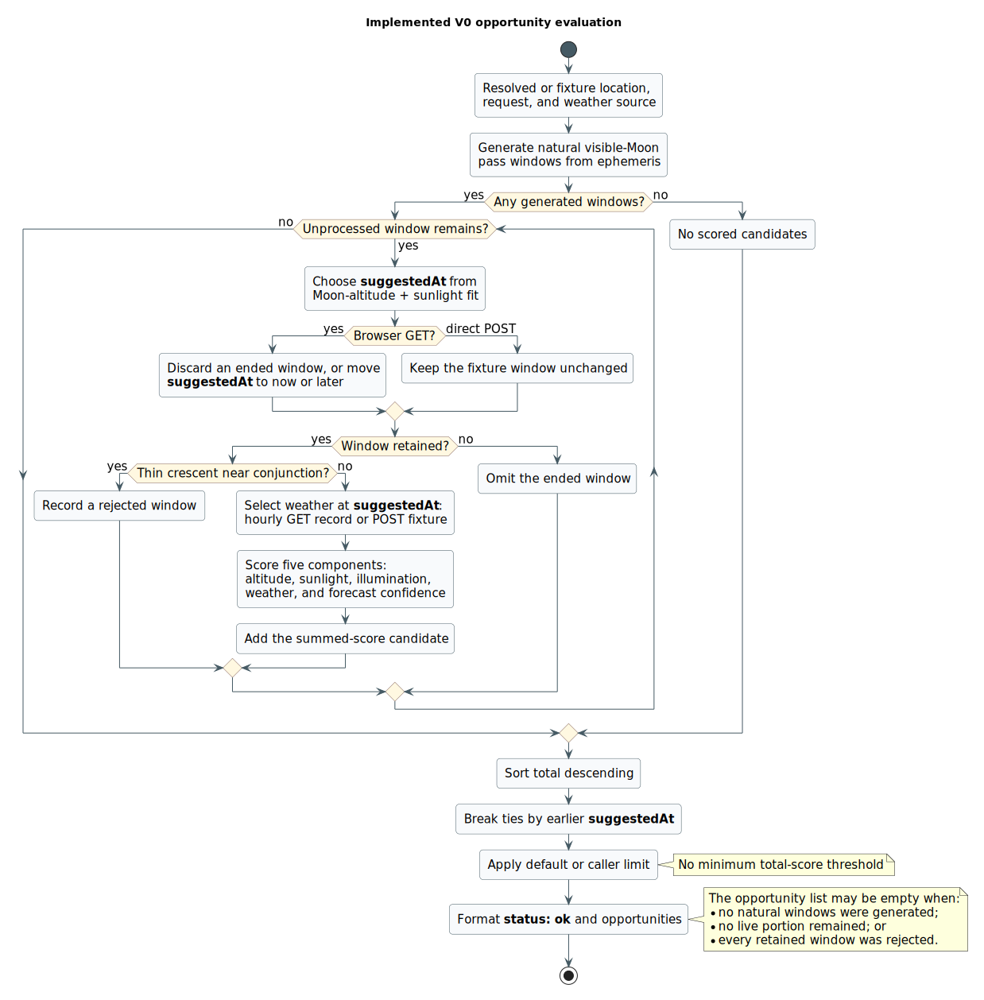

# Scoring Model

## Goal

The scoring model should rank upcoming Moon photography opportunities for a saved location. A strong opportunity has the Moon low enough to compose with foreground subjects, enough ambient light to expose the scene, and weather that is not obviously hostile.

The first model should be explainable. Users should see why an alert fired.

The core photographic problem is exposure balance. The Moon is much brighter than most foreground subjects and can blow out if the scene is exposed like a normal landscape. Moon Service should therefore favor windows where the Moon is visible but the sky and foreground still have enough Sun-driven ambient light that a photographer can preserve Moon detail and still keep useful scene detail.

## Candidate Window

V0 should generate natural visible-Moon windows, not many small scored windows
from fixed ephemeris samples. Low Moon remains the strongest default case, but
the model should also surface context Moon opportunities when ambient light and
conditions are promising.

For each location and search horizon, compute physical Moon passes and the
useful recommendation windows inside them. A pass is a continuous interval
where the apparent refracted Moon altitude is above the horizon. A
recommendation window is the portion of that pass where the Moon altitude is
between the horizon and the configured visible-Moon ceiling, initially:

```text
0 degrees <= Moon altitude <= 90 degrees
```

The interval boundaries are:

- Moonrise.
- Moonset.
- The Moon crossing upward through the configured visible-Moon ceiling when the ceiling is below zenith.
- The Moon crossing downward through the configured visible-Moon ceiling when the ceiling is below zenith.
- Search horizon start and end when a physical Moon pass is already in
  progress or still continuing at the edge of the request.

Local midnight is not an interval boundary. The model should preserve a
continuous Moonrise-to-Moonset pass even when it crosses from one civil date to
the next.

This usually produces zero, one, or two natural recommendation windows per
Moon pass:

- A rise-side window, usually from Moonrise or the search horizon edge to the
  upward ceiling crossing or pass peak.
- A set-side window, usually from the pass peak or downward ceiling crossing
  to Moonset or the search horizon edge.

The implementation may use coarse samples to bracket crossings before solving
for event times, but sampling cadence is not part of the product contract and
should not create artificial 5-minute or 15-minute opportunity slices.

Initial search horizon should match the selected weather provider's reliable
forecast range. If the provider only gives useful confidence for a few days, do
not pretend to predict beyond that.

## Window And Suggested Time Contract

The public result should distinguish the broad opportunity window from the
suggested best time inside that window.

- `startsAt` and `endsAt` describe the natural interval where the Moon is visible
  for the location and remains inside the configured visible-Moon ceiling.
- The target contract defines `suggestedAt` as the strongest moment inside the
  interval according to the full v0 rule-based score.
- The current implementation selects `suggestedAt` from five-minute candidates
  using Moon-altitude fit plus sunlight fit. Illumination, weather, and forecast
  confidence affect the later window ranking, not this time selection.
- The service should not present `suggestedAt` as a guaranteed best photograph,
  exact landmark alignment, or exact local-horizon visibility time.
- UI, feed, and calendar wording should say that local hills, buildings, trees,
  and foreground choices may affect exact visibility and composition.

## Initial Inputs

Moon geometry:

- Altitude.
- Azimuth.
- Illumination or phase.
- Sun-Moon angular separation, using topocentric Moon and Sun altitude/azimuth
  for the selected location.
- Rise/set timing.
- Observer elevation when available.

Sun and light:

- Sun altitude.
- Daylight, golden hour, civil twilight, nautical twilight, or night bucket.
- Relative timing between Sun state and Moon position.
- Exposure-balance context: whether ambient light is likely sufficient for foreground detail while keeping Moon highlights under control.

Weather:

- Cloud cover.
- Low, mid, and high cloud cover when available.
- Precipitation probability.
- Precipitation amount.
- Visibility.
- Forecast confidence if available.
- Optional condition summary, such as clear, partly cloudy, fog, rain, snow, or overcast.

User preferences:

- Location.
- Alert lead time.
- Optional preferred window type, such as low full Moon, crescent, twilight, or daylight Moon.
- Optional weather tolerance or profile later, kept request-scoped until accounts exist.

Future recurring event context:

- Optional recurring subject or event pattern.
- Days of week, recurrence rule, or known operating calendar.
- Approximate local time or time range.
- Early/late tolerance window.
- Optional route, direction, azimuth, or subject position when known.
- Source confidence and active date range.

## V0 Weather Assessment

This section describes the target V0 segmentation model. The current engine
uses the hourly forecast record covering `suggestedAt`; it does not yet split
and merge natural windows at weather-change boundaries.

Assess weather by forecast change intervals, not by a fixed Moon/Sun sampling
cadence.

The base astronomy step should produce natural visible-Moon windows. Weather
then splits those windows only where the forecast state changes enough to affect
the recommendation. Adjacent intervals with the same derived weather class
should be merged back together.

Cloud cover is the most important weather input for Moon photography. Open-Meteo
exposes total, low, mid, and high cloud-cover fields as hourly variables, not as
15-minute variables. The 15-minute variable set includes some useful secondary
fields, such as precipitation amount, visibility, and weather code, but also
many fields that do not drive the first scoring model, such as temperature,
humidity, wind, and radiation.

V0 should therefore use hourly forecast fields as the opportunity segmentation
source. This keeps the model aligned with the most important weather signal
instead of adding 15-minute complexity around less decisive inputs.

The first weather segmentation pipeline should be:

1. Fetch hourly cloud, precipitation probability, precipitation amount, weather
   code, and visibility fields for the forecast horizon.
2. Normalize each hourly provider timestep into a coarse weather class.
3. Build intervals whose boundaries are provider forecast timestamps and
   provider value changes, not an arbitrary ephemeris sampling step.
4. Merge adjacent intervals when the weather class and decision-relevant facts
   are equivalent.
5. Intersect the merged weather intervals with the natural visible-Moon windows.

Window or segment-level weather facts should include:

- Mean and maximum total cloud cover.
- Mean or maximum low, mid, and high cloud cover when available.
- Maximum precipitation probability.
- Total or maximum precipitation amount.
- Minimum visibility.
- Dominant and worst weather code.

The weather label should be intentionally coarse, for example:

```text
clear
mostly_clear
partly_cloudy
mostly_cloudy
mixed
overcast
precipitation_risk
poor_visibility
```

If the forecast is clear or overcast across the whole night, a single merged
window assessment is enough. The product should avoid implying that tomorrow's
weather can be trusted more precisely than the provider data and model
confidence support. 15-minute Open-Meteo fields can be revisited later for
current-condition display or short-term precipitation refinement, but they
should not drive the first scoring contract.

## V0 Selection Rules

These are target policy rules. In the current implementation, only the
thin-crescent near-conjunction rule below hard-rejects a retained natural
window. Weather and visibility contribute to its score, and there is no minimum
total-score threshold.

Reject opportunities when:

- Moon is below the horizon.
- Moon altitude is too high for the low-Moon use case.
- The ordinary Moon opportunity is an extremely thin near-conjunction crescent:
  initially, Moon illumination below 1 percent and topocentric Sun-Moon
  separation below 8 degrees.
- Weather is clearly hostile across the candidate window.
- Visibility is below the selected threshold.
- Forecast confidence is too low to produce an alert, if the provider exposes confidence.

Suggested starting thresholds:

- Moon altitude: 0 to 12 degrees.
- Precipitation probability: below 30 percent.
- Visibility: provider-specific, but reject fog/very poor visibility.
- Cloud cover: reject very high cloud cover, but do not reject partial clouds automatically.

These numbers are placeholders. Validate them against real examples before treating them as product behavior.

## Observer Elevation And Horizon Obstruction

Distinguish two concepts:

- Observer elevation: the location's height above sea level. Ephemeris calculations can use this for small parallax/refraction corrections.
- Horizon obstruction: terrain, hills, buildings, or trees that raise the effective horizon in a specific azimuth direction.

Observer elevation is safe to include in V0 when the geocoder provides it. It does not solve hilly terrain visibility.

Terrain horizon should be deferred until the product supports exact shooting positions. City-level lookup is too vague for terrain obstruction because "Prague" can mean very different viewpoints. Once exact positions exist, a later terrain model can estimate:

```text
observer location + azimuth -> terrain horizon altitude
```

Then visibility can be checked with:

```text
moon_visible = moon_altitude > terrain_horizon_altitude + margin
```

V0 should phrase low-horizon opportunities cautiously:

```text
Local hills, buildings, or trees may affect exact visibility near the horizon.
```

## V0 Window Assessment

Do not make the first public model look more exact than its inputs. The
important output is a ranked set of natural windows with clear facts and a short
explanation.

The service may keep a small numeric score internally to sort windows, but the
v0 product should treat the score as a ranking aid, not a minute-accurate
prediction. A coarse public label is acceptable:

```text
excellent
good
possible
poor
```

Sort candidate windows by:

- Weather usability across the merged forecast segment.
- Useful ambient-light overlap, especially golden hour and civil twilight.
- Low-Moon geometry within the window.
- Moon illumination fit for the default photography profile.
- Forecast confidence, including forecast age and distance into the horizon.
- Earlier local time when quality is otherwise similar.

The current implementation realizes this direction with five additive
component scores—Moon altitude, sunlight, illumination, weather, and forecast
confidence. It orders total score descending, uses earlier `suggestedAt` as the
tie-breaker, and applies the result limit without a minimum-score cutoff.

Moon altitude assessment:

- Prefer portions near 1 to 6 degrees for classic horizon compositions.
- Treat 6 to 12 degrees as strong but slightly less ideal than the lowest clean horizon range.
- Treat 12 to 40 degrees as context Moon territory: not a premium horizon shot, but still useful with the right ambient light, foreground, trees, aircraft, birds, or skyline elements.
- Treat 40 to 90 degrees as weaker but not invalid. Good light, balanced illumination, and weather can still make a decent shot.
- Treat extremely low altitudes cautiously because terrain, buildings, and trees are not modeled.

Sun/light fit:

- Favor golden hour and civil twilight.
- Allow daylight when Moon contrast is plausible and the Moon is visible enough to photograph.
- Penalize full night for the MVP's exposure-balance goal, while keeping it available for later night-photo modes.
- Treat nautical twilight and night cautiously: they may still work, but foreground detail is harder to retain without blending, artificial light, silhouette intent, or high dynamic range technique.

Moon illumination fit:

- Favor full or near-full Moon when all else is equal.
- Do not reject crescent Moon opportunities solely because illumination is low.
- Do reject ordinary opportunities where the crescent is both extremely thin and
  too close to the Sun to be practically visible. This protects cases such as
  Prague and Abu Dhabi on 2026-07-14, where low-altitude windows near new Moon
  can otherwise look attractive despite only about 0.1 to 0.3 percent
  illumination and a Sun-Moon separation of only a few degrees.
- Low crescent windows can still be useful when the Moon is close to the horizon, the sky is clear enough, and ambient light supports the intended photograph.

Exposure-balance explanation:

- Surface Sun altitude and Moon illumination together. A thin crescent in golden hour may be easy to balance; a bright full Moon in deep night may require exposing for the Moon and losing foreground detail.
- Avoid implying that the system knows the user's exact exposure settings. Camera dynamic range, lens, focal length, haze, atmospheric extinction, and post-processing choices matter.
- Prefer wording such as "ambient light should help preserve foreground detail" over exact exposure promises.
- Return a simple exposure-balance label and explanation with each opportunity so the user can understand whether the scene is likely balanced, Moon-bright with foreground risk, a subtle crescent, or likely dark foreground.

Weather fit:

- Clear sky is good.
- Partial or textured cloud can be excellent.
- Overcast, fog, rain, snow, and poor visibility should suppress or strongly lower a window when they dominate the whole interval.

Forecast confidence:

- Use confidence to reduce alert urgency.
- If confidence is not available, expose a neutral confidence state rather than fabricating precision.

## Implemented V0 Evaluation Flow

The diagram below describes executable behavior, not every target rule above.
For browser GET, the engine obtains an hourly forecast before entering this
pipeline and uses the record covering each retained window's `suggestedAt`.
Direct POST instead uses the fixed Prague fixture weather.

[](diagrams/scoring-flow.svg)

[PlantUML source](diagrams/scoring-flow.puml)

In prose: generation can yield no windows; live GET adjustment can remove every
ended window; and the visibility rule can reject every retained window. Each
case still produces a successful `ok` response with an empty opportunity list.
Weather currently lowers or raises a component score rather than rejecting a
window. The only explicit rejection is Moon illumination below 1 percent
together with Sun-Moon separation below 8 degrees.

The implementation authority is the
[window generator](../prototypes/jvm-scoring/src/main/java/dev/moonservice/scoringprototype/window/WindowGenerator.java),
[live-window selector](../backend/src/main/java/dev/moonservice/backend/opportunity/scoring/LiveOpportunityWindowSelector.java),
[opportunity pipeline](../prototypes/jvm-scoring/src/main/java/dev/moonservice/scoringprototype/service/OpportunityService.java),
and [scoring model](../prototypes/jvm-scoring/src/main/java/dev/moonservice/scoringprototype/scoring/ScoringModel.java).

## V0 Scoring Policy Tests

The first executable scoring tests should protect product policy, not claim
empirical validation. They should use representative synthetic Moon, Sun, and
weather facts to ensure the rule-based score stays aligned with the MVP promise.

Required v0 policy expectations:

- A low Moon with useful ambient light should rank above comparable deep-night
  cases because foreground detail is more plausible.
- A low deep-night full Moon can remain possible, but should carry a foreground
  risk explanation.
- High or high-context Moon windows are allowed, but should rank below otherwise
  comparable low-Moon windows for the default photographer-balanced profile.
- Hostile weather should strongly lower an otherwise strong geometry/light case.
- A thin crescent in favorable twilight should remain possible and should use
  subtle-crescent explanation text rather than being rejected only for low
  illumination.
- A near-conjunction thin crescent should be rejected for ordinary Moon
  opportunities when Sun-Moon separation is below the documented visibility
  threshold.
- Tests should prefer relative ordering and public labels over brittle exact
  total-score assertions.

These tests are regression guardrails for v0 product judgment. They do not
replace empirical calibration against real observations or historical photos,
which is tracked separately by
[#33](https://github.com/rapucha/moon-service/issues/33).

## Empirical Calibration Governance

Calibration feedback is evidence for later judgment, not an automatic input to
the live score. Keep raw reports out of fixtures and source control. After a
period of collection, an owner-selected corpus may publish only authored,
reviewed cases with new case IDs, coordinates rounded to three decimals,
paraphrased notes, and preserved timing confidence.

The owner decides when the evidence is sufficient for curation. There is no
numeric report quota. Positive, marginal, and negative examples are useful,
but a missing outcome class does not block inspection when it is recorded as
an explicit calibration gap. The corpus must also state selection limits and
remaining uncertainty.

Timing confidence limits what a report can support:

- Precise, consistent timestamps may support a precise suggested-time change.
- Broad or uncertain timing may support qualitative scoring, wording, or
  caveat changes.
- Evidence uncertain by hours, or marked `date_only`, cannot justify moving a
  recommendation by a precise number of minutes.

Keep two later change types separate:

- Scoring work changes weights, thresholds, classifications, or explanations.
- Window-selection work changes how the suggested instant is chosen inside an
  opportunity window.

Create either change only after a reviewed corpus supports it, and link the
change back to specific authored cases. Preserve the v0 policy tests unless
the evidence justifies changing their stated product judgment. If the corpus
supports neither type of change, document that current behavior remains
provisionally acceptable, name the remaining uncertainty and calibration gaps,
and then close #33 without manufacturing a score adjustment.

## Future Recurring Event Context

Some opportunities are valuable because a repeatable real-world subject may
appear during a usable Moon window. Examples include an aircraft approach that
usually crosses a view at about the same local time, a train or ferry on a
regular schedule, a weekly public event, or another user-defined recurring
pattern.

This should be modeled as event context layered onto the existing astronomy,
light, and weather score. Candidate generation should still begin with natural
visible-Moon windows. The recurring event layer then builds expected event
occurrence windows, expands them by the configured early/late tolerance, and
intersects them with the Moon/weather windows.

Event-aware score components should include:

- Whether the event uncertainty window overlaps a useful Moon window.
- How close the expected event time is to the best Moon/light/weather portion of
  the window.
- The amount of timing tolerance needed for the match.
- Source reliability, cancellation risk, and schedule age.
- Direction or azimuth fit when the event has a known route or subject position.
- The base Moon, light, exposure-balance, and weather score.

The output should explain uncertainty directly. Prefer wording such as:

```text
The Moon window is strong from 18:40 to 19:15. This recurring flight often
passes between 18:50 and 19:05, but timing can shift by about 15 minutes.
```

Do not present event-aware opportunities as confirmed sightings unless a live
provider is deliberately integrated. For flights and other transport examples,
delays, early arrivals, route changes, cancellations, and provider gaps are part
of the model and should reduce confidence or broaden the displayed time range.

Subscriptions for recurring event-aware opportunities should generate a rolling
set of future candidate occurrences, not a single static alert. Without accounts,
the first version should be request-scoped, shareable by URL, or represented as
a public feed/calendar link when the event pattern is nonpersonal. Personal
saved event subscriptions require the privacy model to cover stored preferences,
notification delivery, retention, and deletion.

## Future Scoring Profiles

V0 should start with one default `photographer_balanced` scoring profile. The
anonymous web lookup should stay simple until real usage shows which controls
matter.

Later, scoring should support user-selectable profiles or preferences without
changing candidate generation. Candidate windows can remain broad, while the
score changes based on the photographer's goal.

Possible profile presets:

- `photographer_balanced`: default mix of low or context Moon, useful ambient light, and reasonable weather.
- `crescent_twilight`: favors thin or modest crescents near golden hour or civil twilight.
- `full_moon_horizon`: favors high illumination when the Moon is low, especially near rise/set.
- `daylight_moon`: allows and favors visible daylight Moon opportunities with enough contrast.
- `night_silhouette`: accepts darker foreground conditions when silhouette or night-landscape intent is explicit.
- `recurring_event_overlap`: favors Moon windows that overlap an approximate
  recurring event pattern, with explicit timing uncertainty.

Possible preference controls:

- Light preference: daylight, golden hour, civil twilight, nautical twilight, night, or any.
- Moon type: crescent, quarter, gibbous, full, or any.
- Foreground goal: balanced exposure, silhouette, or night landscape.
- Moon altitude range: very low, low, context, high context, or any visible Moon.
- Weather tolerance: clear only, partial clouds welcome, or dramatic clouds allowed.
- Travel or setup lead time.
- Recurring event pattern, days, local time window, and early/late tolerance.

Preferences should adjust weights and explanations, not hide the raw facts. For
example, a daylight profile may score daylight higher than the v0 default, while
the default profile continues to favor golden hour and civil twilight. The UI
should still show Sun altitude, Moon illumination, weather, and exposure-balance
text so users can override the recommendation with their own judgment.

Do not add server-side user profiles in v0 just to support scoring preferences.
If profile selection is added before accounts, keep it request-scoped or stored
only in browser `localStorage`.

## Alert Explanation

Each opportunity should include a short explanation:

```text
Moon 4.2 degrees above the east horizon near civil twilight. Forecast is partly cloudy with low precipitation risk.
```

Include the raw facts needed for a photographer to make a decision:

- Date/time range.
- Moon altitude and azimuth.
- Moon illumination.
- Sun state.
- Weather summary.
- Score or confidence label.
- Exposure-balance hint, especially when the Moon is very bright, very thin, or the Sun is below civil twilight.

## Known Limitations

V0 ignores:

- Eclipse event opportunities. Solar and lunar eclipses need an explicit
  event-aware result path with their own safety, phase timing, visibility, feed,
  and calendar rules. Do not weaken the ordinary near-conjunction filter to make
  eclipse cases fit normal Moon-pass scoring; that work is tracked separately by
  [#80](https://github.com/rapucha/moon-service/issues/80).
- Terrain horizon elevation and local obstruction.
- Buildings, trees, skylines, and local obstructions.
- Exact subject alignment.
- Shooting position versus subject position.
- Lens focal length and field of view.
- Forecast model disagreement unless the provider exposes it.
- Recurring event delays, early arrivals, route changes, cancellations, or
  schedule drift unless an event provider is integrated later.

These are acceptable limitations for an alert-first MVP, but the UI should avoid claiming exact composition guidance.

## Research Needed

- Initial Astronomy Engine validation and the accepted `2.1.19` build policy
  are recorded in `docs/ephemeris-research.md`. Rerun the documented reference
  validation before any dependency upgrade; the MVP policy was resolved by
  [#17](https://github.com/rapucha/moon-service/issues/17).
- Validate the recommended weather provider integration against local forecast
  examples and map its fields into the model as part of
  [#14](https://github.com/rapucha/moon-service/issues/14).
- Collect real sample days for known good and bad Moon photography conditions
  and tune thresholds from examples as part of
  [#33](https://github.com/rapucha/moon-service/issues/33).
- Collect real recurring-event examples and decide whether v1 should support
  only user-entered patterns, curated public patterns, or live provider-backed
  schedules as part of [#3](https://github.com/rapucha/moon-service/issues/3).
