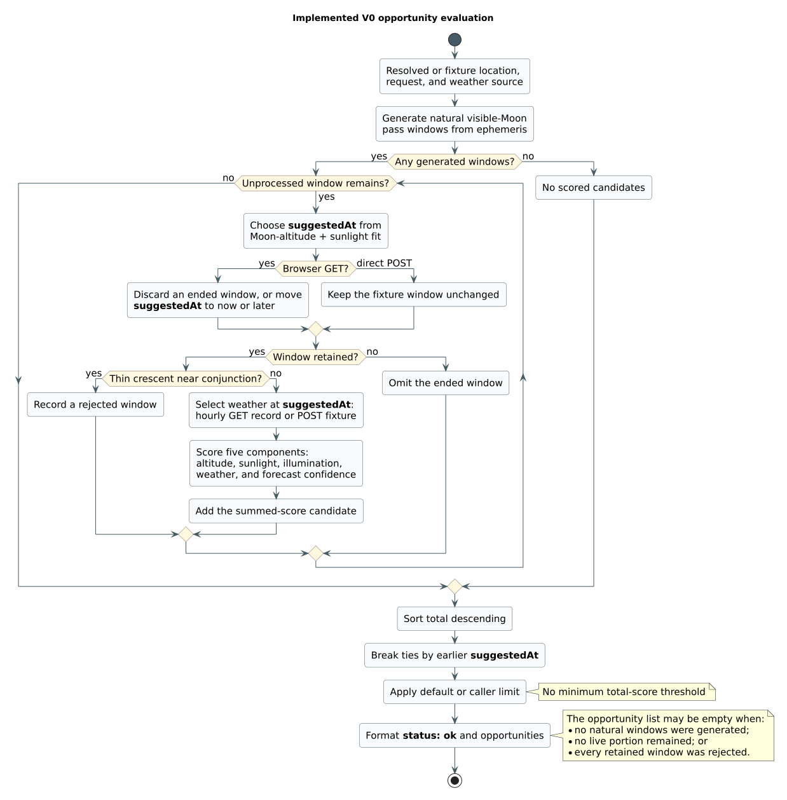

# Scoring Model

## Goal

The scoring model should rank upcoming Moon photography opportunities for a
saved location. A strong opportunity has the Moon low enough to compose with
foreground subjects, enough ambient light to expose the scene, and no clearly
hostile weather.

The first model should explain its results. Users should see why an alert
fired.

The main photography problem is balancing the exposure. The Moon is much
brighter than most foreground subjects. It can blow out when a photographer
exposes the image like a normal landscape. Moon Service should favor windows
when the Moon is visible and the sky and foreground still have enough
Sun-driven ambient light that a photographer can preserve Moon detail and
useful scene detail.

## Candidate Window

V0 should generate natural visible-Moon windows instead of turning fixed
ephemeris samples into many small scored windows. A low Moon remains the
strongest default case. The model should also show context Moon opportunities
when the ambient light and other conditions are promising.

For each location and search horizon, calculate the physical Moon passes and
the useful recommendation windows within them. A pass is one continuous
interval when the apparent refracted Moon altitude is above the horizon. A
recommendation window is the part of a pass when the Moon altitude stays
between the horizon and the configured visible-Moon ceiling. The initial
ceiling is:

```text
0 degrees <= Moon altitude <= 90 degrees
```

Use these interval boundaries:

- Moonrise.
- Moonset.
- The Moon crossing upward through the configured visible-Moon ceiling when
  the ceiling is below zenith.
- The Moon crossing downward through the configured visible-Moon ceiling when
  the ceiling is below zenith.
- Search horizon start and end when a physical Moon pass is already in
  progress or still continuing at the edge of the request.

Do not use local midnight as an interval boundary. The model should keep one
continuous Moonrise-to-Moonset pass when it crosses from one civil date to the
next.

A Moon pass usually produces zero, one, or two natural recommendation windows:

- A rise-side window, usually from Moonrise or the search horizon edge to the
  upward ceiling crossing or pass peak.
- A set-side window, usually from the pass peak or downward ceiling crossing
  to Moonset or the search horizon edge.

The implementation may use coarse samples to bracket a crossing before it
solves for the event time. Sampling cadence is not part of the product
contract. It should not create artificial 5-minute or 15-minute opportunity
slices.

The initial search horizon should match the reliable range of the selected
weather provider. If the provider gives useful confidence for only a few days,
do not claim predictions beyond that range.

## Window And Suggested Time Contract

The public result should report the broad opportunity window separately from
the suggested best time within it.

- Without active hard preferences, `startsAt` and `endsAt` describe the natural
  interval when the Moon is visible from the location and stays within the
  configured visible-Moon ceiling.
- With active version 1 preferences, `startsAt` and `endsAt` bound a practical
  recommendation envelope assembled from precise matching fragments. Nearby
  fragments may include a short nonmatching gap under the rule below.
- Serialized `startsAt`, `suggestedAt`, and `endsAt` values remain precise;
  grouping does not round them.
- `suggestedAt` is a precisely calculated instant that matches every active
  preference. It is selected within one retained matching fragment, not from a
  tolerated nonmatching gap.
- The current implementation selects each fragment suggestion from five-minute
  candidates using Moon-altitude fit plus sunlight fit. A grouped opportunity
  compares those member suggestions with the same fit and earlier-instant
  tie-break. Illumination, weather, and forecast confidence affect later window
  ranking, not this time selection.
- The service should not describe `suggestedAt` as a guaranteed best photograph,
  an exact landmark alignment, or an exact local-horizon visibility time.
- UI, feed, and calendar wording should say that local hills, buildings, trees,
  and foreground choices may affect exact visibility and composition.

## Version 1 Hard Preferences

Version 1 preferences are typed, request-scoped hard filters. A present
preference object must carry version `1`. They remove unusable times before
ranking; they do not adjust scoring weights. The object and every filter inside
it are optional. An absent object and a version 1 object with no active filters
must preserve the preference-free candidates and scores and use the request's
selected product order.

The typed model supports:

- one inclusive `altitudeDegrees` range;
- one optional included azimuth sector and one optional excluded obstruction
  sector;
- either one local-clock window or ambient-light buckets;
- one or more named Moon phases; and
- one or more inclusive `brightLimbOrientationDegrees` ranges.

Altitude endpoints are inclusive. Azimuth and bright-limb ranges use absolute
degrees in `[0, 360)`, and a directed range whose start is greater than its end
crosses `0°`; equal endpoints are invalid. When both azimuth sectors are
present, the excluded sector must stay inside the directed included sector.
The named phases use the existing phase-angle ranges:
`new_moon`, `waxing_crescent`, `first_quarter`, `waxing_gibbous`, `full_moon`,
`waning_gibbous`, `last_quarter`, and `waning_crescent`.

The local-clock window uses the resolved location's timezone, not the browser
timezone. Its start is inclusive and its end is exclusive. A later start
crosses midnight. A daylight-saving gap contains no matching instant; both
instants in an overlap match when their local clock value is allowed.
Ambient-light mode instead uses `daylight`, `golden_hour`, `civil_twilight`,
`nautical_twilight`, or `night` from the existing Sun-altitude rules. One
request cannot combine the two time modes.

Bright-limb ranges use the observer-oriented clockwise convention:
`0°` points toward local zenith and `90°` points right toward increasing
azimuth. A sample with no `brightLimbTiltDegrees` does not match an active
bright-limb filter. A sample in the existing `full_moon` bucket
`[157.5°, 202.5°)` also does not match an active bright-limb filter, even if
the sample contains a numeric tilt. This rule applies whether `full_moon` is
the only selected named phase, one of several selected phases, or named phases
are unrestricted. Without an active bright-limb filter, Full samples keep the
existing named-phase behavior. `northPoleTiltDegrees` is not a preference
field.

### Evaluation order

The opportunity engine applies active preferences in this order:

1. `WindowGenerator` generates every complete natural candidate window inside
   each physical Moon pass.
2. The hard filter evaluates the complete window. A provisional suggestion or
   preliminary score cannot remove another matching part of that window.
3. The hard filter refines every filter transition and splits the window into
   zero, one, or several continuous matching fragments.
4. For a live search, the hard filter drops each fragment whose `endsAt` is not
   after the request's captured `notBefore`. It finalizes every other fragment
   with one precise matching suggestion no earlier than the later of the
   fragment start and `notBefore`. An ongoing fragment keeps its original
   start.
5. Before scoring and ranking, the engine groups consecutive finalized
   fragments when they have the same `moonPass.id`, their natural source-window
   coverage touches or overlaps, and each precise gap is no more than ten
   minutes. The rule is transitive across several qualifying gaps. It does not
   restore an expired fragment, bridge a system-created natural-window gap, or
   join different physical passes.
6. An ungrouped fragment remains unchanged. A grouped opportunity keeps the
   earliest retained start and latest retained end and selects from its
   members' precise suggestions before that end. It prefers suggestions that
   pass the near-conjunction visibility rule, then uses the existing
   candidate-fit and earlier-instant tie-break. If every member fails the
   visibility rule, the existing downstream rejection still records the
   grouped opportunity. The selected member supplies the window kind.
7. The engine calculates score, selected weather, and displayed facts for the
   selected suggestion, applies the selected product comparator to all retained
   opportunities, and then applies the ordinary global result limit.

The practical envelope may contain an active-preference mismatch, including an
altitude, azimuth, time or light, phase, or bright-limb mismatch. The selected
suggestion still matches every active preference precisely. The combined
`moonPath` is the chronological, deduplicated union of member path points and
the combined boundaries and suggestion; it does not claim continuous
preference match through a tolerated gap.

Several fragments separated by a gap longer than ten minutes, a system-created
natural-window gap, or a physical-pass boundary remain flat opportunities.
The engine does not otherwise guarantee one result per pass. Preferences add
no score component and do not change the selected product order. The engine
applies that order after filtering, grouping, eligibility, and scoring, and
before the result limit.

### Boundary and sampling contract

When a filter changes between adjacent astronomy samples, the hard filter
calculates the transition instead of cutting at the coarse sample time. This
applies to lunar-disk azimuth overlap, numeric and circular ranges, phase
changes, Sun-altitude bucket boundaries, and exact local-clock boundaries.

The hard filter and the azimuth mask use the same chronological astronomy
samples and crossing-refinement calculation. The current implementation uses a
five-minute grid anchored at the physical pass start, adds natural-window
boundaries, and refines a detected transition to one-second tolerance.
Sampling brackets numerical crossings; it is not an analytical guarantee. An
enter-and-exit event that occurs entirely between two evaluated samples may be
missed. The contract does not impose a minimum azimuth-sector width to hide
that limitation. This precise calculation produces matching fragments and
diagnostics; the practical-envelope rule above determines how nearby fragments
are presented as opportunities.

### Lunar-disk azimuth filter

Azimuth sectors represent absolute compass bearings. The allowed set is the
included sector minus the optional excluded obstruction. When only an excluded
sector is present, the full compass is implicitly included.

`EphemerisSampler` supplies the actual topocentric apparent lunar angular
radius for the location and instant. The hard filter projects that radius onto
compass bearing at the sample altitude with spherical geometry. It does not use
the Moon's center alone or a fixed azimuth offset. When the lunar disk contains
the zenith, its bearing footprint spans the full compass.

A sample matches when the visible lunar disk has a positive-area intersection
with the allowed set. A partially allowed disk matches. A disk entirely
outside the included sector or completely hidden by the obstruction does not.
An obstruction narrower than the disk's bearing footprint may be unable to
hide the disk completely. A zero-area tangent contact does not match.

### Azimuth mask and filter diagnostics

When azimuth filtering is active, the engine also calculates every continuous
azimuth-only matching interval across each complete physical pass. It does this
before applying another hard filter, ranking retained intervals, or applying
the result limit. The mask stays within the inclusive domain from
`moonPass.startsAt` through `moonPass.endsAt`; a search-horizon edge may already
truncate that domain.

Mask intervals are sorted, non-overlapping transition ranges. The engine keeps
the complete mask for every physical pass represented by a returned
opportunity. Opportunities with the same `moonPass.id` use the same mask.
Azimuth filtering inactive means no mask. The mask is authoritative for the
backend's azimuth decision; clients must not infer it from useful intervals or
center-position path samples. Applying live `notBefore` does not shorten it.

The preference result reports normalized active filters and one excluded-sample
count. Count a distinct sample once when the engine considered it as a possible
recommendation and any active filter rejected it, even when several filters
failed. Do not count display-only Moon-pass samples, path samples, or samples
used only to refine a crossing. Do not return excluded samples or opportunities
as a second result list.

## Initial Inputs

Moon geometry:

- Altitude.
- Azimuth.
- Illumination or phase.
- Sun-Moon angular separation, using topocentric Moon and Sun altitude/azimuth
  for the selected location.
- Rise/set timing.
- Observer elevation when available.

Sun and light:

- Sun altitude.
- Daylight, golden hour, civil twilight, nautical twilight, or night bucket.
- Relative timing between Sun state and Moon position.
- Exposure-balance context: whether ambient light is likely to preserve
  foreground detail while keeping Moon highlights under control.

Weather:

- Cloud cover.
- Low, mid, and high cloud cover when available.
- Precipitation probability.
- Precipitation amount.
- Visibility.
- Forecast confidence if available.
- Optional condition summary, such as clear, partly cloudy, fog, rain, snow, or
  overcast.

User preferences:

- Location.
- Alert lead time.
- Optional preferred window type, such as low full Moon, crescent, twilight, or
  daylight Moon.
- Optional weather tolerance or profile later. Keep it request-scoped until
  accounts exist.

Future recurring event context:

- Optional recurring subject or event pattern.
- Days of week, recurrence rule, or known operating calendar.
- Approximate local time or time range.
- Early/late tolerance window.
- Optional route, direction, azimuth, or subject position when known.
- Source confidence and active date range.

## V0 Weather Assessment

This section defines the target V0 weather segmentation. The current engine
uses the hourly forecast record that covers `suggestedAt`. It does not yet split
and merge natural windows where the weather changes.

Use forecast-change intervals to assess weather. Do not use a fixed Moon/Sun
sampling cadence.

The astronomy step should first produce natural visible-Moon windows. Weather
then splits a window only when the forecast changes enough to affect the
recommendation. Adjacent intervals with the same derived weather class and
equivalent decision-relevant facts should be merged again.

Cloud cover is the most important weather input for Moon photography.
Open-Meteo provides total, low, mid, and high cloud-cover fields as hourly
variables, not 15-minute variables. Its 15-minute variables include some useful
secondary fields, such as precipitation amount, visibility, and weather code.
They also include many fields that do not drive the first scoring model, such
as temperature, humidity, wind, and radiation.

V0 should therefore use hourly forecast fields to divide natural windows into
weather segments. This uses the most important weather signal without adding
15-minute processing for less important inputs.

The first weather pipeline should run in this order:

1. Fetch hourly cloud, precipitation probability, precipitation amount, weather
   code, and visibility fields for the forecast horizon.
2. Convert each hourly provider timestep into a coarse weather class.
3. Build intervals from provider forecast timestamps and provider value
   changes. Do not use an arbitrary ephemeris sampling step as a boundary.
4. Merge adjacent intervals when the weather class and decision-relevant facts
   are equivalent.
5. Intersect the merged weather intervals with the natural visible-Moon windows.

Each window or segment should include these weather facts:

- Mean and maximum total cloud cover.
- Mean or maximum low, mid, and high cloud cover when available.
- Maximum precipitation probability.
- Total or maximum precipitation amount.
- Minimum visibility.
- Dominant and worst weather code.

The weather label should stay deliberately coarse, for example:

```text
clear
mostly_clear
partly_cloudy
mostly_cloudy
mixed
overcast
precipitation_risk
poor_visibility
```

When the forecast stays clear or overcast for the whole night, one merged
window assessment is enough. The product should not imply that tomorrow's
weather can be trusted more precisely than the provider data and model
confidence support.
15-minute Open-Meteo fields can be reconsidered later for current-condition
display or short-term precipitation detail. They should not drive the first
scoring contract.

## V0 Selection Rules

The rules below define the target policy. For a preference-free request, the
current implementation hard-rejects a retained natural window only under the
thin-crescent near-conjunction rule. Active version 1 preferences separately
remove nonmatching intervals as described above. Weather and visibility change
the score, and the current implementation has no minimum total-score threshold.

Reject opportunities when:

- Moon is below the horizon.
- Moon altitude is too high for the low-Moon use case.
- The ordinary Moon opportunity is an extremely thin near-conjunction crescent:
  initially, Moon illumination below 1 percent and topocentric Sun-Moon
  separation below 8 degrees.
- Weather is clearly hostile across the candidate window.
- Visibility is below the selected threshold.
- Forecast confidence is too low to produce an alert, if the provider exposes
  confidence.

Suggested starting thresholds:

- Moon altitude: 0 to 12 degrees.
- Precipitation probability: below 30 percent.
- Visibility: provider-specific, but reject fog/very poor visibility.
- Cloud cover: reject very high cloud cover, but do not reject partial clouds
  automatically.

These numbers are placeholders. Validate them against real examples before
treating them as product behavior.

## Observer Elevation And Horizon Obstruction

Keep these two concepts separate:

- Observer elevation is the location's height above sea level. Ephemeris
  calculations can use it for small parallax/refraction corrections.
- Horizon obstruction is terrain, hills, buildings, or trees that raise the
  effective horizon in a specific azimuth direction.

Including observer elevation in V0 is safe when the geocoder provides it.
Observer elevation does not solve visibility over hilly terrain.

The product should defer terrain-horizon support until it supports exact
shooting positions. A city-level lookup is too vague because "Prague" can mean
very different viewpoints. Once exact positions exist, a later terrain model
can estimate:

```text
observer location + azimuth -> terrain horizon altitude
```

The model can then check visibility with:

```text
moon_visible = moon_altitude > terrain_horizon_altitude + margin
```

V0 should describe low-horizon opportunities cautiously:

```text
Local hills, buildings, or trees may affect exact visibility near the horizon.
```

## V0 Window Assessment

Do not make the first public model claim more precision than its inputs
support. The important output is a set of ranked natural windows or
preference-retained intervals, clear facts, and a short explanation.

The service may use a small internal numeric score to sort windows. The v0
product should present that score as a ranking aid, not a minute-accurate
prediction. A coarse public label is acceptable:

```text
excellent
good
possible
poor
```

The total score reflects:

- Weather usability across the merged forecast segment.
- Useful ambient-light overlap, especially golden hour and civil twilight.
- Low-Moon geometry within the window.
- Moon illumination fit for the default photography profile.
- Forecast confidence, including forecast age and distance into the horizon.

The current implementation adds five component scores: Moon altitude,
sunlight, illumination, weather, and forecast confidence. The product API
supports two result orders. `best_match` sorts total score descending and uses
the existing earlier-`suggestedAt` tie-break. `soonest` sorts `suggestedAt`
ascending, total score descending, then stable opportunity `id` ascending. If
the IDs are equal, stable sorting retains deterministic source order. Both
comparators run across the complete eligible set before the global result
limit, without a minimum-score cutoff. The direct fixture POST remains score
ordered with its caller-supplied limit.

Moon altitude assessment:

- Prefer portions near 1 to 6 degrees for classic horizon compositions.
- Treat 6 to 12 degrees as strong but slightly less ideal than the lowest clean
  horizon range.
- Treat 12 to 40 degrees as context Moon territory. It is not a premium horizon
  shot, but is still useful with the right ambient light, foreground,
  trees, aircraft, birds, or skyline elements.
- Treat 40 to 90 degrees as weaker but not invalid. Good light, balanced
  illumination, and weather can still make a decent shot.
- Treat extremely low altitudes cautiously because the model does not include
  terrain, buildings, or trees.

Sun/light fit:

- Favor golden hour and civil twilight.
- Allow daylight when Moon contrast is plausible and the Moon is visible enough
  to photograph.
- Penalize full night for the MVP's exposure-balance goal, while keeping it
  available for later night-photo modes.
- Treat nautical twilight and night cautiously. They may still work, but
  retaining foreground detail is harder without blending, artificial light,
  silhouette intent, or high dynamic range technique.

Moon illumination fit:

- Favor full or near-full Moon when all else is equal.
- Do not reject crescent Moon opportunities solely because illumination is low.
- Do reject ordinary opportunities where the crescent is both extremely thin and
  too close to the Sun to be practically visible. This protects cases such as
  Prague and Abu Dhabi on 2026-07-14, where low-altitude windows near new Moon
  can otherwise look attractive despite only about 0.1 to 0.3 percent
  illumination and a Sun-Moon separation of only a few degrees.
- Low crescent windows can still be useful when the Moon is close to the
  horizon, the sky is clear enough, and ambient light supports the intended
  photograph.

Exposure-balance explanation:

- Show Sun altitude and Moon illumination together. A thin crescent in golden
  hour may be easy to balance. A bright full Moon in deep night may require
  exposing for the Moon and losing foreground detail.
- Avoid implying that the system knows the user's exact exposure settings.
  Camera dynamic range, lens, focal length, haze, atmospheric extinction, and
  post-processing choices matter.
- Prefer wording such as "ambient light should help preserve foreground detail"
  over exact exposure promises.
- Return a simple exposure-balance label and explanation with each opportunity
  so the user can tell whether the scene is likely balanced,
  Moon-bright with foreground risk, a subtle crescent, or likely to have a dark
  foreground.

Weather fit:

- Clear sky is good.
- Partial or textured cloud can be excellent.
- Overcast, fog, rain, snow, and poor visibility should suppress or strongly
  lower a window when they dominate the whole interval.

Forecast confidence:

- Use confidence to reduce alert urgency.
- If confidence is not available, expose a neutral confidence state rather than fabricating precision.

## Implemented V0 Evaluation Flow

The diagram below shows the preference-free `best_match` product GET and direct
fixture executable behavior. It does not include every target rule above. An
active version 1 preference inserts the hard-filter, interval-splitting, and
final-rescoring steps described above before ordering and limiting. For either
live product route, the engine fetches an hourly forecast before it enters this
pipeline. It uses the forecast record that covers each retained window's
`suggestedAt`. A direct POST instead uses the fixed Prague fixture weather.

[](diagrams/scoring-flow.svg)

[PlantUML source](diagrams/scoring-flow.puml)

Window generation can return no windows. For either live product route, the
service captures one instant for the location's local start date and
`notBefore`. Without active preferences, adjustment removes a completed window,
moves an ongoing window's suggestion to its next valid instant at or after
`notBefore`, and leaves a future suggestion unchanged. With active hard
preferences, the engine instead filters complete natural windows, finalizes
matching live fragments at `notBefore`, groups and scores them, applies the
selected order, and then applies the limit. It does not pre-adjust natural
windows before hard filtering.

An active hard preference can remove every retained interval, and the ordinary
visibility rule can reject every retained window. Each case still returns a
successful `ok` response with an empty opportunity list. Weather currently
raises or lowers one component score; it does not reject a window. Apart from
active hard preferences, the engine explicitly rejects a window only when Moon
illumination is below 1 percent and Sun-Moon separation is below 8 degrees.

The implementation authority is the
[window generator](../prototypes/jvm-scoring/src/main/java/dev/moonservice/scoringprototype/window/WindowGenerator.java),
[hard filter](../prototypes/jvm-scoring/src/main/java/dev/moonservice/scoringprototype/window/OpportunityHardFilter.java),
[live-window selector](../backend/src/main/java/dev/moonservice/backend/opportunity/scoring/LiveOpportunityWindowSelector.java),
[opportunity pipeline](../prototypes/jvm-scoring/src/main/java/dev/moonservice/scoringprototype/service/OpportunityService.java),
and [scoring model](../prototypes/jvm-scoring/src/main/java/dev/moonservice/scoringprototype/scoring/ScoringModel.java).

## V0 Scoring Policy Tests

The first executable scoring tests should protect the product policy without
claiming empirical validation. They should use representative synthetic Moon,
Sun, and weather facts to check that the rule-based score stays aligned with
the MVP promise.

Required v0 policy expectations:

- A low Moon with useful ambient light should rank above comparable deep-night
  cases because foreground detail is more plausible.
- A low deep-night full Moon can remain possible, but should carry a foreground
  risk explanation.
- High or high-context Moon windows are allowed, but should rank below otherwise
  comparable low-Moon windows for the default photographer-balanced profile.
- Hostile weather should strongly lower an otherwise strong geometry/light
  case.
- A thin crescent in favorable twilight should remain possible and should use
  subtle-crescent explanation text rather than being rejected only for low
  illumination.
- A near-conjunction thin crescent should be rejected for ordinary Moon
  opportunities when Sun-Moon separation is below the documented visibility
  threshold.
- Tests should prefer relative ordering and public labels over brittle exact
  total-score assertions.

These tests protect the v0 product judgment from regressions. They do not
replace empirical calibration against real observations or historical photos.
That work is tracked separately by
[#33](https://github.com/rapucha/moon-service/issues/33).

## Empirical Calibration Governance

Use calibration feedback as evidence for later judgment. Do not feed it
automatically into the live score. Keep raw reports out of fixtures and source
control. After collecting reports for a period, the owner may publish a
selected corpus containing only authored and reviewed cases that use new case
IDs, omit feedback UUIDs, round coordinates to three decimals when coordinates
are needed, paraphrase notes, and include only the reduced evidence and
server-controlled facts needed for review.

The owner decides when there is enough evidence to curate the corpus. No
numeric report quota applies. Coverage across the ambient-light and
crescent-visibility values is valuable, as are useful notes. A missing evidence
kind or combination does not block inspection when the corpus records it as an
explicit calibration gap. The corpus must also state its selection limits and
remaining uncertainty.

A reduced report describes claimed evidence about the loaded opportunity at
the instant the server received the report. It contains no historical timing
input or timing confidence. It does not prove that the tester was present.
Ambient-light, crescent-visibility, and note evidence may support qualitative
changes to scoring, wording, or caveats. A raw report alone cannot reconstruct
an earlier observation or justify moving a suggested time by a precise number
of minutes. That decision requires consistent, corroborating authored evidence.

Keep two later change types separate:

- Scoring work changes weights, thresholds, classifications, or explanations.
- Window-selection work changes how the suggested instant is chosen inside an
  opportunity window.

Create either type of change only after a reviewed corpus supports it. Link the
change to specific authored cases. Preserve the v0 policy tests unless the
evidence justifies changing the product judgment they state. If the corpus
supports neither type of change, document that the current behavior remains
provisionally acceptable. Name the remaining uncertainty and calibration gaps,
then close #33 without manufacturing a score adjustment.

## Future Recurring Event Context

Some opportunities matter because a repeatable real-world subject may appear
during a usable Moon window. Examples include an aircraft approach that
usually crosses a view at about the same local time, a train or ferry on a
regular schedule, a weekly public event, or another recurring pattern that the
user defines.

The model should layer this event context onto the existing astronomy, light,
and weather score. Candidate generation should still start with natural
visible-Moon windows. The recurring event layer then builds the expected event
occurrence windows, expands them by the configured early/late tolerance, and
intersects them with the Moon/weather windows.

Event-aware score components should include:

- Whether the event uncertainty window overlaps a useful Moon window.
- How close the expected event time is to the best Moon/light/weather portion of
  the window.
- The amount of timing tolerance needed for the match.
- Source reliability, cancellation risk, and schedule age.
- Direction or azimuth fit when the event has a known route or subject position.
- The base Moon, light, exposure-balance, and weather score.

The output should state the uncertainty directly. Prefer wording such as:

```text
The Moon window is strong from 18:40 to 19:15. This recurring flight often
passes between 18:50 and 19:05, but timing can shift by about 15 minutes.
```

Do not present an event-aware opportunity as a confirmed sighting unless the
product deliberately integrates a live provider. For flights and other
transport examples, delays, early arrivals, route changes, cancellations, and
provider gaps are part of the model. They should reduce confidence or broaden
the displayed time range.

Subscriptions for recurring event-aware opportunities should generate a
rolling set of future candidate occurrences, not one static alert. Without
accounts, the first version should be request-scoped, shareable by URL, or
represented as a public feed/calendar link when the event pattern is
nonpersonal. Personal saved event subscriptions require a privacy model that
covers stored preferences, notification delivery, retention, and deletion.

## Future Scoring Profiles

V0 should start with one default `photographer_balanced` scoring profile. The
anonymous web lookup should stay simple until real usage shows which controls
matter.

Later scoring profiles may adjust weights without changing candidate
generation. They are separate from version 1 hard preferences, which remove
unusable intervals without changing the score. Candidate windows can remain
broad while a later profile changes ranking to match the photographer's goal.

Possible profile presets:

- `photographer_balanced`: default mix of low or context Moon, useful ambient
  light, and reasonable weather.
- `crescent_twilight`: favors thin or modest crescents near golden hour or civil
  twilight.
- `full_moon_horizon`: favors high illumination when the Moon is low, especially
  near rise/set.
- `daylight_moon`: allows and favors visible daylight Moon opportunities with
  enough contrast.
- `night_silhouette`: accepts darker foreground conditions when silhouette or
  night-landscape intent is explicit.
- `recurring_event_overlap`: favors Moon windows that overlap an approximate
  recurring event pattern, with explicit timing uncertainty.

Possible future scoring-profile controls:

- Light preference: daylight, golden hour, civil twilight, nautical twilight,
  night, or any.
- Moon type: crescent, quarter, gibbous, full, or any.
- Foreground goal: balanced exposure, silhouette, or night landscape.
- Moon altitude range: very low, low, context, high context, or any visible
  Moon.
- Weather tolerance: clear only, partial clouds welcome, or dramatic clouds
  allowed.
- Travel or setup lead time.
- Recurring event pattern, days, local time window, and early/late tolerance.

Future scoring profiles should adjust weights and explanations without hiding
the raw facts. For example, a daylight profile may score daylight higher than
the v0 default, while the default profile continues to favor golden hour and
civil twilight. The UI should still show Sun altitude, Moon illumination,
weather, and exposure-balance text. Users can then override the recommendation
with their own judgment.

Do not add server-side user profiles in v0 just to support profile selection. If
profile selection is added before accounts, keep it request-scoped or stored
only in browser `localStorage`.

## Alert Explanation

Each opportunity should give the user a short explanation:

```text
Moon 4.2 degrees above the east horizon near civil twilight. Forecast is partly cloudy with low precipitation risk.
```

Include the raw facts a photographer needs to make a decision:

- Date/time range.
- Moon altitude and azimuth.
- Moon illumination.
- Sun state.
- Weather summary.
- Score or confidence label.
- Exposure-balance hint, especially when the Moon is very bright, very thin, or
  the Sun is below civil twilight.

## Known Limitations

V0 does not account for:

- Eclipse event opportunities. Solar and lunar eclipses need an explicit
  event-aware result path with their own safety, phase timing, visibility, feed,
  and calendar rules. Do not weaken the ordinary near-conjunction filter to make
  eclipse cases fit normal Moon-pass scoring; that work is tracked separately by
  [#80](https://github.com/rapucha/moon-service/issues/80).
- Terrain horizon elevation and local obstruction.
- Buildings, trees, skylines, and local obstructions.
- Exact subject alignment.
- Shooting position versus subject position.
- Lens focal length and field of view.
- Forecast model disagreement unless the provider exposes it.
- Recurring event delays, early arrivals, route changes, cancellations, or
  schedule drift unless an event provider is integrated later.

These limitations are acceptable for an alert-first MVP. The UI should avoid
claiming exact composition guidance.

## Research Needed

- `docs/ephemeris-research.md` records the initial Astronomy Engine validation
  and the accepted `2.1.19` build policy. Rerun the documented reference
  validation before any dependency upgrade. The MVP policy was resolved by
  [#17](https://github.com/rapucha/moon-service/issues/17).
- Validate the recommended weather provider integration against local forecast
  examples and map its fields into the model as part of
  [#14](https://github.com/rapucha/moon-service/issues/14).
- Collect real sample days for known good and bad Moon photography conditions
  and tune thresholds from examples as part of
  [#33](https://github.com/rapucha/moon-service/issues/33).
- Collect real recurring-event examples and decide whether v1 should support
  only user-entered patterns, curated public patterns, or live provider-backed
  schedules as part of [#3](https://github.com/rapucha/moon-service/issues/3).
