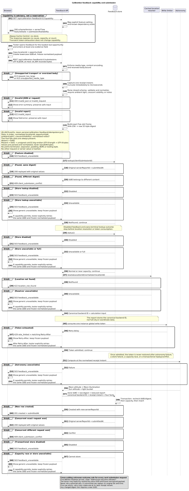

# UI Spec

## Status

This is a working UI specification for the web MVP. It records decisions made
so far, separates them from open design questions, and gives future UI work a
stable target.

The current scope is the `/search` web page, opportunity cards, Moon path
visualization, and the calibration-feedback interaction tracked by
[#33](https://github.com/rapucha/moon-service/issues/33). Broader visual design,
feeds, calendar export pages, account flows, and native apps are out of scope
for this document until they become active product work.

If implementation and this document disagree, treat the disagreement as a
product decision to resolve. Do not silently encode new UI behavior only in
frontend code.

## Product Intent

The web UI is a lightweight discovery tool for photographers. A user should be
able to enter a city or town and quickly decide whether an upcoming Moon window
is worth planning around.

The UI should answer:

- where the opportunity is;
- when the useful window starts, peaks, and ends;
- where the Moon is in altitude and azimuth;
- what the light and weather context is;
- why the opportunity was ranked highly;
- what caveats matter, especially local horizon obstruction.

The UI should be clear about what the MVP can and cannot model today, especially
terrain horizon, obstruction, and shooting-position limitations.

## Agreed UI Direction

- The first public surface is web-first and account-free.
- The browser page is served by the Spring Boot backend as static HTML, CSS, and
  JavaScript.
- There is one responsive `/search` page. There is no separate mobile site.
- The UI should steer users toward city or town lookup, not exact home
  addresses.
- Recent searches may be stored only in browser `localStorage`, with display
  names and canonical IDs rather than timestamps, exact addresses, cookies, or
  server-side user identifiers.
- The page should expose shareable lookup results.
- The UI should present ranked opportunities, not only chronological events.
- Opportunity cards are currently ranked by backend score.
- Opportunity cards may use a layered information model. The first scan should
  show the decisive facts, while score details, dense weather numbers, and some
  caveats can move into secondary or collapsible treatment.
- A physical Moon pass may cross local midnight. The UI should not split that
  pass into separate day groups merely because the civil date changes.
- One Moon pass can legitimately contain more than one ranked recommendation,
  for example one while the Moon is ascending and another while it is
  descending. The UI should render recommendations with the same `moonPass.id`
  inside one pass card, not as separate top-level cards.
- Anonymous lookup currently receives up to ten raw ranked recommendation
  windows as a provisional safeguard while scoring is being calibrated. The UI
  should describe them as top-ranked forecast candidates rather than ten
  objectively good photographs; grouping by `moonPass.id` may produce fewer
  than ten top-level pass cards.
- Use the degree symbol, for example `7.8°`, instead of `deg`.
- Dates, times, numbers, percentages, and units should go through formatting
  helpers so future localization does not require rewriting card structure.
- Display instants in the opportunity location's timezone. The 12-hour or
  24-hour clock convention should follow the user's browser locale settings.
- Card-level window and suggested-time labels should include the location's
  short timezone label when available, so comparisons with UTC-based ephemeris
  tools are less ambiguous.

## Frontend Structure

The current MVP should stay as static HTML, CSS, and plain JavaScript modules.
Do not jump to a heavier SPA framework only to support near-term UI polishing.

Authored and mixed browser files live under `frontend/src/`. Directly served
SVG assets live under `frontend/assets/`, and deterministic generated browser
modules live under `frontend/generated/`. Maven flattens all three directories
into classpath `/static`, preserving their root-relative public URLs. Root Node
tooling and `tests/ui/` stay at the repository root.

The frontend module split is intended to keep future UI changes manageable:

- `app.js`: bootstrapping, events, lookup flow;
- `api.js`: API path construction and fetch handling;
- `format.js`: date, time, degree, and percentage formatting;
- `dom.js`: DOM and SVG element helpers;
- `recentSearches.js`: localStorage behavior;
- `responseView.js`: response states and result rendering;
- `opportunityCard.js`: opportunity card layout;
- `moonPathView.js`: Moon path, separate Sun pass, and suggested-time sky-position views;
- `moonPhaseView.js`: Moon phase rendering;
- `scoreView.js`: score block and score details.

## Opportunity Card

Each card should be scan-friendly and useful without opening another page.

The card should include:

- local window start and end;
- suggested time;
- duration;
- score and confidence;
- short reason text when supplied by the API;
- Moon altitude, azimuth, illumination, and phase;
- Sun altitude and light bucket;
- weather summary and relevant forecast risk;
- exposure balance text;
- local horizon caveat when applicable;
- `.ics` action when available.

Cards should avoid hiding the main decision behind decoration. The primary
information is the opportunity itself: time, Moon position, light, weather, and
reasoning.

Cards currently carry more information than a first-scan view needs. Future UI
passes should keep the main opportunity card compact, especially on mobile, and
move secondary diagnostics into a lower-priority presentation rather than
showing every backend fact at equal visual weight.

Each user-facing result card should represent one Moon pass, even when that pass
has only one ranked recommendation window. The card should be ranked by the best
recommendation in that pass. The card title should state whether there is one
or multiple candidate windows in that Moon pass, while the page-level summary
states both the ranked Moon-pass count and the total candidate-window count.
The full pass start and end should be
shown as lower-priority Moon pass context below the recommendation cards, with
exact dates and a short location timezone label. Each recommendation card should show a
`Best` or `Alternative` badge, its raw candidate rank and score, suggested time,
window side, Moon altitude and direction, window duration, light bucket, Sun
altitude, a coarse sky/weather label, and a short photo hint. Keep the API
ranking explanation available in a collapsed candidate-level detail. Avoid
showing exact cloud-cover percentages in the compact card; keep raw weather
numbers in lower-priority details or API data where they do not imply false
precision.
The Moon path panel should be one pass-level chart that shows the path across
the pass and marks each recommendation's suggested position, rather than
showing a separate chart per recommendation.
The altitude chart should use the full card width without requiring horizontal
scrolling in normal desktop or mobile layouts. Azimuth should appear as a top
rail on the altitude chart so direction shares the same time axis as altitude
and light buckets.
This keeps after-midnight times explicit without making them look like a
separate night.

## Calibration Feedback Flow

Calibration feedback is an optional alpha-testing flow, not a general contact
form. The browser follows the exact transport and data rules in
[the calibration API contract](api-shape.md#calibration-feedback-api). It tells
the tester that notes, city-level location, and timing may identify them and
asks them not to include names, exact addresses, or unrelated personal details.
It never requests device-location or GPS permission. Location comes from the
city the tester chooses through the existing lookup.

### Entry points and modes

When capability allows reporting, every currently loaded real recommendation
exposes `Review this recommendation`. The form retains that opportunity's
existing `id`, `moonPass.id`, `location.id`, resolved city display, and compact
snapshot. It does not change or mint opportunity, pass, or location identifiers.
Fictional results cannot open the form.

A separate `Report an observation` action may start with the current selected
real city. It also lets the tester type and select another city, including for
a historical report, by reusing the existing opportunity query and ambiguous-
candidate selection. It does not add a feedback-only lookup endpoint, resolver,
or provider. Preview remains unavailable until that flow selects a real
location. The report has no recommendation snapshot. Its weather comparison
is fixed to `not_compared` and is explained rather than shown as an editable
rating.

The form collects the five ratings and required notes only after location and
timing are ready. A recommendation review preserves its loaded snapshot even
when the tester corrects the observation time. Changing the selected
recommendation starts a different form rather than silently replacing it.
The browser sends only the selected `locationId`; coordinates, elevation,
timezone, country, and display name are not request inputs. Preview displays
the canonical city returned by the server. The UI says that choosing a city
does not prove the tester was there and that the observation is self-reported.
It never requests device-location or GPS permission.

### Timing and reconstruction

The tester chooses `Now` or `Past`. `Now` explains that the server receipt time,
not the browser clock, is authoritative. After preview, show that same instant
in the reported city's local time and, when useful, browser-local time. Label
both zones so they cannot be mistaken for different observations.

`Past` collects the original local date and time, a corrected local date and
time, source, and confidence. It shows the selected city's server-resolved IANA
timezone but does not let the client submit or edit that zone. The original
value remains visible and unchanged while the correction is edited. Past
controls must accept four-digit years `0001-9999`; use a validated text or
segmented fallback where a native date-time control cannot represent that full
range.

`Preview conditions` is an explicit action and is the default trigger. An
implementation may also issue one debounced preview after all fields are valid
and input has settled for at least 500 ms. It must cancel a pending call on a
new edit and must never call on every keystroke. Preview sends only
`locationId` and the timing union; ratings, notes,
recommendation data, and queue metadata never enter that request.

A successful preview shows the accepted local time and UTC offset, Moon facts,
Sun facts, light bucket, and whether the pass encloses the accepted time or is
the nearest pass. It shows pass boundaries and the local-horizon caveat. A
no-pass result still shows instant facts and says plainly that no visible pass
was found in the displayed search interval, normally 36 hours on either side.
It does not imply that weather was checked.

The browser keeps a local freshness key containing mode, `locationId`, timing,
selected offset, and, for a recommendation review, the compact-snapshot hash.
It ignores a response unless that key still matches, although mode and snapshot
are not sent to preview. Ratings and notes do not make a reconstruction stale.

Editing the selected city or any timing field, including entered time,
corrected time, offset, source, or confidence, marks the reconstruction stale.
Final submission stays unavailable until a new preview succeeds for the current
values. Repeated correction and preview do not save a report. Preview output is
display-only; final submission never sends it back as trusted facts.

During a spring clock change, some local times never happen. The UI attaches
that gap error to the corrected local time and asks for a real clock time.
During an autumn change, one local time can happen twice. The UI shows both
returned UTC offsets as radio choices, with the resulting UTC instant and
offset in each label, and requires a choice before preview. A browser-clock
future check is a warning; only the server's five-minute rule rejects the time.
For `Now`, the UI also says that preview and final receipt instants can differ
slightly and that final submission recomputes the facts.

### End-to-end sequence

This sequence uses the existing city lookup and the feedback routes from the
OpenAPI contract. Preview facts are display-only and never become stored
evidence.

[PlantUML source](diagrams/calibration-feedback-sequence.puml)

### Accessible interaction

The reconstruction uses headings and text facts, not chart shape or color
alone. Its pass relationship, accepted time, UTC offset, and no-pass state have
text equivalents. Updated preview and submission outcomes are announced in a
polite live region. Errors also appear in a summary that links to the affected
field; focus moves to the summary after a rejected explicit action.

Controls keep their labels while busy. A busy state prevents duplicate sends,
uses `aria-busy`, and does not erase entered values. Keyboard focus remains on
the triggering control unless an error summary or success confirmation needs
attention. Rate-limit copy includes the server retry delay without starting an
automatic retry.

### Capability, errors, and submission

The page reads capability before offering the flow. A disabled operation has a
short explanation and no active submit control. An unavailable operation keeps
the form and uses the same generic public wording whether location resolution
or storage is unavailable. The UI never guesses or displays the cause,
database state, capacity, or counts. New submissions remain unavailable, but a
frozen attempted payload may still offer an explicit exact retry because a
known row can replay without fresh resolution or capacity.

Inline invalid states preserve all safe input. Rate-limited and preview-busy
states preserve input and allow another explicit attempt after `Retry-After`.
An unavailable preview cannot be bypassed by final submission. No failure
silently saves or submits a report.

On the first final attempt, the browser creates one UUIDv4 for the exact
normalized payload before sending it. A definite validation error permits
editing; the next attempt after any normalized content change gets a new UUID.
A conflict says that the identifier already belongs to different content and
requires a new UUID. The browser does not work around a conflict by changing
content back automatically.

If the request was sent but no definite response arrived, the result is
`Submission outcome unknown`. The browser retains the exact UUID and normalized
payload and offers `Retry exact submission`; it neither edits nor resends them
automatically. Editing from that state creates a new logical submission and a
new UUID. Immediate unsaved forms retain uncertain state for the current page;
the later saved-review queue preserves it across reload.

A definite `429` or `503` keeps that attempted UUID and frozen payload for an
explicit unchanged retry. Editing instead creates a new UUID. A validation
failure that occurred before any report was accepted follows the same rule:
unchanged retry may keep the UUID, while changed normalized content may not.

Before retrying a delayed or uncertain `Now` attempt, the browser gets a fresh
preview and explains the two valid results: an existing report replays with its
original receipt instant, while an attempt that created no row can be accepted
at the retry receipt instant. Choosing a remembered clock time changes the form
to `Past` and creates a new UUID.

Success distinguishes a newly accepted report from an idempotent replay, shows
the server report UUID, and clears the active form only after the confirmation
is available to assistive technology.

### Saved-review boundary

The later queue applies only to recommendation reviews and only after an
explicit `Save for review` action. Viewing a recommendation, opening a form,
typing, previewing, or receiving an error never saves it. Reverse observations
remain immediate-only.

Saving lets a tester keep the loaded recommendation before going outside and
return to that same context afterward. Local browser storage supplies that
account-free handoff; it is not a server inbox or activity history.

The queue has at most 20 distinct opportunity IDs and keeps insertion order.
Saving an existing unattempted review updates its one entry in place without a
duplicate or position change. An attempted frozen payload is never silently
replaced. Saving a new distinct opportunity appends it; when 20 already exist,
the first entry is removed, the new one is appended, and the tester is told
which review was replaced. List order, not a stored timestamp, defines the
earliest entry.

An unattempted saved entry has no client submission UUID. The queue stores the
UUID and exact normalized payload immediately before its first final request.
An uncertain response retains both for exact retry after reload. Editing an
attempted payload creates a new UUID before another request. Success or explicit
deletion removes the entry; nothing is submitted in the background.

After reload, a past preview remains current only when its schema version and
complete mode, `locationId`, timing, selected-offset, and compact-snapshot
freshness key still match. A restored `now` preview is always stale because the
next request has a new server receipt instant. Restored preview facts remain
display-only and never enter final submission as trusted evidence.

Disabled local storage, quota failure, and corrupt entries are nonfatal and
visibly explained. Valid entries remain usable when one entry is corrupt, and
the tester can explicitly delete the unreadable entry. The queue states that a
local draft contains its city and recommendation context and may later contain
entered timing, ratings, notes, accepted preview display state, UUID, and frozen
payload. Unreadable data is left untouched until the tester uses the queue
control to remove it.

## Moon Path Panel

The Moon path panel is a planning visualization. It must be internally
consistent with the numeric values shown in the same card, but it must not claim
exact terrain-aware composition guidance.

The panel should show:

- start, suggested, and end time;
- start, suggested, and end altitude;
- start, suggested, and end azimuth;
- a Moon-first chart over the opportunity window or pass, with Moon altitude
  plotted over time and Moon azimuth shown as a top rail on the same time axis;
- a separate collapsible Sun-pass chart when at least one sample has a Sun
  altitude of zero or above. It uses the same full-pass time axis and light
  bands as the Moon chart, keeps below-horizon body markers hidden, and retains
  the Sun direction rail across all samples with valid Sun position data;
- a separate collapsible quasi-dome at the selected suggested time when the Sun
  is above the horizon. It plots the Sun and Moon using their true altitude and
  azimuth, states their angular separation, and must expose those same values in
  its accessible name. The dome is a static planning diagram, not an
  interactive or terrain-aware 3D view.

The suggested marker must sit on the displayed path at the suggested moment. The
preferred way to do this is to construct the path so it passes through the real
suggested sample, rather than visually moving the dot to a different altitude.
This preference is still subject to confirmation if a better path model is
chosen.

## Altitude Chart

Agreed behavior:

- The x-axis spans only the opportunity window for single recommendations, or
  the Moon pass for grouped pass cards, not the whole night or day.
- The plotted path starts and ends at the displayed window or pass boundaries.
- Desktop and tablet charts use a stable full-card width without horizontal
  scrolling in normal layouts.
- Mobile charts show the full opportunity window or pass in the card without
  horizontal scrolling.
- Mobile charts should still communicate relative duration honestly when the
  comparison remains readable. A short window should not look the same width as
  a long window unless we explicitly decide to sacrifice duration encoding for
  readability.
- Typography, stroke width, dot size, and axis styling should be stable across
  short and long windows. Short windows must not produce huge labels, thick
  lines, or oversized dots.
- Axis labels should use degree symbols.
- The curve should read as a natural Moon altitude trend.
- Jagged sampled polylines, knotty interpolation artifacts, and pointy joins are
  not acceptable.
- The curve should not visually wrap as if it takes a major arc or goes beyond a
  plausible sky path.
- Start, suggested, and end markers should be visually distinct.
- The suggested marker may be larger than the start/end markers and should read
  as the Moon rather than a generic dot.
- Every visible Moon marker shows the compact phase and orientation for that
  marker's own sample time. `moonPhaseAngleDegrees`,
  `brightLimbTiltDegrees`, and `northPoleTiltDegrees` come from the corresponding
  `moonPass.path` or `moonPath` point; grouped Best and Alternative markers use
  their suggested-time values. Bright-limb tilt rotates the illumination, while
  north-pole tilt rotates only the canonical lunar surface texture and never the
  phase mask. The two tilt fields have independent fallbacks: an absent or
  invalid bright-limb value retains the schematic location-independent phase
  rendering, while an absent or invalid north-pole value retains the canonical
  north-up texture. When an older response has no valid per-point phase, pass
  markers may reuse the Best Moon image. Texture rotation does not yet model
  libration in longitude or latitude.
- The Moon altitude chart does not overlay Sun markers. The separate Sun-pass
  chart draws Sun samples only when Sun altitude is zero or positive and sizes
  recommendation markers by priority. It must cull lower-priority path,
  start, or end markers when their body images would overlap a recommendation
  marker. Do not raise its chart ceiling above 90 degrees; preserve real Sun
  altitude and azimuth in marker metadata and tooltip text.
- Light bucket bands may appear behind the altitude path.
- A subtle animated generic foreground silhouette layer may appear behind the
  chart markers and labels to help users build intuition for low Moon altitude.
  It is visual-only, not landmark-aware, not terrain-aware, and must respect
  `prefers-reduced-motion`. Silhouette heights should be modeled in apparent
  altitude degrees rather than fixed pixels so they shrink on high-arc Moon
  passes and grow on low-arc passes. The current reference scale is low hills
  `2.2°`, small gabled building `3.0°`, tree `4.5°`, mid-rise block `5.5°`,
  church or cathedral `6.8°`, and tall tower `11.7°`.

Current v0 curve model:

- Use a continuous monotone cubic path through the available chart samples. This
  keeps the suggested point on the path, preserves the sample values, avoids the
  sharp split-arc junction, and limits interpolation overshoot.
- The backend should provide enough canonical samples for the chart shape to be
  physically plausible. V0 window charts use regular 30-minute path samples
  plus start, suggested, end, and light-bucket boundary samples. Pass charts use
  pass-level samples across the full Moonrise-to-Moonset pass, with
  recommendation markers inserted from the grouped windows' suggested samples.
  The frontend should not have to infer a rounded peak from only sparse points.
- Treat this as a UI path model, not a terrain-aware or composition-exact Moon
  trajectory.

## Moon Path Foreground Animation

The foreground silhouettes in `moonPathView.js` are a visual altitude aid, not
time data and not location-aware scenery. They sit behind Moon markers and axis
labels, inside the altitude plot clip, so users can compare a low Moon altitude
against familiar rough objects without reading the silhouettes as chart ticks.

The runtime engine lives in `frontend/src/moonPathSilhouettes.js`. It is
symbol-based: the runtime places sanitized SVG symbols from
`frontend/generated/moonPathSilhouetteSymbols.js` instead of
constructing building/tree paths directly in the chart code.

The symbol catalog is generated from source assets under
`assets/moon-path-silhouettes/`:

- `manifest.json` lists every symbol id, source SVG file, `baselineY`,
  `intrinsicHeight`, tags, license, and attribution.
- `generic/*.svg` contains the current project-owned generic silhouettes.
- `scripts/build_moon_path_silhouette_symbols.mjs` validates and sanitizes the
  manifest plus SVG files, then writes the generated static frontend module.
- `npm run silhouettes:build` regenerates the module.
- `npm run silhouettes:check` verifies that the generated module is current and
  runs sanitizer/manifest tests.

The runtime config in `moonPathSilhouettes.js` contains:

- `SILHOUETTE_SEQUENCE_WIDTH`: the width, in SVG chart units, of one repeated
  foreground sequence. The CSS drift shifts each layer by exactly this amount so
  the repeated `<use>` elements loop without a visible jump.
- `SILHOUETTE_HEIGHT_DEGREES`: named reference heights in apparent altitude
  degrees. For example, a `4.5°` tree is drawn shorter on a chart whose ceiling
  is `70°` than on a chart whose ceiling is `35°`.
- `SILHOUETTE_LAYERS`: animated parallax layer definitions and figure placement.

SVG chart units are the units of the chart `viewBox`. They behave like local
pixels inside the fixed chart coordinate system, not CSS pixels and not time.

Symbol contract:

- `id`: lowercase kebab-case key referenced by runtime figures.
- `viewBox`: source SVG coordinate system, parsed from the SVG file.
- `baselineY`: source SVG y-coordinate for the ground/`0°` baseline.
- `intrinsicHeight`: source height used when scaling the symbol to
  `heightDegrees`.
- `tags`: lowercase metadata tags for future generic, location, or event packs.
- `license`: required metadata for project-owned and third-party art.
- `attribution`: required metadata for future legal/about surfaces.
- `elements`: generated sanitized `path` and `rect` definitions. Do not edit
  these by hand; edit the source SVG and rebuild.

Sanitization is deliberately strict. The current source subset allows only
simple root `<svg>` files containing self-closing `<path>` and `<rect>` elements
with known classes. Scripts, event handlers, external references, embedded
images, styles, filters, animation, remote URLs, and unsupported attributes are
rejected before runtime.

Layer semantics:

- `far`: faintest and slowest layer. It carries sparse hills and tall forms so
  the background reads as distant context.
- `mid`: medium opacity and medium speed. It carries mid-rise and church-like
  forms.
- `near`: strongest and fastest layer. It carries the most readable houses,
  trees, and towers.

Layer parameters:

- `id`: stable layer key used to build internal SVG definition IDs.
- `className`: CSS class added to the rendered `<g>`, currently `is-far`,
  `is-mid`, or `is-near`.
- `opacity`: passed into CSS as `--moon-path-foreground-opacity`.
- `durationSeconds`: animation duration. Smaller values move faster and create
  the near-layer parallax effect.
- `delaySeconds`: animation offset so layers do not align into one repeated
  block at page load.
- `offsetX`: horizontal offset, in SVG chart units, applied to every figure in
  that layer's sequence.
- `figures`: ordered list of objects drawn into one repeated sequence.

Symbol source locations:

- Source SVGs live under `assets/moon-path-silhouettes/generic/` for the
  current generic pack.
- Symbol metadata lives in `assets/moon-path-silhouettes/manifest.json`.
- The generated runtime catalog is
  `frontend/generated/moonPathSilhouetteSymbols.js`.
- Runtime placement and animation live in `frontend/src/moonPathSilhouettes.js`.

Figure parameters:

- `symbol`: key from the generated symbol catalog, such as
  `generic-tree-wavy` or `generic-church-small`.
- `x`: horizontal position inside the repeated sequence, in SVG chart units.
  This is not time and is not tied to the hour axis.
- `heightDegrees`: target height in apparent altitude degrees. Runtime uses
  this value plus the symbol `intrinsicHeight` and `baselineY` metadata to scale
  and baseline-align the symbol.

Runtime figure configs should not carry shape-construction parameters such as
`windowColumns`, `windowRows`, or arbitrary path instructions. If a visual
variant is needed, create a new source SVG and manifest entry, then reference
that generated `symbol` id from the layer config.

The current generic reference heights are:

- low hill: `2.2°`
- small gabled building: `3.0°`
- tree: `4.5°`
- mid-rise block: `5.5°`
- church or cathedral: `6.8°`
- tall tower: `11.7°`

To add a new symbol:

1. Add a safe SVG file under `assets/moon-path-silhouettes/`. Keep it in the
   supported subset unless the sanitizer and tests are deliberately expanded.
2. Add a manifest entry with `id`, `file`, `baselineY`, `intrinsicHeight`,
   `tags`, `license`, and `attribution`.
3. Run `npm run silhouettes:build`.
4. Reference the generated symbol id from `SILHOUETTE_LAYERS` in
   `moonPathSilhouettes.js`.
5. Run `npm run silhouettes:check` and the frontend UI checks.
6. Keep the silhouette behind markers and labels, preserve
   `prefers-reduced-motion`, and update this section when adding new reusable
   metadata or reference heights.

Future landmark-aware or event-aware silhouettes should use the same symbol
catalog and manifest path, but they need separate product and provider
decisions before the UI claims real city context.

## Azimuth Rail

Agreed behavior:

- The azimuth rail should show the Moon direction sweep across the opportunity
  window or Moon pass using compass direction labels.
- Direction labels should share the same x-axis and time scale as the altitude
  chart.
- Recommendation markers should align with the same samples as the altitude
  path.
- The suggested markers should be visually distinct.

Open questions:

- Whether the azimuth rail needs additional marker labels beyond the chart
  labels and the compact recommendation cards.

## Responsive Behavior

Agreed behavior:

- The same page should work in desktop, tablet, and mobile browser viewports.
- Mobile should not require horizontal scrolling to understand a single
  opportunity card.
- Text must fit inside controls and cards without overlap.
- The opportunity card should remain readable in browser responsive-device
  modes in both Firefox and Chrome.

Open questions:

- Exact mobile chart width policy when opportunity durations vary widely.
- Whether opportunity cards should collapse optional detail sections on mobile.
- Whether chart legends or caveats should be shortened on narrow screens.

## Curve Model Under Discussion

The Moon altitude curve is the main unresolved UI and modeling issue.

Things already discussed:

- A sampled curve can be physically closer to backend data, but naive smoothing
  made the chart look knotty and artificial.
- A circular-arc style looked more natural than the sampled curve.
- A single arc through start, end, and one additional point is attractive for
  simplicity, but choosing the wrong point can put the suggested marker off the
  curve or make the curve imply an unnatural path.
- Splitting the curve into ascending and descending sections can make the dot
  align with the path, but the join can become visibly sharp.
- A real Moon path formula or backend-provided path geometry may still be
  preferable if sample-based rendering keeps producing unnatural shapes.
- The current v0 implementation uses regular backend chart samples with
  monotone cubic interpolation as a practical compromise.

Questions to resolve before more chart work:

- Is the altitude chart meant to be physically accurate within the available
  samples, or a schematic trend that stays visually plausible?
- Which points must the displayed curve pass through: start, suggested, end,
  peak, all samples, or a smaller set?
- Should the backend eventually provide path geometry instead of canonical
  samples for the frontend to draw a smooth curve deterministically?
- What continuity is required at the peak: smooth tangent continuity, rounded
  peak, or exact peak point even if that creates a cusp?
- How much visual approximation is acceptable if numeric labels remain exact?

Current preference:

- The path should look smooth and natural.
- The suggested dot should sit on the path at the real suggested time and
  altitude.
- The chart should preserve start and end values.
- If those constraints conflict, stop and decide the visual contract before
  adding another curve workaround.

## UI Experiment History

UI experiments, tuning passes, and small visual fixes should preserve a
repo-level history that is easy to revert, compare, and bisect. Agentic UI work
can be nondeterministic, so prefer explicit checkpoints over long uncommitted
iteration.

Use this workflow for UI exploration:

- Commit the current accepted implementation before starting a new experiment,
  so the baseline is easy to return to.
- Use a short-lived branch per experiment theme, such as
  `ui-exp-sky-icons`, `ui-exp-pass-card-density`, or
  `ui-exp-chart-layout`.
- Keep commits small and named by the visible change, for example
  `Experiment with sky condition icon in pass cards` or
  `Try denser pass recommendation facts`.
- Keep each committed checkpoint buildable enough to inspect locally. At
  minimum, run patch hygiene and the focused syntax/test checks appropriate to
  the changed files.
- Use tags for visual checkpoints when screenshots or human visual judgment are
  the main comparison tool, for example `ui-pass-card-baseline` or
  `ui-sky-text-only-v2`.
- Use `git worktree` for parallel variants that need side-by-side local review
  or separate dev-server ports.
- Do not squash experimental commits until the final direction is chosen. The
  granular history is more useful during exploration than a tidy linear story.
- Once a direction is selected, either revert rejected experiment commits or
  start a clean implementation commit from the accepted baseline.

Avoid mixing unrelated UI experiments, tuning changes, and bug fixes in one
commit. Small fixes that emerge during a UI pass should either be committed as
their own fix or called out clearly if they are inseparable from the selected
UI direction.

## Verification Expectations

For UI changes that affect opportunity cards or charts:

- Run `npm run frontend:check` when Node tooling is available. It combines
  plain-JS TypeScript checking, ESLint, and Playwright desktop/mobile smoke
  checks.
- Check desktop and mobile responsive viewports.
- Check at least one long opportunity window and one short opportunity window.
- Verify that labels, dots, strokes, and chart dimensions remain visually
  consistent.
- Verify that the suggested marker is on the displayed path.
- Verify that the chart does not contain obvious major-arc wraps, pointy joins,
  overlaps, or clipped labels.
- Prefer browser inspection or screenshots over reasoning from SVG strings
  alone.
