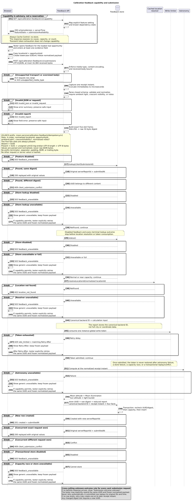

# UI Spec

## Status

This is a working UI specification for the web MVP. It records decisions made
so far, separates them from open design questions, and gives future UI work a
stable target.

The current scope is the `/search` web page, opportunity cards, Moon path
visualization, the altitude and availability preferences tracked by
[#192](https://github.com/rapucha/moon-service/issues/192), the direction,
phase, and bright-limb preference controls tracked by
[#193](https://github.com/rapucha/moon-service/issues/193), and the
calibration-feedback interaction tracked by
[#33](https://github.com/rapucha/moon-service/issues/33), and the
next-matching-date recovery tracked by
[#233](https://github.com/rapucha/moon-service/issues/233). Broader visual
design, feeds, calendar export pages, account flows, and native apps are out of
scope for this document until they become active product work.

If implementation and this document disagree, treat the disagreement as a
product decision to resolve. Do not silently encode new UI behavior only in
frontend code.

## Product Intent

The web UI is a lightweight discovery tool for photographers. A user should be
able to enter a city or town and quickly decide whether an upcoming Moon window
is worth planning around.

The UI should answer:

- where the opportunity is;
- when the useful window starts, peaks, and ends;
- where the Moon is in altitude and azimuth;
- what the light and weather context is;
- why the opportunity was ranked highly;
- what caveats matter, especially local horizon obstruction.

The UI should be clear about what the MVP can and cannot model today, especially
terrain horizon, obstruction, and shooting-position limitations.

## Agreed UI Direction

- The first public surface is web-first and account-free.
- The browser page is served by the Spring Boot backend as static HTML, CSS, and
  JavaScript.
- There is one responsive `/search` page. There is no separate mobile site.
- The UI should steer users toward city or town lookup, not exact home
  addresses.
- Recent searches may be stored only in browser `localStorage`, with display
  names and canonical IDs rather than timestamps, exact addresses, cookies, or
  server-side user identifiers.
- Search does not repeat Open-Meteo or GeoNames provider credit. It keeps a
  compact link to NASA's Moon-photography guide in the workspace. About holds
  the full privacy, service-limit, and provider-processing explanations and
  links the NASA guide as well.
- The form says that an exact home address is unnecessary. About retains the
  explanation that local hills, buildings, and trees are not modeled; Search
  does not repeat it as a standalone result note or `Lookup notes` section.
- The page should expose shareable lookup results.
- The UI should present ranked opportunities, not only chronological events.
- Opportunity cards are currently ranked by backend score.
- Opportunity cards may use a layered information model. The first scan should
  show the decisive facts, while score details, dense weather numbers, and some
  caveats can move into secondary or collapsible treatment.
- A physical Moon pass may cross local midnight. The UI should not split that
  pass into separate day groups merely because the civil date changes.
- One Moon pass can legitimately contain more than one ranked recommendation,
  for example one while the Moon is ascending and another while it is
  descending. The UI should render recommendations with the same `moonPass.id`
  inside one pass card, not as separate top-level cards.
- Anonymous lookup currently receives up to ten raw ranked recommendation
  windows as a provisional safeguard while scoring is being calibrated. The UI
  should describe them as top-ranked forecast candidates rather than ten
  objectively good photographs; grouping by `moonPass.id` may produce fewer
  than ten top-level pass cards.
- Use the degree symbol, for example `7.8°`, instead of `deg`.
- Dates, times, numbers, percentages, and units should go through formatting
  helpers so future localization does not require rewriting card structure.
- Display instants in the opportunity location's timezone. The 12-hour or
  24-hour clock convention should follow the user's browser locale settings.
- Card-level window and suggested-time labels should include the location's
  short timezone label when available, so comparisons with UTC-based ephemeris
  tools are less ambiguous.

## Frontend Structure

The current MVP should stay as static HTML, CSS, and plain JavaScript modules.
Do not jump to a heavier SPA framework only to support near-term UI polishing.

Authored and mixed browser files live under `frontend/src/`. Directly served
SVG assets live under `frontend/assets/`, and deterministic generated browser
modules live under `frontend/generated/`. Maven flattens all three directories
into classpath `/static`, preserving their root-relative public URLs. Root Node
tooling and `tests/ui/` stay at the repository root.

The frontend module split is intended to keep future UI changes manageable:

- `app.js`: bootstrapping, events, lookup flow;
- `api.js`: API path construction and fetch handling;
- `format.js`: date, time, degree, and percentage formatting;
- `dom.js`: DOM and SVG element helpers;
- `recentSearches.js`: localStorage behavior;
- `cameraSetup.js`: browser-only saved camera setup, illuminated-Moon estimates,
  and camera-preview lifecycle;
- `cameraFramingPreview.js`: camera-preview loading, failure handling, and
  digital rectilinear framing geometry;
- `cameraReferenceScene.js`: private six-level foreground selection,
  registered world-space composition, and endpoint cropping;
- `highResolutionMoonRenderer.js`: lazy 2K texture loading and event-oriented
  Moon rendering for camera previews;
- `cameraFramingPreview.css`: responsive Moon-detail and reference-scene
  presentation;
- `opportunityPreferences.js`: preference state, storage, request options,
  notices, planning-request transport, and coordination of the focused
  preference controls;
- `planningView.js`: dedicated weather-free planning states and singular result;
- `angularPreferenceControls.js`: altitude and azimuth preference
  coordination, normalization, and result-chart azimuth helpers;
- `angularPreferencePreview.js`: schematic altitude and bearing sliders,
  fixed local Moon samples, and live exclusion shading;
- `angularPreferenceRules.js`: nonlinear altitude mapping, bearing boundary
  constraints, and merged schematic exclusion segments;
- `angularPreferencePreview.css`: schematic axes, handle lanes, generic
  foreground, exclusion shading, and responsive presentation;
- `moonAppearanceControls.js`: Moon-shape selection and the textured
  bright-limb dial;
- `moonAppearancePreview.css`: textured shape-thumbnail sizing and responsive
  layout;
- `moonPreferenceControls.css`: shared preference-control base, Moon-shape,
  and Moon-dial presentation;
- `responseView.js`: response states and result rendering;
- `opportunityCard.js`: opportunity card layout;
- `moonPathView.js`: Moon path, separate Sun pass, and suggested-time sky-position views;
- `moonPhaseView.js`: Moon phase rendering;
- `scoreView.js`: score block and score details.

## Camera estimates

The search sidebar contains one shared `Camera setup` disclosure for digital
and film capture. The browser applies and saves each valid format, output-MP,
marked-focal-length, or teleconverter change immediately. The editor has no
Update or Apply button. While a numeric field is empty or invalid, the browser
keeps the last valid estimate and saved setup and shows an inline validation
message. Reset restores the first-use setup.

`Camera setup` is a native disclosure at every viewport width. It starts open
above `680 px` and closed at or below `680 px`, and the user can toggle it in
either layout. Every control stays within the camera form. The Teleconverter
label and selector have visible separation.

First use selects Full-frame digital, `24 MP`, a marked focal length of
`300 mm`, and no teleconverter (`1×`). The format selector groups these fixed
presets:

| Medium | Preset | Estimate geometry |
| --- | --- | --- |
| Digital | Full frame | `36.0 mm` sensor width, `3:2` |
| Digital | APS-C | `23.5 mm` sensor width, `3:2` |
| Digital | Micro Four Thirds | `17.3 mm` sensor width, `4:3` |
| Digital | Medium format 44×33 digital | `43.8 mm` sensor width, `4:3` |
| Film | Film | no frame geometry; physical image size depends only on the lens and selected teleconverter |

Film uses one neutral choice and calls the capture surface a `film original`,
not a negative. The editor does not ask for 35 mm, 120, sheet-film, or other
film-frame formats because they do not change the physical Moon image size at
a given marked focal length and teleconverter setting.

The editor shows `Output resolution (MP)` only for digital formats. It offers
`6`, `8`, `10`, `12`, `16`, `20`, `24`, `26`, `30`, `33`, `36`, `40`, `42`,
`45`, `50`, `61`, `80`, `100`, `102`, and `150` as native suggestions and
accepts any finite positive decimal value. The value is the final output MP,
so a photographer can enter the output of a pixel-shift mode directly. The
editor has no monochrome or generic pixel-shift multiplier. Visible help tells
the photographer to choose a common value from the field's browser suggestions
or type any positive value. The short help appears immediately after the field.

The marked-focal-length field accepts any finite positive decimal value. Its
deduplicated native suggestions contain:

- classical primes: `14`, `20`, `24`, `28`, `35`, `50`, `85`, `100`, `105`,
  `135`, `180`, `200`, `300`, `400`, `500`, `600`, `800`, `1000`, and `1200`;
- Pentax Limited primes: `15`, `21`, `31`, `35`, `40`, `43`, `70`, and `77`;
  and
- the endpoints of these common zoom families: `10–20`, `11–18`, `12–24`,
  `14–24`, `15–30`, `16–35`, `16–45`, `16–50`, `16–85`, `17–50`,
  `17–70`, `18–55`, `18–135`, `18–270`, `18–300`, `20–40`, `24–70`,
  `24–105`, `24–120`, `28–105`, `28–300`, `50–135`, `55–200`,
  `55–300`, `60–250`, `70–200`, `70–300`, `80–200`, `100–400`,
  `150–450`, `150–500`, `200–500`, and `200–600`.

The input uses bold type when it contains exactly `21`, `31`, `43`, or `77`.
Visible help tells the photographer to choose a common marked focal length
from the field's browser suggestions or type any positive value. The short help
appears immediately after the field.

The compact teleconverter selector contains `None (1×)`, `1.4×`, `1.7×`,
and `2×`. The stored marked focal length and multiplier remain separate, and
the editor displays their product as the focal length used for the estimate
only when a teleconverter is selected. A marked focal length at or below
`4 mm` remains valid but produces a nonblocking message that calls it very
small. A marked focal length above `5000 mm` remains valid but produces a
nonblocking message that calls it really big. The teleconverter does not affect
these warnings. The editor says: `This works best with a regular lens. With a
fisheye, keep the Moon near the center—the edges can stretch its apparent size.`

The browser stores this exact five-key state only under
`moonService.cameraSetup.v1`:

```json
{
  "version": 1,
  "captureFormat": "digital_full_frame",
  "outputMegapixels": 24,
  "focalLengthMm": 300,
  "teleconverterMultiplier": 1
}
```

Loading accepts only a complete object with exactly those fields, supported
enum values, and finite positive numbers. The browser silently removes invalid
state and restores the defaults. There is no migration from the unpublished
horizontal-pixel or format-specific film previews. While Film is active, the
setup retains `outputMegapixels` so switching back to digital restores the last
valid value. If `localStorage` is unavailable, valid changes remain in page
memory and the editor shows a visible warning.

The estimate uses the result's existing `moon.illuminationPercent` and a
nominal lunar apparent diameter of `0.52°`:

```text
illuminated fraction = illuminationPercent / 100
focal length used in the calculation = marked focal length × teleconverter multiplier
angular thickness = 0.52° × illuminated fraction
Moon image diameter = 2 × focal length used in the calculation × tan(0.52° / 2)
illuminated thickness on the capture surface = Moon image diameter × illuminated fraction
```

Digital estimates derive horizontal sampling from output MP and the selected
format's aspect ratio:

```text
horizontal output pixels = sqrt(output MP × 1,000,000 × aspect ratio)
pixel thickness = illuminated thickness × horizontal output pixels / sensor width
```

The digital result shows angular thickness and pixel thickness. It shows
`0 px` for zero illumination, `<1 px` for a positive subpixel value, and the
nearest whole pixel otherwise.

The Film result shows only the full Moon image diameter and the maximum
illuminated thickness on the film original in millimetres. It shows `0 mm` for
zero illuminated thickness, `<0.01 mm` for a positive value below `0.01 mm`,
and two decimal places otherwise. It does not show angular thickness, a film
format, frame dimensions, or percentage coverage.

Both result types state that the value is the widest illuminated thickness and
that a crescent tapers to zero at its horns. Digital copy adds no sampling,
resizing, visibility, optical-resolution, exposure, or pixel-shift caveat. Film
copy continues to describe physical image size on the film original and its
existing limits.

Each ordinary grouped result card contains one initially closed native
`Camera estimate` disclosure based on its primary suggested opportunity. Each
successful planning result contains the same disclosure based on that
planning window's illumination. Loading, empty, and error states contain no
estimate. A valid editor change replaces only the estimate inside each current
card and preserves whether each disclosure is open; it does not rerender the
whole card.

### Camera preview

Opening a `Camera estimate` lazily loads the tracked 2048×1024 NASA Moon
texture from `/moon-textures/lroc_color_2k.jpg`. Closed estimates request no
preview media. An eligible digital estimate calculates its framing geometry,
selects one foreground level, and loads only that level. It does not prefetch
the other five levels or add an application cache. Already loaded resources may
still be shared through ordinary browser caching. A valid camera change
recomputes the selection for every open estimate and preserves its open state.

Every opened digital or Film estimate shows a `Moon detail` figure when the
texture is available. It uses the opportunity's required phase angle and the
same observer-oriented bright-limb and north-pole conventions as the compact
Moon renderer. A missing `brightLimbTiltDegrees` uses the location-independent
phase orientation and labels the limb angle as approximate. A missing
`northPoleTiltDegrees` keeps the texture canonical north-up and labels the
surface orientation as approximate. Visible copy states that `Moon detail`
uses the opportunity's phase and orientation. Its caption also states that the
enlarged figure is not to camera scale.

Digital estimates also show `Example framing`. Film does not because the
neutral Film setup has no selected frame or output geometry. The digital figure
uses a rectilinear pinhole projection:

```text
focal length used = marked focal length × teleconverter multiplier
sensor height = sensor width / aspect ratio
horizontal field of view = 2 × atan(sensor width / (2 × focal length used))
vertical field of view = 2 × atan(sensor height / (2 × focal length used))
full-Moon image diameter = 2 × focal length used × tan(0.52° / 2)
scene width at reference distance = 120 m × sensor width / focal length used
```

The foreground is the six-level, project-owned proof-of-concept package
accepted through issue #249, with the owner-accepted Level 0 alpha trim from
issue #245. Each lossless alpha WebP is 960×720 pixels. The images form one
registered fictional foreground, contain no baked Moon, and do not set a
production-quality photography standard.

| Level | Public route | Declared world width |
| --- | --- | ---: |
| 0 | `/camera-preview/level-0.webp` | `1350 m` |
| 1 | `/camera-preview/level-1.webp` | `371.25 m` |
| 2 | `/camera-preview/level-2.webp` | `102.09375 m` |
| 3 | `/camera-preview/level-3.webp` | `28.07578125 m` |
| 4 | `/camera-preview/level-4.webp` | `7.72083984375 m` |
| 5 | `/camera-preview/level-5.webp` | `2.12323095703125 m` |

All levels use the shared normalized foreground contact
`{ x: 0.46875, y: 0.5138888888888888 }`, which is pixel `(450, 370)`. The
renderer keeps these descriptors as private constants. It does not fetch
`scene-pyramid.json`; that file remains authoring and verification metadata.

The renderer draws a restrained synthetic sky behind the selected alpha
foreground. It draws the event-oriented Moon separately in the transparent sky
on the right side of the shared contact. It selects the smallest declared world
width that fully covers the calculated world-space view, keeps the contact
registered, and crops the selected image at its declared scale. It does not
stretch a level to fit the frame or synthesize scene detail.

The scene uses one private fixed reference distance of `120 m`. The distance is
not a control, stored value, URL or API field, constructor option, fallback, or
extension point. The package's authored-detail range ends at an effective focal
length of `2500 mm`. Above that endpoint, including the supported `2000 mm`
marked lens with the `2×` teleconverter, the renderer keeps Level 5 at the
correct scale and crops it more tightly. Pixelation and clipping are allowed,
and the preview claims no additional authored detail. When a view is wider than
Level 0, the renderer keeps Level 0 at the correct scale and lets the synthetic
sky show beyond the foreground image. It does not stretch the image to fill the
frame.

The existing camera editor continues to accept any finite positive marked focal
length. Its native supported examples run from `4 mm` through `2000 mm` with
the existing teleconverter choices. A valid value outside the package's
authored range uses the endpoint behavior above. When a valid setup cannot
produce finite preview geometry with both fields of view strictly between
`0°` and `180°`, the estimate omits only `Example framing` and shows the
accessible framing-unavailable message. Wide views receive no artificial
minimum Moon or foreground size. Long views may crop the Moon or foreground.
The display-sized canvas clips the calculated composition and never allocates
the camera's full native output dimensions.

For digital formats, output MP determines output width and height, the
calculated full-Moon pixel diameter, and the source-limited texture sampling
used for the framing Moon. A megapixel-only change does not change field of
view, normalized scene geometry, Moon position, angular size, selected
foreground level, preview backing size, or CSS display size. Sampling never
invents detail beyond the tracked 2K source.

Each canvas has an accessible name. Visible text outside the canvases states the
phase and orientation basis, labels only an affected orientation as
approximate, reports output sampling, and gives either failure result. The
framing caption says: `Reference scene only—the scale is calculated; the
placement is illustrative.` It does not claim a real viewpoint, alignment,
terrain, obstruction, exposure, or photograph prediction.

If the Moon texture cannot load or decode, the estimate keeps its numerical
facts, omits every preview figure, and shows an accessible preview-unavailable
message. If the selected foreground WebP cannot load or decode, the estimate
keeps `Moon detail` and its numerical facts, omits only `Example framing`, and
shows an accessible framing-unavailable message. It does not substitute a
neighboring level. Film loads and shows `Moon detail`, keeps its numerical
estimate, and has no `Example framing` because it has no selected frame or
output geometry.

The two digital figures sit side by side when space permits and stack in a
narrow workspace. Replacing an estimate after a valid camera edit preserves
its open state and renders the new setup without changing the result card
around it.

Exact camera values stay in the browser. They never enter product API requests,
page URLs, share links, recent-search storage, or analytics. Selecting digital
framing requests one `/camera-preview/level-N.webp` static asset; that path is a
coarse setup-derived level and may appear in ordinary request logs. A shared
result uses the receiving browser's setup.

This version does not model scan resolution or pixels, PPI or DPI, print size,
enlargement, printer output, slide projection, or film resolving power. It also
does not add custom sensor dimensions, film formats or frame dimensions,
film-frame coverage, camera or lens catalogues, custom or stacked
teleconverters, event-specific lunar diameter, backend camera fields, exposure
settings, or exposure advice.

## Opportunity Preferences

The accepted option A places the preference editor, labeled `Limits`, in the
existing desktop sidebar. On mobile, the same editor uses a compact native
`details` disclosure with the same summary label. Active state and
`Reset all preferences` remain inside this editor. The results region does not
repeat them in an active-limit summary or removable filter chips.

The editor exposes these hard filters:

- Moon altitude is one optional inclusive range edited with a vertical
  dual-handle slider over `[0°, 90°]` on the schematic Moon-pass selector.
  With no active stored altitude range, its dormant first-use values are
  `10°–30°`; the control remains disabled until the user enables it. A valid
  active version 1 stored range remains the user's selected range.
  The range remains at least `10°` wide.
  The bottom is `0°` and the top is `90°`. The display position is
  `(altitude / 90)^0.85`, which gives low altitudes mildly more room. Pointer
  input uses the inverse mapping and request values remain degrees. An attempt
  to close the last `10°` moves the marker briefly toward the other marker,
  then returns it to the valid boundary. The invalid overshoot is visual only.
- `Time & light` uses exactly one mode at a time. Local-clock mode accepts
  exactly one window in the searched location's timezone and explains that it
  may cross midnight. Ambient-light mode accepts one or more of `Daylight`,
  `Golden hour`, `Civil twilight`, `Nautical twilight`, and `Night`. Switching
  modes removes the other mode from active state. `Golden hour` is the initial
  ambient-light choice.
- Moon direction is optional as a whole. When enabled, the schematic's shared
  compass axis contains distinct fills and handle pairs for an included sector
  and a blocked sector contained inside it. It has no visible numeric bearing
  inputs. Joined green endpoints include the full compass. In that state, a
  remaining blocked sector is sent as excluded-only `azimuthDegrees`.
  Coincident blocked-sector endpoints mean there is no blocked sector. If the
  green endpoints are also joined, the request omits `azimuthDegrees`. With
  distinct green endpoints, it sends the included sector without `excluded`.
  Disabling direction filtering also omits `azimuthDegrees`.
- Moon shape uses five checkboxes: `New / very thin`, `Crescent`, `Half`,
  `Gibbous`, and `Full`. `New / very thin` expands to `new_moon`; `Crescent` expands to
  `waxing_crescent` and `waning_crescent`; `Half` expands to `first_quarter`
  and `last_quarter`; `Gibbous` expands to `waxing_gibbous` and
  `waning_gibbous`; and `Full` expands to `full_moon`. The union is persisted
  and sent as `namedPhases` in canonical exact-phase order: `new_moon`,
  `waxing_crescent`, `first_quarter`, `waxing_gibbous`, `full_moon`,
  `waning_gibbous`, `last_quarter`, and `waning_crescent`. An absent value and
  all five shapes selected both mean unrestricted, and the editor shows all
  five selected in either state. At least one shape must remain selected.
- Bright-limb orientation is optional and has one target on a circular,
  single-handle dial. It has no editable numeric range inputs. The browser
  starts a new target at `270°` (`Left`) and
  snaps the target to `0°`, `45°`, `90°`, `135°`, `180°`, `225°`, `270°`, or
  `315°`. When active, it sends exactly one inclusive `45°`-wide normalized
  range in `brightLimbOrientationDegrees`; the range may cross `0°`.
  Neighboring possible ranges share one endpoint and cover the complete circle.

The local-clock preference uses one `From` and `Until` pair of 24-hour `HH:mm`
text fields. It has no add-window or remove-window control and does not use a
browser-localized native time control.

Altitude and direction use one responsive schematic selector. Its vertical
altitude axis and horizontal absolute-bearing axis contain the real slider
handles; there are no duplicate standalone tracks. The bearing axis runs from
north at `0°` through east, south, and west to a repeated north label at
`360°`. Short tick marks divide it every `15°`; longer ticks align only with
the `90°` cardinal divisions. Its arrows mean increasing bearing, not Moon
travel direction. Handle values remain in `[0°, 360°)`. The altitude axis is
labeled directly, and the bearing arrow labels the horizontal axis. The collapsed
`? Handle help` disclosure below the schematic explains dragging, keyboard steps,
minimum ranges, marker colors, and usable-sector transfer. Hovering the plot explains
the configured included, excluded, or blocked range under the pointer. The message
hides `1.5` seconds after the last pointer movement and immediately when the pointer
leaves the plot. Handles do not open tooltips. Assistive technology gets the same
facts through descriptions.

Each range handle is a directional boundary. Its inner edge marks the exact
logical angle and aligns with the fill and schematic exclusion edge. Green
marker bodies extend outside the usable sector. Red marker bodies point into
the blocked sector. Their hit areas include the visible marker and extend
outside the blocked sector so narrow blocked sectors remain draggable.
Adjacent exclusion rectangles merge before drawing so coincident green and red
boundaries do not leave a dim hairline. At the straight `10°` minimum, one
opaque composite shape replaces both green marker bodies and the fill between
them. It has one outer border and shadow, with no internal edge or gridline.
When the green endpoints meet at maximum width, their joined marker and a full
green rail represent the full compass. Only a remaining red sector is shaded.

The schematic uses a fixed illustrative arc, small textured Moon images, and
the existing generic moving hills, trees, and buildings. It shows no time or
ambient-light buckets and does not claim to describe the searched location's
Moon path, skyline, terrain, or obstructions. Altitude and bearing changes dim
the excluded sky and landscape regions behind the fixed arc. The Moon images
use a fixed left-lit crescent and remain fully visible with the arc.
This local preview does not model lunar-disk intersection and is not
authoritative `azimuthMatchIntervals`.

The altitude mapping applies to the handles, grid, fill, fixed arc, Moon
samples, foreground height, and exclusion shading.

Both compass sectors may cross north, but an individual red handle stops at
the visible north endpoint and never appears at the other end of the axis.
Pointer, touch, and keyboard interaction keep the blocked boundaries inside
the included boundaries. Each of the two usable pieces beside the blocked
sector is either `0°` or at least `10°` wide, and at least one piece remains
usable. Opening a collapsed piece snaps it to `10°`. Closing a piece first
stops at `10°`; continuing closes it to `0°`.

When one usable piece is `0°` and a red handle closes the other from `10°`,
that moving red handle snaps to its adjacent green handle. The other red
handle moves inward by `10°`, transferring the usable piece to the other side.
If that transfer would move the other red handle across north, both handles
remain at the last valid `10°` state.
If a green handle tries to remove the only remaining piece, it stays at
`10°`. The schematic does not show transient constraint messages; handle help
and slider values explain the interaction.

Green-handle movement keeps the outside complement of the green sector at
either `0°` or at least `10°`. Closing that last `10°` joins the green endpoints
and includes the full compass. When the remaining usable direction allows it,
opening joined green endpoints creates a `10°` outside complement. Otherwise,
the handles remain joined. In the full-compass state, only a nonempty blocked
sector is stored or sent. An excluded-only stored value restores joined green
handles at the blocked sector's start boundary. Equal endpoints are not stored
for the included sector, and that display position has no request meaning.
Blocked-sector
endpoints may meet; then the browser draws no blocked fill or shading. When an
included-only stored value is loaded, the coincident blocked handles appear at
the included sector's clockwise midpoint.

Decorative Moon and landscape SVG content stays outside hit testing and the
accessibility tree. Reduced motion stops the generic foreground drift and the
elastic marker movement without removing the schematic.

The bright-limb dial explains the observer-oriented convention: `0°` points
toward local zenith, `90°` points right toward increasing azimuth, and angles
increase clockwise. It uses `moonPhaseView.js` and the canonical textured Moon.
The texture stays north-up while the illumination rotates. The illustrative
crescent is thicker than the earlier mockup but remains below quarter phase,
and the disk has a neutral or dark rim rather than a bright circumference.
`northPoleTiltDegrees` is not a preference.

The five Moon-shape checkboxes have `aria-hidden` textured symbolic thumbnails.
`New / very thin`, `Crescent`, `Half`, and `Gibbous` each show two separate
disks with phase angles `11.25°`, `45°`, `90°`, and `135°`, respectively. The
first disk has its illuminated edge at `90°` (`Right`) and the second at `270°`
(`Left`). `Full` shows one disk at `180°`. Every disk uses
`northPoleTiltDegrees: 0`; only illumination is mirrored, not the north-up
texture pixels. While bright-limb orientation is enabled and the preference
editor is visible and open, its preview cycles through each selected shape
exactly once before repeating, at the chosen target orientation. It uses at
most one timer and stops when any enabling condition no longer holds. A hidden
document or `prefers-reduced-motion` stops the cycle; reduced motion shows the
first selected shape in control order. This animation is presentational. It
does not alter preference state, request fields, or the fixed `45°` interval
width.

When Moon shape and bright-limb orientation are both active, a sample must
match any exact named phase expanded from the selected shapes and the single
bright-limb interval. A sample with no reported bright-limb orientation does
not match an active orientation preference. A Full sample does not match an
active bright-limb preference. With Full and any non-Full shape selected, the
control remains active and explains that the limit applies only to the
non-Full shapes. With Full selected alone, the checkbox is disabled, its dial
is hidden, and the editor explains that Full has no useful bright-limb
direction.

These controls remove candidates that fall outside the limits. They do not
adjust scores or change the order of candidates that remain. With no active
filter, Search keeps its preference-free request and current default results.
The detailed request and filtering rules remain in
[the product preference API contract](api-shape.md#product-preference-post) and
[the scoring model](scoring-model.md#version-1-hard-preferences).

Each enabled preference can be removed through its own editor control without
changing the others. Reset removes every active filter and removes the stored
preference object when browser storage accepts the removal. If removal fails,
the current page uses reset state in memory and reports the storage failure.
The location-timezone and location-only share explanations stay with the
relevant controls in `Limits`. When preferences are active, the share
explanation says that the link still contains only the location and that a
receiving browser applies its own saved preferences, if any.

Result-specific messages remain near the results without recreating an active
preference summary:

- The browser does not render the API's general `messages` array as a separate
  `Lookup notes` section. The API contract remains unchanged.

- If active filters remove every candidate, a closed native `No match`
  disclosure says that no opportunities were found in the response's forecast
  horizon. Its body says that the preferences caused the result; it does not
  describe this state as an astronomy, location, or weather failure.
- A valid `preferenceImpact` reports the distinct live opportunities available
  with no preferences before ranking and the result limit inside that
  disclosure. A definition-list row for every active filter reports the count
  when that filter acts alone, the reduction from the shared baseline, and its
  next bounded theoretical match without weather. It marks every filter tied
  for the largest positive reduction.
- Filter rows are independent, not cumulative or combinatorial. The browser
  says that the other preferences are off for each row. A next match is
  formatted in the resolved location's timezone with the year and explicit
  IANA timezone label. A `not_found` row names the returned positive
  `lookAheadDays`. The `namedPhases` impact row is labeled `Moon shape`. Filter
  names in these rows are plain text without term tooltips.
- The browser shows preference impact only for an empty opportunity result. An
  omitted, unknown, or malformed impact object leaves the impact rows absent
  while retaining the ordinary no-match reason. The browser does not invent
  counts, run another search, or calculate its own long-range match.
- The result view constructs the disclosure and each row as text-only DOM.
  Response and location strings are never interpreted as HTML.
- If the server ignored fields, the warning reports them as text, never as
  HTML.
- If stored state is malformed or uses an unsupported version, the browser
  discards it and says that the saved preferences could not be used.
- If browser storage is unavailable, the browser says that preferences will
  last only for the current page while search continues.
- The browser does not expose the server's internal excluded-sample count.

The browser keeps one versioned preference state for the editor, storage,
reset behavior, and result explanations. It derives the active count and
ordinary and planning request state from that stored editor state. It stores supported state
under `moonService.opportunityPreferences.v1`. Version 1 storage retains only
the supported `altitudeDegrees`, `time`, `azimuthDegrees`, `namedPhases`, and
`brightLimbOrientationDegrees` fields. Local-clock state stores one
`time.window` object. The former plural `time.windows` shape is unsupported and
is discarded rather than migrated. The privacy explanation calls this choice
`selected Moon shapes`; request and storage retain the exact `namedPhases`
contract. The browser restores `namedPhases` only when it is an exact union of
the five Moon-shape groups. An asymmetric subset such as
`waxing_crescent` without `waning_crescent` is unsupported, so the browser
discards the whole stored preference object through the existing notice. It
does not migrate or broaden that selection. An exact all-phase union
normalizes to omission. A bright-limb target is stored as an array
containing exactly one normalized `{start, end}` range; the browser derives and
snaps the dial midpoint when restoring it. An exact `20°`-wide range written by
the earlier version 1 control migrates to the nearest current axis and the
current `45°` width. When Full is the only selected shape, a checked
bright-limb target remains checked and stored through Apply and reload but is
inactive. The browser omits it from the active count and from ordinary and
planning requests. Selecting any non-Full shape re-enables the same snapped
target. The browser discards other malformed or unsupported stored state
rather than sending it. If `localStorage` is blocked or unavailable, it keeps
the state in page memory and lets search continue.
Applying the form retains valid values from a disabled altitude, direction, or
availability editor on the current page so re-enabling that control restores
the user's draft. Those disabled values remain absent from the request and
version 1 storage; a reload restores only active stored state. Reset clears
both active preferences, the stored Full-only bright-limb target, and
page-memory drafts.

`opportunityPreferences.js` owns this state, its normalization and storage, the
editor coordination, preference request options, and storage or ignored-field
notices.
`angularPreferenceControls.js` coordinates `angularPreferencePreview.js`;
the preview module and `moonAppearanceControls.js` own their focused editor
interactions. `app.js` coordinates the lookup flow with the preference module.
`api.js` remains responsible for the existing default request, and
`responseView.js` remains responsible for ordinary opportunity statuses,
including the structured preference impact inside an empty result.
The resolved-result header retains the location, ranked Moon-pass and candidate
counts, and sharing controls. It does not add a secondary metadata grid for the
fixed forecast horizon, evaluated-window count, timezone, or lookup method.

Every preference input has a visible label. Related choices use `fieldset` and
`legend`, and reset uses a real button. Every handle supports an equivalent
keyboard interaction and exposes its name, value, and instructions to
assistive technology. Distinct sector labels, not color alone, identify the
included and blocked compass handles. The native disclosure, editor, and reset
action work from the keyboard in a logical order.

The schematic uses joined included-sector endpoints only as internal
full-compass state and prevents uncontained blocked sectors while a handle
moves. Stored equal included-sector endpoints remain invalid. Coincident
blocked-sector endpoints are valid and omit the blocked sector. Before sending,
the browser rejects any remaining nonnumeric, non-finite, out-of-range,
duplicate-phase, or unknown-phase value.
Validation identifies the affected control in text and moves focus to it.
Storage and ignored-field changes are announced to screen readers without
depending on color. An empty result announces its `No match` summary;
preference-impact rows become available after the user expands the disclosure.
Removing a preference or resetting all preferences leaves focus on a logical
surviving control.

When azimuth filtering is active, the Moon-pass chart dims only the portions
outside the authoritative `moonPass.azimuthMatchIntervals`. It must not infer
the mask from returned opportunity windows or center-position path samples.
Another hard preference or the global result limit must not dim an interval
that the backend marked as an azimuth match.

## Next matching Moon date

The recovery action appears only after an ordinary opportunity request successfully returns
`status: "ok"`, `location.kind: "real_location"`, and an empty `opportunities` array.
It remains absent for a nonempty result, ambiguous or missing location, fixture result, invalid response, request failure, or provider failure; the browser never starts recovery automatically.

The ordinary empty result shows a native button labeled
`Find the next matching Moon date`. Its description says that the action
searches ahead using Moon position, local time, and ambient light, and that
weather is not considered. The button references that description with
`aria-describedby`. The explanation remains outside the closed ordinary
`No match` disclosure. The action works with pointer, Enter, and Space
activation and does not depend on color or motion.

Activation captures the successful response's canonical `location.id` and the
normalized active version 1 preference snapshot currently held in page memory.
The browser sends exactly those values as `locationId` and `preferences`; it
does not reconstruct preferences from `localStorage`, include a dormant
Full-only bright-limb target, omit an active field, or add a horizon or mode.
Planning does not change the page URL, browser history, share state, recent
searches, saved preferences, or any other storage.

`app.js` enters a dedicated `Next matching Moon date` state and disables the
recovery button synchronously before starting the request. Planning shares the
ordinary lookup's abort and supersession owner. A new ordinary lookup remains
available, aborts or supersedes planning, and owns all later result and focus
updates. A stale planning completion must not render or announce anything. The
browser does not issue a duplicate request or retry automatically; any later attempt
requires another explicit button activation.

`planningView.js` renders loading, success, bounded empty, and
planning-specific error states. It does not pass a planning response through
`responseView.js` or `opportunityCard.js`. It validates the response's
`planningHorizonDays`, `startsAt`, and `endsAt`; the browser does not carry its
own horizon value. A bounded-empty horizon statement uses only those response
facts.

- Success presents the one `nextPlanningWindow` as a dedicated planning-date
  card.
  It shows the resolved location, local suggested date and time, window bounds
  and IANA timezone, Moon altitude, azimuth with compass direction, exact named
  phase, bright-limb orientation relative to local zenith, Sun altitude, and
  ambient-light bucket. It retains those matching-window facts and adds a
  `Moon pass context` interval for the complete horizon-bounded pass. A `null`
  bright-limb orientation is explained as not defined for that Moon phase; the
  browser does not invent an angle.
- Bounded empty presents `emptyReason.text` and the response-owned horizon and
  endpoint. It explains that the bounded search found no date, not that the
  preferences can never match.
- A request, validation, location, dependency, or malformed-response failure
  stays a planning-specific error. It does not become a successful empty
  result or alter the preceding ordinary search.

The planning panel omits ordinary opportunity cards, Moon-pass grouping,
candidate lists, weather and forecast facts, score and confidence, components,
photo hints, ranking reasons, sharing controls, and calendar actions. It does
not create a placeholder fact when bright-limb orientation is `null`.

The planning renderer accepts only the closed documented `nextPlanningWindow`
geometry. The pass interval must contain the matching window and stay inside
the planning interval. Its samples must be chronological, include the complete
point shape, begin and end at the declared pass boundaries, and match the
separate `path.start` and `path.end` points. An active direction filter requires
bounded chronological `moonPass.azimuthMatchIntervals`; an inactive filter
requires that member to be absent. Incomplete, non-finite, unordered,
out-of-bounds, or inconsistent geometry produces the planning-specific
malformed-response state.

The card passes that geometry to the existing `moonPathPanel()`. Before doing
so, it adds one UI-only point at `suggestedAt` from the suggested-time Moon and
Sun facts. It merges points by full RFC 3339 timestamp, with this point taking
precedence, then restores chronological order. The Moon chart therefore
contains exactly one `suggested` marker labeled `Suggested`, even when a
backend pass sample has the same timestamp. It never labels a planning point
`Best`, `Alternative`, with an option number, or with a rank.

The full bounded pass supplies the Moon chart and its light bands. Direction
dimming uses only the returned `azimuthMatchIntervals`; the browser does not
infer another mask. The collapsed Sun pass appears only when at least one
merged pass point puts the Sun at or above the horizon. The collapsed sky dome
appears only when the Sun is at or above the horizon at `Suggested`, and it
states the Sun/Moon angular separation there. The documented `-4.7°` suggested
Sun example has no sky dome. These conditions and the full pass apply equally
to the desktop and mobile charts.

Activation replaces the ordinary workspace title with
`Next matching Moon date`, makes that heading programmatically focusable, and
moves focus to it while the results live region announces the loading and
settled states. The complete ordinary `Weather checked` metadata group is
hidden. A separate `Weather is not considered` notice remains visible through
loading, success, bounded empty, and error states. Desktop and mobile use the
same content, order, focus behavior, and omission rules.

## Opportunity Card

Each card should be scan-friendly and useful without opening another page.

The card should include:

- local window start and end;
- suggested time;
- duration;
- score and confidence;
- short reason text when supplied by the API;
- Moon altitude, azimuth, illumination, and phase;
- Sun altitude and light bucket;
- weather summary and relevant forecast risk;
- exposure balance text;
- `.ics` action when available.

Cards should avoid hiding the main decision behind decoration. The primary
information is time, Moon position, light, weather, and reasoning. Each
recommendation shows the exact readable `phaseName`, including its waxing or
waning distinction instead of reducing it to the grouped shape.

Cards currently carry more information than a first-scan view needs. Future UI
passes should keep the main opportunity card compact, especially on mobile, and
move secondary diagnostics into a lower-priority presentation rather than
showing every backend fact at equal visual weight.

Each user-facing result card should represent one Moon pass, even when that pass
has only one ranked recommendation window. The card should be ranked by the best
recommendation in that pass. The card title should state whether there is one
or multiple candidate windows in that Moon pass, while the page-level summary
states both the ranked Moon-pass count and the total candidate-window count.
The full pass start and end should be
shown as lower-priority Moon pass context below the recommendation cards, with
exact dates and a short location timezone label. Each recommendation card should show a
`Best` or `Alternative` badge, its raw candidate rank and score, suggested time,
window side, Moon altitude and direction, window duration, light bucket, Sun
altitude, a coarse sky/weather label, and a short photo hint. Keep the API
ranking explanation available in a collapsed candidate-level detail. Avoid
showing exact cloud-cover percentages in the compact card; keep raw weather
numbers in lower-priority details or API data where they do not imply false
precision.
The Moon path panel should be one pass-level chart that shows the path across
the pass and marks each recommendation's suggested position, rather than
showing a separate chart per recommendation.
The altitude chart should use the full card width without requiring horizontal
scrolling in normal desktop or mobile layouts. Azimuth should appear as a top
rail on the altitude chart so direction shares the same time axis as altitude
and light buckets.
This keeps after-midnight times explicit without making them look like a
separate night.

## Calibration Feedback Flow

Calibration feedback is an optional alpha-testing flow, not a general contact
form. The browser follows the exact transport and data rules in
[the calibration API contract](api-shape.md#calibration-feedback-api). It tells
the tester that notes, city-level location, and opportunity context may identify
them and asks them not to include names, exact addresses, or unrelated personal
details.
It never requests device-location or GPS permission.

The reduced alpha supports only evidence about the currently loaded real
opportunity. There is no feedback preview, historical timing, reverse
observation, feedback-only location lookup, recommendation snapshot, or saved
review queue.

### Capability and entry

The page reads feedback capability before offering the form. New entry is active
only when `featureState` is `enabled` and `submissionAvailability` is
`available`. A disabled feature shows a short explanation and no active
feedback control. When the feature is enabled but submission is `disabled` or
`unavailable`, the page suppresses new entry and uses generic wording without
guessing or displaying the cause, database state, capacity, or counts.
Capability describes a new submission; it does not reserve capacity or a write
token.

When capability allows a new submission, a feedback action on the currently
loaded real opportunity opens the form. The browser copies that result's exact
`location.id` and opportunity `id` into `locationId` and `opportunityId`. It
does not change or mint either identifier. Fictional results cannot open the
form, and changing the loaded opportunity starts a different form.

The form offers three optional evidence fields:

- ambient light: `Good`, `Too bright`, or `Too dark`;
- crescent visibility: `Visible` or `Too small to see`; and
- notes.

At least one field must remain present after server normalization. Notes are
optional rather than required. The browser may catch obvious empty or oversized
input, but the server's Unicode normalization and 1-4,000-code-point rule are
authoritative.

The browser sends no timing, location detail, coordinates, timezone, weather,
client astronomy fact, application revision, or opportunity snapshot. The
server uses its microsecond-normalized receipt instant and computes the four
stored astronomy facts. The UI says that the city and opportunity identifiers
are self-reported context rather than proof that the tester was there.

### Submission and exact retry

Immediately before the first submission attempt, the browser creates a
lowercase-canonical UUIDv4 and freezes the exact normalized semantic payload.
It sends no request automatically. An edit that changes any normalized evidence
value starts a new logical submission and requires a new UUID. A different
loaded opportunity also requires a new UUID.

`201 created` and `200 replayed` are both success states. The confirmation
distinguishes them and shows the returned server report UUID and submission
instant. A conflict explains that the client UUID already belongs to different
content; the browser never works around it automatically.

If a sent request has no definite response, the page shows `Submission outcome
unknown` and offers an explicit exact retry with the same UUID and frozen
payload. A definite `429` shows the server retry delay before offering the same
explicit action. A definite `503` may also offer an unchanged explicit retry.
No state resubmits in the background or after reload.

An exact retry can replay a committed row with its original IDs and submission
instant. If no row exists, the retry can create one using its later server
receipt instant because receipt time is not part of the idempotency digest.
When the feature remains enabled, an unavailable capability does not by itself
hide an already frozen exact-retry action because a full store can still replay
an existing row. A disabled feature or `disabled` submission availability does
not offer the action.

Validation and transport errors preserve safe input and identify the affected
field when possible. Changing any normalized digest input after a definite
validation error starts a new logical submission and requires a new UUID before
another request. Public error copy never exposes dependency details or echoes
submitted values.

### End-to-end sequence

This sequence shows the reduced current-observation capability and submission
contract. The browser copies identifiers from the loaded opportunity and sends
only tester-authored evidence. The server uses its receipt instant and computes
the four current astronomy facts.

[](diagrams/calibration-feedback-sequence.svg)

[PlantUML source](diagrams/calibration-feedback-sequence.puml)

### Accessible interaction

Evidence choices use labeled controls, and the at-least-one rule has text that
does not rely on color. Errors appear in a summary that links to the affected
field; focus moves to the summary after a rejected explicit action.

Controls keep their labels while busy. A busy state prevents duplicate sends,
uses `aria-busy`, and does not erase entered values. Keyboard focus remains on
the triggering control unless an error summary or success confirmation needs
attention. Rate-limit copy includes the server retry delay without starting an
automatic retry.

Created, replayed, conflict, unknown-outcome, rate-limited, and unavailable
states are announced in a polite live region. A success confirmation stays
available to assistive technology before the form is cleared. Exact retry is a
labeled tester action, never a timer or background behavior.

## Moon Path Panel

The Moon path panel is a planning visualization. It must be internally
consistent with the numeric values shown in the same card, but it must not claim
exact terrain-aware composition guidance.

The panel should show:

- start, suggested, and end time;
- start, suggested, and end altitude;
- start, suggested, and end azimuth;
- a Moon-first chart over the opportunity window or pass, with Moon altitude
  plotted over time and Moon azimuth shown as a top rail on the same time axis;
- a separate collapsible Sun-pass chart when at least one sample has a Sun
  altitude of zero or above. It uses the same full-pass time axis and light
  bands as the Moon chart, keeps below-horizon body markers hidden, and retains
  the Sun direction rail across all samples with valid Sun position data;
- a separate collapsible quasi-dome at the selected suggested time when the Sun
  is above the horizon. It plots the Sun and Moon using their true altitude and
  azimuth, states their angular separation, and must expose those same values in
  its accessible name. The dome is a static planning diagram, not an
  interactive or terrain-aware 3D view.

The suggested marker must sit on the displayed path at the suggested moment. The
preferred way to do this is to construct the path so it passes through the real
suggested sample, rather than visually moving the dot to a different altitude.
This preference is still subject to confirmation if a better path model is
chosen.

## Altitude Chart

Agreed behavior:

- The x-axis spans only the opportunity window for single recommendations, or
  the Moon pass for grouped pass cards, not the whole night or day.
- The plotted path starts and ends at the displayed window or pass boundaries.
- Desktop and tablet charts use a stable full-card width without horizontal
  scrolling in normal layouts.
- Mobile charts show the full opportunity window or pass in the card without
  horizontal scrolling.
- Mobile charts should still communicate relative duration honestly when the
  comparison remains readable. A short window should not look the same width as
  a long window unless we explicitly decide to sacrifice duration encoding for
  readability.
- Typography, stroke width, dot size, and axis styling should be stable across
  short and long windows. Short windows must not produce huge labels, thick
  lines, or oversized dots.
- Axis labels should use degree symbols.
- The curve should read as a natural Moon altitude trend.
- Jagged sampled polylines, knotty interpolation artifacts, and pointy joins are
  not acceptable.
- The curve should not visually wrap as if it takes a major arc or goes beyond a
  plausible sky path.
- Start, suggested, and end markers should be visually distinct.
- The suggested marker may be larger than the start/end markers and should read
  as the Moon rather than a generic dot.
- Every visible Moon marker shows the compact phase and orientation for that
  marker's own sample time. `moonPhaseAngleDegrees`,
  `brightLimbTiltDegrees`, and `northPoleTiltDegrees` come from the corresponding
  `moonPass.path` or `moonPath` point; grouped Best and Alternative markers use
  their suggested-time values. Bright-limb tilt rotates the illumination, while
  north-pole tilt rotates only the canonical lunar surface texture and never the
  phase mask. The two tilt fields have independent fallbacks: an absent or
  invalid bright-limb value retains the schematic location-independent phase
  rendering, while an absent or invalid north-pole value retains the canonical
  north-up texture. When an older response has no valid per-point phase, pass
  markers may reuse the Best Moon image. Texture rotation does not yet model
  libration in longitude or latitude.
- The Moon altitude chart does not overlay Sun markers. The separate Sun-pass
  chart draws Sun samples only when Sun altitude is zero or positive and sizes
  recommendation markers by priority. It must cull lower-priority path,
  start, or end markers when their body images would overlap a recommendation
  marker. Do not raise its chart ceiling above 90 degrees; preserve real Sun
  altitude and azimuth in marker metadata and tooltip text.
- Light bucket bands may appear behind the altitude path.
- A subtle animated generic foreground silhouette layer may appear behind the
  chart markers and labels to help users build intuition for low Moon altitude.
  It is visual-only, not landmark-aware, not terrain-aware, and must respect
  `prefers-reduced-motion`. Silhouette heights should be modeled in apparent
  altitude degrees rather than fixed pixels so they shrink on high-arc Moon
  passes and grow on low-arc passes. The current reference scale is low hills
  `2.2°`, small gabled building `3.0°`, tree `4.5°`, mid-rise block `5.5°`,
  church or cathedral `6.8°`, and tall tower `11.7°`.

Current v0 curve model:

- Use a continuous monotone cubic path through the available chart samples. This
  keeps the suggested point on the path, preserves the sample values, avoids the
  sharp split-arc junction, and limits interpolation overshoot.
- The backend should provide enough canonical samples for the chart shape to be
  physically plausible. V0 window charts use regular 30-minute path samples
  plus start, suggested, end, and light-bucket boundary samples. Pass charts use
  pass-level samples across the full Moonrise-to-Moonset pass, with
  recommendation markers inserted from the grouped windows' suggested samples.
  The frontend should not have to infer a rounded peak from only sparse points.
- Treat this as a UI path model, not a terrain-aware or composition-exact Moon
  trajectory.

## Moon Path Foreground Animation

The foreground silhouettes in `moonPathView.js` are a visual altitude aid, not
time data and not location-aware scenery. They sit behind Moon markers and axis
labels, inside the altitude plot clip, so users can compare a low Moon altitude
against familiar rough objects without reading the silhouettes as chart ticks.

The runtime engine lives in `frontend/src/moonPathSilhouettes.js`. It is
symbol-based: the runtime places sanitized SVG symbols from
`frontend/generated/moonPathSilhouetteSymbols.js` instead of
constructing building/tree paths directly in the chart code.

The symbol catalog is generated from source assets under
`assets/moon-path-silhouettes/`:

- `manifest.json` lists every symbol id, source SVG file, `baselineY`,
  `intrinsicHeight`, tags, license, and attribution.
- `generic/*.svg` contains the current project-owned generic silhouettes.
- `scripts/build_moon_path_silhouette_symbols.mjs` validates and sanitizes the
  manifest plus SVG files, then writes the generated static frontend module.
- `npm run silhouettes:build` regenerates the module.
- `npm run silhouettes:check` verifies that the generated module is current and
  runs sanitizer/manifest tests.

The runtime config in `moonPathSilhouettes.js` contains:

- `SILHOUETTE_SEQUENCE_WIDTH`: the width, in SVG chart units, of one repeated
  foreground sequence. The CSS drift shifts each layer by exactly this amount so
  the repeated `<use>` elements loop without a visible jump.
- `SILHOUETTE_HEIGHT_DEGREES`: named reference heights in apparent altitude
  degrees. For example, a `4.5°` tree is drawn shorter on a chart whose ceiling
  is `70°` than on a chart whose ceiling is `35°`.
- `SILHOUETTE_LAYERS`: animated parallax layer definitions and figure placement.

SVG chart units are the units of the chart `viewBox`. They behave like local
pixels inside the fixed chart coordinate system, not CSS pixels and not time.

Symbol contract:

- `id`: lowercase kebab-case key referenced by runtime figures.
- `viewBox`: source SVG coordinate system, parsed from the SVG file.
- `baselineY`: source SVG y-coordinate for the ground/`0°` baseline.
- `intrinsicHeight`: source height used when scaling the symbol to
  `heightDegrees`.
- `tags`: lowercase metadata tags for future generic, location, or event packs.
- `license`: required metadata for project-owned and third-party art.
- `attribution`: required metadata for future legal/about surfaces.
- `elements`: generated sanitized `path` and `rect` definitions. Do not edit
  these by hand; edit the source SVG and rebuild.

Sanitization is deliberately strict. The current source subset allows only
simple root `<svg>` files containing self-closing `<path>` and `<rect>` elements
with known classes. Scripts, event handlers, external references, embedded
images, styles, filters, animation, remote URLs, and unsupported attributes are
rejected before runtime.

Layer semantics:

- `far`: faintest and slowest layer. It carries sparse hills and tall forms so
  the background reads as distant context.
- `mid`: medium opacity and medium speed. It carries mid-rise and church-like
  forms.
- `near`: strongest and fastest layer. It carries the most readable houses,
  trees, and towers.

Layer parameters:

- `id`: stable layer key used to build internal SVG definition IDs.
- `className`: CSS class added to the rendered `<g>`, currently `is-far`,
  `is-mid`, or `is-near`.
- `opacity`: passed into CSS as `--moon-path-foreground-opacity`.
- `durationSeconds`: animation duration. Smaller values move faster and create
  the near-layer parallax effect.
- `delaySeconds`: animation offset so layers do not align into one repeated
  block at page load.
- `offsetX`: horizontal offset, in SVG chart units, applied to every figure in
  that layer's sequence.
- `figures`: ordered list of objects drawn into one repeated sequence.

Symbol source locations:

- Source SVGs live under `assets/moon-path-silhouettes/generic/` for the
  current generic pack.
- Symbol metadata lives in `assets/moon-path-silhouettes/manifest.json`.
- The generated runtime catalog is
  `frontend/generated/moonPathSilhouetteSymbols.js`.
- Runtime placement and animation live in `frontend/src/moonPathSilhouettes.js`.

Figure parameters:

- `symbol`: key from the generated symbol catalog, such as
  `generic-tree-wavy` or `generic-church-small`.
- `x`: horizontal position inside the repeated sequence, in SVG chart units.
  This is not time and is not tied to the hour axis.
- `heightDegrees`: target height in apparent altitude degrees. Runtime uses
  this value plus the symbol `intrinsicHeight` and `baselineY` metadata to scale
  and baseline-align the symbol.

Runtime figure configs should not carry shape-construction parameters such as
`windowColumns`, `windowRows`, or arbitrary path instructions. If a visual
variant is needed, create a new source SVG and manifest entry, then reference
that generated `symbol` id from the layer config.

The current generic reference heights are:

- low hill: `2.2°`
- small gabled building: `3.0°`
- tree: `4.5°`
- mid-rise block: `5.5°`
- church or cathedral: `6.8°`
- tall tower: `11.7°`

To add a new symbol:

1. Add a safe SVG file under `assets/moon-path-silhouettes/`. Keep it in the
   supported subset unless the sanitizer and tests are deliberately expanded.
2. Add a manifest entry with `id`, `file`, `baselineY`, `intrinsicHeight`,
   `tags`, `license`, and `attribution`.
3. Run `npm run silhouettes:build`.
4. Reference the generated symbol id from `SILHOUETTE_LAYERS` in
   `moonPathSilhouettes.js`.
5. Run `npm run silhouettes:check` and the frontend UI checks.
6. Keep the silhouette behind markers and labels, preserve
   `prefers-reduced-motion`, and update this section when adding new reusable
   metadata or reference heights.

Future landmark-aware or event-aware silhouettes should use the same symbol
catalog and manifest path, but they need separate product and provider
decisions before the UI claims real city context.

## Azimuth Rail

Agreed behavior:

- The azimuth rail should show the Moon direction sweep across the opportunity
  window or Moon pass using compass direction labels.
- Direction labels should share the same x-axis and time scale as the altitude
  chart.
- Recommendation markers should align with the same samples as the altitude
  path.
- The suggested markers should be visually distinct.

Open questions:

- Whether the azimuth rail needs additional marker labels beyond the chart
  labels and the compact recommendation cards.

## Responsive Behavior

Agreed behavior:

- The same page should work in desktop, tablet, and mobile browser viewports.
- At widths up to 680px, Recent searches is one native disclosure that starts
  closed whenever `/search` loads. Its summary must work with a keyboard and a
  screen reader. Opening it shows the current browser-local list, storage note,
  location selection, and clear action.
- Above 680px, Recent searches stays open and visible in the sidebar. The page
  does not show the mobile disclosure control.
- Above 920px, the complete left sidebar has its own viewport-bounded vertical
  scroll area. Wheel or trackpad input over it scrolls the sidebar without
  moving the workspace, and keyboard focus reveals the focused control. At
  920px and below, the sidebar returns to ordinary document scrolling.
- The long privacy, service-limit, and data-source explanations do not appear
  between city search and results. They remain available on About.
- Mobile should not require horizontal scrolling to understand a single
  opportunity card.
- Text must fit inside controls and cards without overlap.
- The opportunity card should remain readable in browser responsive-device
  modes in both Firefox and Chrome.

Open questions:

- Exact mobile chart width policy when opportunity durations vary widely.
- Whether opportunity cards should collapse optional detail sections on mobile.
- Whether chart legends or caveats should be shortened on narrow screens.

## Curve Model Under Discussion

The Moon altitude curve is the main unresolved UI and modeling issue.

Things already discussed:

- A sampled curve can be physically closer to backend data, but naive smoothing
  made the chart look knotty and artificial.
- A circular-arc style looked more natural than the sampled curve.
- A single arc through start, end, and one additional point is attractive for
  simplicity, but choosing the wrong point can put the suggested marker off the
  curve or make the curve imply an unnatural path.
- Splitting the curve into ascending and descending sections can make the dot
  align with the path, but the join can become visibly sharp.
- A real Moon path formula or backend-provided path geometry may still be
  preferable if sample-based rendering keeps producing unnatural shapes.
- The current v0 implementation uses regular backend chart samples with
  monotone cubic interpolation as a practical compromise.

Questions to resolve before more chart work:

- Is the altitude chart meant to be physically accurate within the available
  samples, or a schematic trend that stays visually plausible?
- Which points must the displayed curve pass through: start, suggested, end,
  peak, all samples, or a smaller set?
- Should the backend eventually provide path geometry instead of canonical
  samples for the frontend to draw a smooth curve deterministically?
- What continuity is required at the peak: smooth tangent continuity, rounded
  peak, or exact peak point even if that creates a cusp?
- How much visual approximation is acceptable if numeric labels remain exact?

Current preference:

- The path should look smooth and natural.
- The suggested dot should sit on the path at the real suggested time and
  altitude.
- The chart should preserve start and end values.
- If those constraints conflict, stop and decide the visual contract before
  adding another curve workaround.

## UI Experiment History

UI experiments, tuning passes, and small visual fixes should preserve a
repo-level history that is easy to revert, compare, and bisect. Agentic UI work
can be nondeterministic, so prefer explicit checkpoints over long uncommitted
iteration.

Use this workflow for UI exploration:

- Commit the current accepted implementation before starting a new experiment,
  so the baseline is easy to return to.
- Use a short-lived branch per experiment theme, such as
  `ui-exp-sky-icons`, `ui-exp-pass-card-density`, or
  `ui-exp-chart-layout`.
- Keep commits small and named by the visible change, for example
  `Experiment with sky condition icon in pass cards` or
  `Try denser pass recommendation facts`.
- Keep each committed checkpoint buildable enough to inspect locally. At
  minimum, run patch hygiene and the focused syntax/test checks appropriate to
  the changed files.
- Use tags for visual checkpoints when screenshots or human visual judgment are
  the main comparison tool, for example `ui-pass-card-baseline` or
  `ui-sky-text-only-v2`.
- Use `git worktree` for parallel variants that need side-by-side local review
  or separate dev-server ports.
- Do not squash experimental commits until the final direction is chosen. The
  granular history is more useful during exploration than a tidy linear story.
- Once a direction is selected, either revert rejected experiment commits or
  start a clean implementation commit from the accepted baseline.

Avoid mixing unrelated UI experiments, tuning changes, and bug fixes in one
commit. Small fixes that emerge during a UI pass should either be committed as
their own fix or called out clearly if they are inseparable from the selected
UI direction.

## Verification Expectations

For UI changes that affect opportunity cards or charts:

- Run `npm run frontend:check` when Node tooling is available. It combines
  plain-JS TypeScript checking, ESLint, and Playwright desktop/mobile smoke
  checks.
- Check desktop and mobile responsive viewports.
- Check at least one long opportunity window and one short opportunity window.
- Verify that labels, dots, strokes, and chart dimensions remain visually
  consistent.
- Verify that the suggested marker is on the displayed path.
- Verify that the chart does not contain obvious major-arc wraps, pointy joins,
  overlaps, or clipped labels.
- Prefer browser inspection or screenshots over reasoning from SVG strings
  alone.
